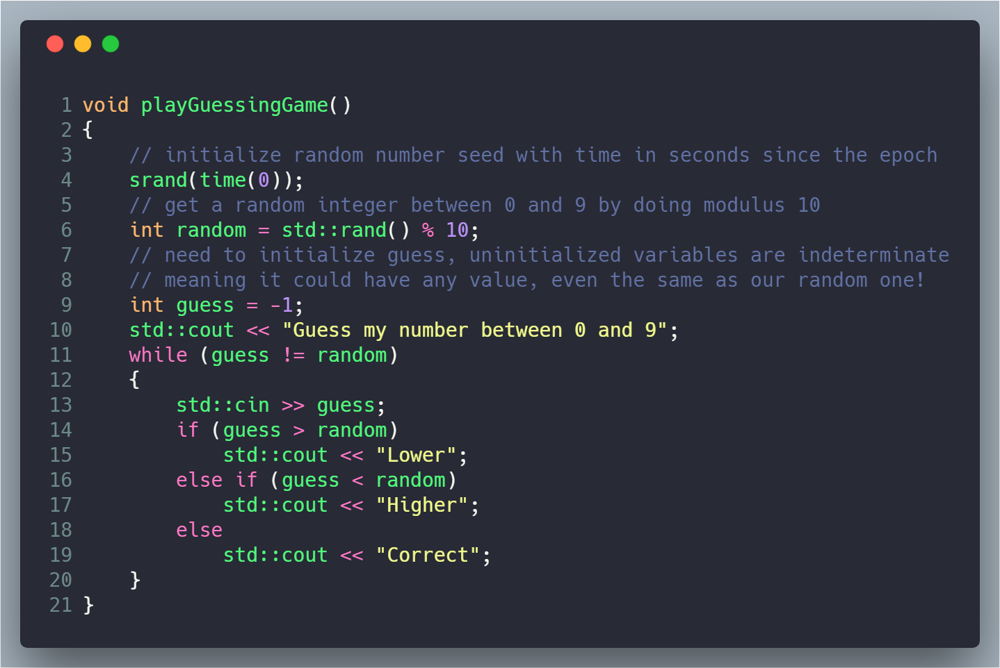

I post a progress report showing what I did and how my products performed each month.
Last month's report can be seen [here](/<%= previousReportSlug %>).

## What did I do

_Hours worked on **side-projects** in <%= currentMonth %>_

I worked **68** _productive_ on side projects hours last month.

To make these progress reports a bit more interesting, from now on I'll post my favourite song, TV show, and article I read last month.

* **Article of the Month**: [Schelling fences on slippery slopes](https://www.lesswrong.com/posts/Kbm6QnJv9dgWsPHQP/schelling-fences-on-slippery-slopes)
* **Song of the Month**: [Dennis da Menace & Brous One - Gourmet](https://open.spotify.com/track/5hBCrlxAhj6LVKDR2PGZcs?si=G8GZ2v9xSRmTc9goIDfrXw)
    <iframe src="https://open.spotify.com/embed/track/5hBCrlxAhj6LVKDR2PGZcs" width="300" height="80" frameborder="0" allowtransparency="true" allow="encrypted-media"></iframe>

* **TV series of the Month**: [The Order](https://trakt.tv/shows/the-order-2019)

### What was worked on

* X
* Y
* Z

## Platform Growth

### Website

Sessions stayed at **10,896** on my website.

I did **not** stick to my bi-weekly schedule of releasing a blog post.
I missed this week, but I was too busy doing other things.
Still, I managed to write two blog posts.

1. [Goals for 2019](/goals-2019/)
1. [How to write pandoc plugins in Nodejs](/how-to-write-pandoc-plugins-in-nodejs/)

### Subscribers

My [twitter](https://twitter.com/cmichelio) followers increased by _10_ to **600**.

## Sales

#### Learn EOS Development

I sold 3 books last month.

#### Trading

I made 236 EOS last month trading crypto.

## What's next

* X
* Y