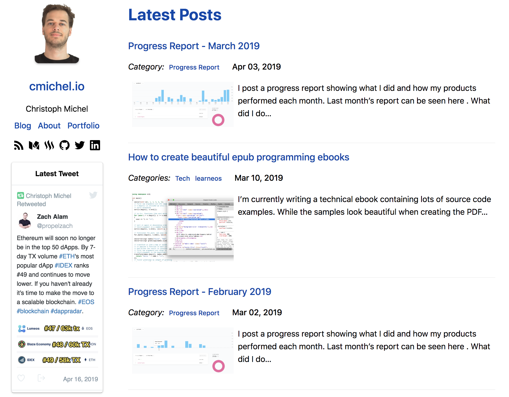
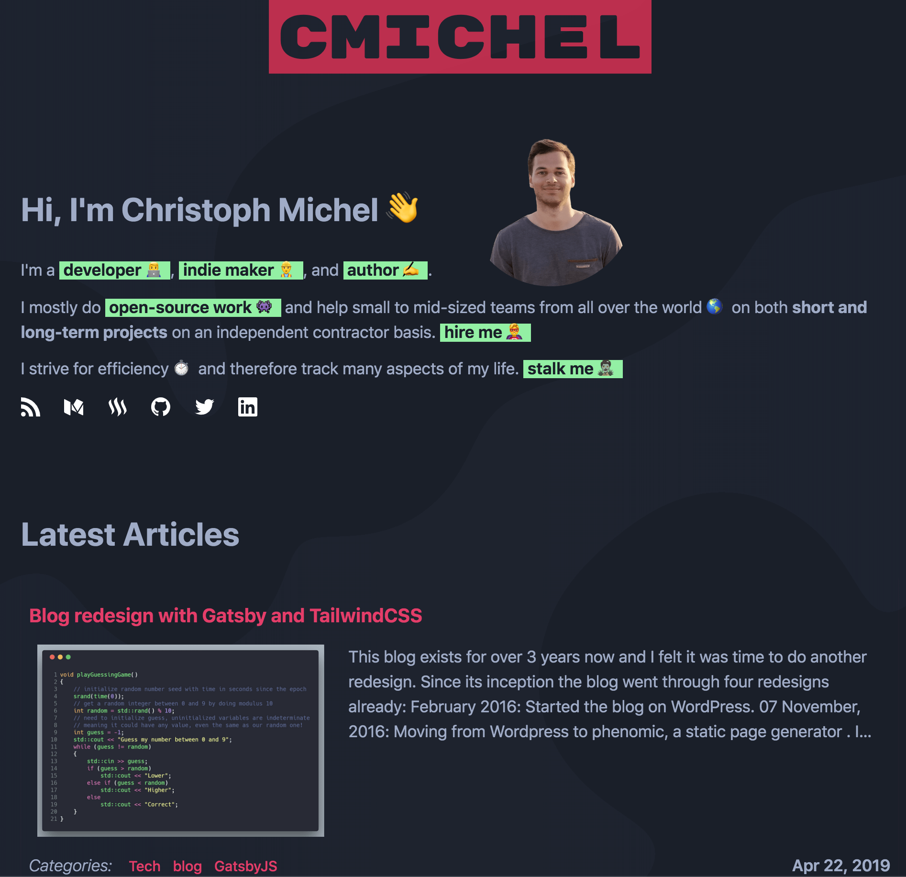
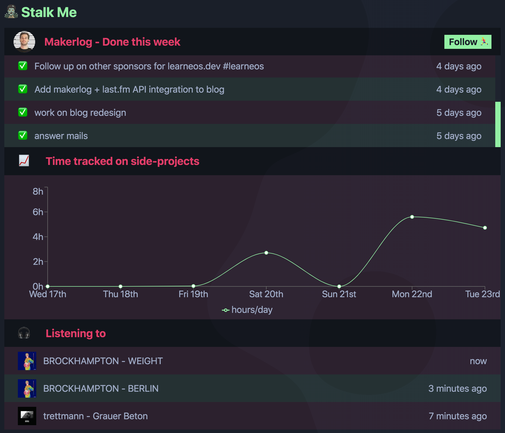

This blog exists for over 3 years now and I felt it was time to do another redesign.
Since its inception the blog went through four redesigns already:

* February 2016: Started the blog on WordPress.
* 07 November, 2016: [Moving from Wordpress to phenomic, a static page generator](/wordpress-to-static-site-generator). I redesigned the blog here to the minimalist white / blue design which I've been using until today.
* 28 November, 2017: Port from phenomic to [GatsbyJS v1](https://www.gatsbyjs.org/), a better static site generator. I'm not sure why I made the move to the new technology. Probably because `gatsby` came out as the clear and more future-proof winner.
* 08 October, 2018: Update to `gatsby v2`: Just a technical update, no desgin or functionality changes.
* Today: Still running the same technology (minor changes), but a major design change as I got bored with the old one.

_Old white & blue design_

_New dark mode with red & green colors_

## Design decisions

* Dark mode using similar colors as my VS Code programming theme [One Dark Space Gray](https://marketplace.visualstudio.com/items?itemName=fivepointseven.vscode-theme-onedark-spacegray).
* Removed a strict `/about` and `/portfolio` page and instead show a short bio on the main `/` website.
    Users can click on the green buttons for further information on a specific topic about me, which then makes the specific section visible.
    I prefer this approach as it doesn't immediately overload the user with too much text and information about me, while still allowing the user to pick topics they are interested in.
* Created an interesting [Metaballs effect](https://en.wikipedia.org/wiki/Metaballs) as the background using my [metaballs-js package](https://www.npmjs.com/package/metaballs-js) I wrote in WebGL.
    Initially the metaballs where in an lowly saturated red but it was too distracting, so I just made everything black and the actual metaballs barely visible.
    It also has a nice mouse-over effect where one metaball keeps following the cursor.

## Technical updates

* My previous blog used `glamorous`, a CSS-in-JS solution, to style elements.
    I never was a fan, gave it a try because it was hyped, and still don't like it.
    I removed it again.
    I prefer highly-customizable functional CSS libraries like [TailwindCSS](https://tailwindcss.com).
    The development is so much faster, more enjoyable, more maintainable and leads to a more consistent design.
    It's like writing inline styles but in a clean way. 😃
    It's also really tiny when combining it with [purgecss](https://github.com/FullHuman/purgecss) as we will see later.
    Read more about it [in this excellent post](https://adamwathan.me/css-utility-classes-and-separation-of-concerns/) and give it a try.
* I now make full use of the power of gatsby. Everything is pre-processed by some plugin and then queried by GraphQL. 😅
    Using [gatsby-image](https://www.gatsbyjs.org/packages/gatsby-image/) for **all** images now transforms them into the correct sizes.
    Meaning, I don't have to do manual image manipulation anymore or pay for a service like cloudinary.
    The biggest advantage is for the user and SEO as less KBs need to be downloaded.
* There's a funny `Stalk Me` section showing **real-time stats** about me, like what music I'm listening to, what and how many hours I worked on in the past week.
    The way it works is by deploying my blog to Netlify and making use of _Netlify functions_, essentially AWS Lambda functions.
    Upon hitting my Netlify _stats_ function API endpoint, it hits several other API endpoints to collect and return the data (Last.fm scrobbling Spotify, Clockify, and Makerlog).
    
    _Stalk Me section providing real-time stats_

## Performance

- show web.dev
- show JS + css size
