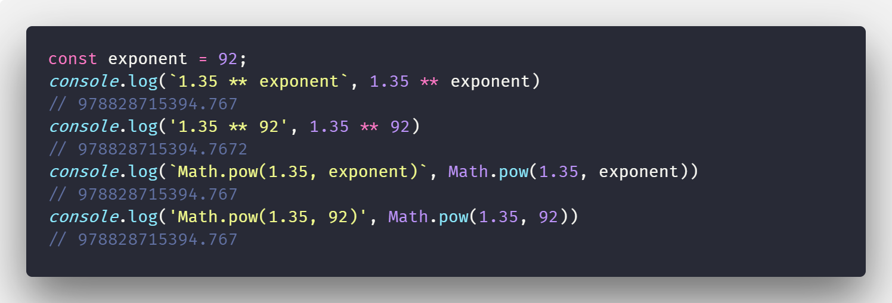

I always thought that the new ES6 exponentiation operator [`x ** y`](https://tc39.github.io/ecma262/#sec-exp-operator-runtime-semantics-evaluation) is the same as [`Math.pow(x,y)`](https://tc39.github.io/ecma262/#sec-math.pow).

Indeed this is what [the specification](https://tc39.github.io/ecma262/#sec-math.pow) says about `Math.pow`:
> Return the result of Applying the ** operator with base and exponent as specified in 12.6.4.

12.6.4 - _Applying the ** Operator_ states that the result is _implementation-dependent_ - but there should still be no discrepancy between `**` and `Math.pow`.

However, evaluating the following in the current V8 JS Engine (Chrome / Node) results in this:

```js
console.log('1.35 ** 92', 1.35 ** 92)                   // 978828715394.7672
console.log('Math.pow(1.35, 92)', Math.pow(1.35, 92))   // 978828715394.767
```

The exponentiation operator `**` returns a more accurate approximation.

But this is not the only weirdness with the exponentiation operator:
Let's try evaluating the same with variables ([REPL](https://repl.it/@MrToph/ExponentiationBugs)) - it shouldn't make any difference:

```js
const exponent = 92;
console.log(`1.35 ** exponent`, 1.35 ** exponent)                   // 978828715394.767
console.log('1.35 ** 92', 1.35 ** 92)                               // 978828715394.7672
console.log(`Math.pow(1.35, exponent)`, Math.pow(1.35, exponent))   // 978828715394.767
console.log('Math.pow(1.35, 92)', Math.pow(1.35, 92))               // 978828715394.767
```



But it does: `1.35 ** 92` differs from `1.35 ** exponent`.

So what seems to be happening here, is that the JS code `1.35 ** 92` is processed by the compiler and already [constant folded](https://en.wikipedia.org/wiki/Constant_folding).

This makes sense as V8 really compiles to machine code.
> V8 increases performance by compiling JavaScript to native machine code before executing it, versus executing bytecode or interpreting it.

V8 works by first interpreting the JS code with their **Ignition Interpreter** and having a second run with the **TurboFan compiler** [_optimizing_ the machine code](https://v8project.blogspot.com/2017/05/launching-ignition-and-turbofan.html).


> From [Understanding V8's bytecode](https://medium.com/dailyjs/understanding-v8s-bytecode-317d46c94775)

TurboFan now does _constant folding_ and its exponentiation algorithm has a better precision than the JIT compiler's (Ignition) exponentiation algorithm.

If you try the same in other JS engines like _Firefox's SpiderMonkey_, the result is a consistent value of `978828715394.767` among all computations.

## Is it a bug?
I would say so, although it wasn't severe in my code, it's still not following the spec that says `Math.pow` and `**` should result in the same value.

If you're transpiling the code with babel, `x ** y` is translated to `Math.pow(x,y)` which again leads to discrepancies between transpiled and untranspiled code.
As we have seen `Math.pow(1.35, 92)` is **not** being optimized - (only _operators_ seem to be optimized by V8), and thus `1.35 ** 92` results in different code when [transpiled to ES5](https://babeljs.io/repl/#?babili=false&browsers=&build=&builtIns=false&spec=false&loose=false&code_lz=IwOgzArABAVDUE4BMQ&debug=false&forceAllTransforms=false&shippedProposals=false&circleciRepo=&evaluate=true&fileSize=false&sourceType=module&lineWrap=false&presets=es2015%2Creact%2Cstage-2&prettier=false&targets=&version=6.26.0&envVersion=).

Using this bug and disregarding any clean code practices, we can write a nice function to determine if we're running on Chrome (unless you transpile your code 😉):

```js
function isChrome() {
    return 1.35 ** 92 !== Math.pow(1.35, 92)
}
```

Still more readable than user agent strings. 🤷
