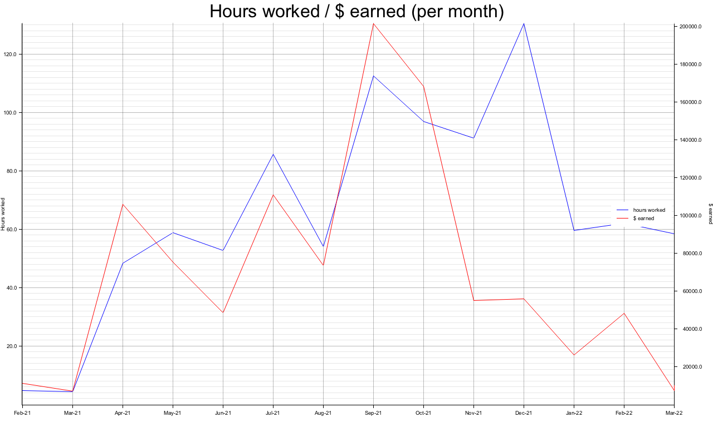
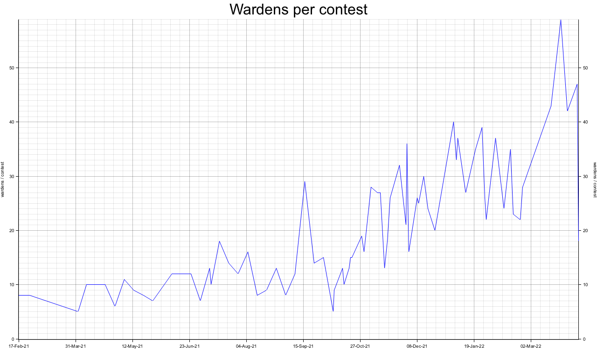
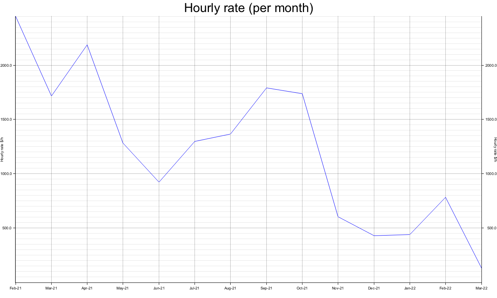

After 14 months of grinding [Code4rena](https://code4rena.com/) audit contests I'm the first person to hit 1M$ in awards and take the number one spot on the [leaderboard](https://web.archive.org/web/20220503203405/https://code4rena.com/leaderboard). 🥳


I also tracked my hours worked on Code4rena over the same time period, so for the first time, we can look at some interesting auditor stats.

## General Stats

- I participated in **97 of the 108 EVM contests**. I stopped after the 108th contest as I was confident that I would hit 1M$ in awards once the judging phase for the pending ones was done. (Some of these contests are still pending judging at the time of writing.) Code4rena's audit contests allow for participation of varying degrees but for the vast majority of contests, I treated it as a standard audit and read the entire code base instead of just a few of the contracts in scope.
- I audited **395,626 lines of Solidity code**. Determined by running this command on my C4 contest directory, which excludes _most_ of the out-of-scope interfaces and external libraries:
    ```bash
    find . -name '*.sol' -type f -not -regex '.*/test.*' -not -regex '.*/interface.*' -not -regex '.*/node_modules.*' -not -regex '.*/openzeppelin.*' -not -regex '.*/@openzeppelin.*' -not -regex '.*/mock.*' | sort -n | xargs wc -l &> c4.log
    ```
    That's ~4,000 LOC on average per contest which feels too much on the higher end. There are several short 3-day contests with ~1,000 LOC - the filter above is definitely missing some contracts that are out of scope.
- I found **900 issues** in total, **168 high-severity issues** (76 of which are unique issues only found by myself).

## Time-weighted Stats

I worked **951 hours** on Code4rena since its inception in February 2021. On average, that's an hourly rate of 1057.80$.
However, this rate does not say much about how my hourly rate evolved over the past 14 months.
It gets more interesting when we average the awards I earned per month and plot it against the hours worked.



The hours worked (blue line) went up consistently until they dropped at the beginning of this year.
In the beginning, the awards earned (red line) were proportional to the hours worked until the huge drop in awards in November 2021.  

#### Where does the drop in awards come from?

Part of it is because of a tracking error as I also developed the smart contracts for Code4rena as part of their governance working group during November / December / January. This time was also tracked as Code4rena time and I can't distinguish it from my time spent on the audit contests.
The other explanation I have is that Code4rena just became a lot more competitive during this time and people started farming low severity issues which lead to an overhaul of the rules in February. Secureum's Epoch 0 started in October 2021 which brought in a lot of new wardens (auditors) and I published my [how to become a smart contract auditor blog post](/how-to-become-a-smart-contract-auditor/).
You can see it from this "wardens per contest" chart:



In the beginning, we averaged 10 wardens per contest, then it was around 25 towards the end of 2021, and the recent contests see as high as 59 wardens submitting at least one bug or gas optimization. 👀
This is great for the sponsors who receive an insane amount of value but bad for the auditors as they all compete for the same pot and the pot size has not significantly increased since inception.

Let's look at the first "awards earned & hours worked" chart again in a different way - by dividing these values we get the hourly rate (averaged per month).



It started very high at 2000$/h and I stayed above 1000$/h for most of 2021 until the big drop in November 2021.
Afterwards, I was and still am averaging 500$/h.

> ❕ Most of March and April's contests have **not** been judged yet which means the hourly rate for these months will still go up once the judging is done. The charts will be updated in the future.

This is still a very decent hourly rate but it's possible to earn more doing traditional audits if you're at the top. Having said that, I still prefer Code4rena to standard audits as it's a lot more hands-off, less responsibility, less communication overhead for auditors, and neither do I need to join meetings or audit the fixes.
I just read public code and submit bugs through a web interface without talking to any human, can't get much better than that. 😁

# What's next?

I'll take a break from C4 until some newly-discussed features have been implemented and I might try part-time bug bounties for 1-2 months as I'm curious what my average hourly rate would be there.
Then I'd be the first to publicize an evidence-based comparison between audits, audit contests, and bug bounties.  
The anecdotal advice is that bug bounties pay the best - judging from seeing a few large million $ payouts.
At the same time, I also hear a lot of complaints about how protocols mistreat whitehats and down-play severity or simply don't pay out.
The earnings are therefore also a lot more volatile which is why I've always felt more comfortable doing audits. 
But I'm curious what payouts one can expect and how volatile they really are - is doing bug bounties for a month enough to get close to the expected payouts?

---

The charts have been created using the [plotters crate](https://crates.io/crates/plotters) and the source code is [available here](https://github.com/MrToph/c4-stats).
