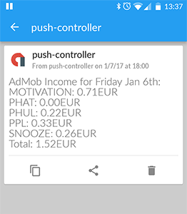

I wanted to send a daily report of my apps' AdMob income to my phone using the [PushOver notification service](https://pushover.net/), but couldn't find any (working) examples to fetch the Google AdSense (+AdMob) revenue using Node.js and Express.js.
For most other languages there are [code examples](https://developers.google.com/adsense/management/libraries), but not for the Google-API-NodeJS-Client - we will change that.


## Setup
We will use the [google-api-nodejs-client](https://github.com/google/google-api-nodejs-client) and authenticate through OAuth.
I assume you already set up a **Web** application at the Google Developer Console, added the AdSense Management API and created the credentials.
(You can create a `localhost` credential for testing purposes.)
Download the credentials as a `.json` file (client_secret_*.apps.googleusercontent.com).
The [Getting Started](https://developers.google.com/adsense/management/getting_started) guide describes how to do that.

Create a new project and install the dependencies with `npm install --save express googleapis`.

## Authentication
We will use Google _OAuth_ for Authentication in our Express.js app.
Therefore, we need to define the _scope_ of our access (`adsense.readonly`) and provide a path (`/auth/google`) that redirects to Google's Consent - _Grant Access_ - page.
When the user confirms, Google passes the authentication tokens as parameters to a `callback path` defined as in the credentials file (`redirect_uris`).
Don't worry, we only need to authenticate manually _once_ to receive a `refresh_token`.
We save it and can then always request fresh `access_token`s when these expire.


```js
import google from 'googleapis'
const config = require('./client_secret_*.apps.googleusercontent.com.json').web

const scope = 'https://www.googleapis.com/auth/adsense.readonly'

const oauth2Client = new google.auth.OAuth2(
  config.client_id,
  config.client_secret,
  config.redirect_uris[0],  // may NOT be an array. Otherwise, the consent site works, but silently fails in getToken.
)

const consentURL = oauth2Client.generateAuthUrl({
  access_type: 'offline', // 'online' (default) or 'offline' (gets refresh_token)
  scope,  // If you only need one scope you can pass it as string
  prompt: 'consent',    // always prompt for consent
})

app.get('/auth/google', (req, res) => {
  res.redirect(consentURL)
})

// oauth2callback as defined in config.redirect_uris[0] in the Google Dev Console
app.get('/oauth2callback', (req, res) => {
  getTokens(req.query.code,
    (tokens) => {
      // save tokens somewhere in a DB or a file
      res.send(`Received code: ${req.query.code}<br>Tokens: ${JSON.stringify(tokens)}<br>Save them.`)
    },
    (err, response) => res.send(`Received an error while trying to get tokens with code ${req.query.code}: ${err}\n${JSON.stringify(response)}`),
  )
})

function getTokens(code, sucCallback, errCallback) {
  oauth2Client.getToken(code, (err, tokens, response) => {
    if (!err) {
      // set the tokens here for future API requests
      oauth2Client.setCredentials(tokens)
      sucCallback(tokens)
    } else {
      errCallback(err, response)
    }
  })
}
```

## Fetching AdSense Reports data
Once your client is authenticated and has its tokens set, you can start fetching your revenue data using the `adsense` API of `googleapis`.
Updating expired `access_token`s _if necessary_ is handled in `oauth2Client.getAccessToken(callback)`.
You can customize the query by specifying `start` and `end dates`, or split the total earnings into the individual Ads by providing a `dimension`.
For playing around and figuring out how to use the AdSense API, the [documentation](https://developers.google.com/adsense/management/v1.4/reference/accounts/reports/generate) provides a useful form.

```js
// make sure oauth2Client's credentials are set
// with oauth2Client.setCredentials(tokens) as in getTokens
// or somewhere else with the saved tokens

app.get('/adsense', (req, res) => {
  getLatestReport(
    (err, reportString) => {
      if (err) {
        // Send error per push notification, E-Mail etc.
      } else {
        // Send report per push notification, E-Mail etc.
        // send(reportString)
      }
    })
})

function getLatestReport(callback) {
  const adsense = google.adsense('v1.4')
  // Get a non-expired access token, after refreshing if necessary https://github.com/google/google-auth-library-nodejs/blob/master/lib/auth/oauth2client.js
  oauth2Client.getAccessToken((err, accessToken) => {
    if (err) {
      callback(`getAccessToken Error: ${err}`)
      return
    }
    // create report for yesterday. Today's revenue info is still inaccurate
    const date = moment().add(-1, 'days').format('YYYY-MM-DD')
    const params = {
      accountId: 'pub-58**************',
      startDate: date,
      endDate: date,
      auth: oauth2Client,
      metric: 'EARNINGS',   // https://developers.google.com/adsense/management/metrics-dimensions
      dimension: 'AD_UNIT_NAME',
    }
    adsense.accounts.reports.generate(params, (errReport, resp) => {
      if (errReport) {
        callback(errReport)
      } else {
        callback(null, reportToString(resp))
      }
    })
  })
}

function reportToString(report) {
  const date = moment(report.endDate)
  let response = `AdMob Income for ${date.format('dddd MMM Do')}:`
  const numRows = report.totalMatchedRows
  const rows = report.rows
  const currency = report.headers.find(x => x.name === 'EARNINGS').currency
  for (let i = 0; i < numRows; i += 1) {
    // This depends on your naming convention of your Ad units
    const name = rows[i][0].split('_')[0]
    const earnings = rows[i][1]
    response += `\n${name}: ${earnings}${currency}`
  }
  // console.log(report)
  response += `\nTotal: ${report.totals[1]}${currency}`
  return response
}
```

I use a cronjob to access the script once a day which delivers the report as a notification through [PushOver](https://pushover.net/).
The output then looks like this:


