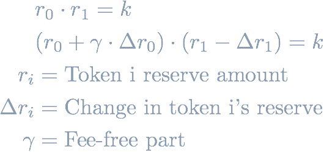
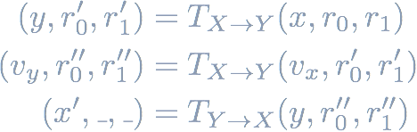

A common attack in DeFi (as well as in traditional finance) is the **sandwich attack**.
Upon observing a trade of asset X for asset Y, an attacker **frontruns** the victim trade by also buying asset Y, lets the victim execute the trade, and then **backruns** (executes after) the victim by trading back the amount gained in the first trade.
Intuitively, one uses the knowledge that someone's going to buy an asset, and that this trade will increase its price, to make a profit. The attacker's plan is to buy this asset cheap, let the victim buy at an increased price, and then sell the received amount again at a higher price afterwards.

These attacks often appear in the wild due to the public nature of blockchains, all transactions can be observed by anyone in the [mempool](https://medium.com/@danrobinson/ethereum-is-a-dark-forest-ecc5f0505dff) (unless one has a special direct link to a mining pool).
Alternatively, smart contracts may contain functions without access restrictions performing such a trade. These functions often exist for claiming LP reward tokens and immediately swapping them for some other token using a DEX.

Sandwich attacks are not new, [Vitalik already talked about them](https://ethresear.ch/t/improving-front-running-resistance-of-x-y-k-market-makers/1281) in the context of Uniswap in 2018.
There has been a more extensive discussion about them in the recent [High-frequency trading paper](https://arxiv.org/pdf/2009.14021.pdf).

> The name comes from the fact that the victim's transaction is wrapped by two transactions.

_[Image Source](https://medium.com/coinmonks/demystify-the-dark-forest-on-ethereum-sandwich-attacks-5a3aec9fa33e)_

However, some _fundamental questions are still unanswered_:

1. When is a sandwich attack profitable?
1. What is the maximum profit?
1. What is the optimal amount (for the attacker) to trade?

We will answer these questions here for constant-product AMM types like Uniswap.
First some background on the Uniswap AMM.

# Uniswap

The characteristic equation that describes any trade on [Uniswap](https://uniswap.org/) is the `r0 * r1 = k` equation where `r_i` are the reserves of a Uniswap pool.
In practice, Uniswap takes a fee of 0.3% on the input amount of each trade and [the equation](https://github.com/Uniswap/uniswap-v2-core/blob/master/contracts/UniswapV2Pair.sol#L182) becomes:

<!-- & r_0 \cdot r_1 = k \\
& (r_0 + \gamma \cdot \Delta r_0) \cdot (r_1 - \Delta r_1) = k \\
r_i &= \text{Token i reserve amount} \\
\Delta r_i &= \text{Change in token i's reserve} \\
\gamma &= \text{Fee-free part} -->

The amount `y` received for trading `x` tokens can then [be computed](https://github.com/Uniswap/uniswap-v2-periphery/blob/master/contracts/libraries/UniswapV2Library.sol#L43) as:

<!-- & T_{X\rightarrow Y}(x,r_0,r_1) = \frac{\gamma x \cdot r_1}{r_0 + \gamma x} -->

The sandwich attack involves frontrunning the victim trade with a trade buying the same asset. The gained tokens are sold again after (backrunning) the victim trade.
If we extended the trade function to also return the updated reserves, the attacker can be formalized as:

<!-- (y, r_0', r_1') & = T_{X\rightarrow Y}(x,r_0,r_1) \\
(v_y, r_0'', r_1'') & = T_{X\rightarrow Y}(v_x,r_0',r_1') \\
(x', \_, \_) & = T_{Y\rightarrow X}(y,r_0'',r_1'') -->

## Profitability of a sandwich attack

The profit of a sandwich attack is the difference between the tokens received in the final sell and the tokens spent in the initial buy action.
The initial reserves and the victim's trade amount are fixed, the only variable under the attacker's control is the _initial amount to trade in the frontrun_.
Then the question becomes: 

#### How to choose the trading amount to maximize the profit?

Using flash loans an attacker can basically receive infinite tokens and we can ignore setting a bound on the attacker's available funds.
One might think that trading as much tokens as possible will yield the most profit.
This would indeed be true if Uniswap didn't take any fees.
In reality, the sandwich attacker needs to pay the 0.3% fee twice and the higher the input amount the higher the fee that needs to be paid.

Note that an **upper-bound on the profit is the victim's trade amount** - one cannot make back more tokens in the last trade than what has been input in the first two trades.
Thus, beyond the point where the fees are higher than the victim's trade amount, the attacker does not make a profit anymore.

> The [High-frequency trading paper on DEXes paper](https://arxiv.org/pdf/2009.14021.pdf) does not state an optimal analytical solution. Instead, it is computed numerically using binary search: "Three steps allow us to compute the optimal adversarial input amount. First, the maximum amount A can transact without breaking V ’s slippage protection (denoted by o^) is computed using a binary search. Second, we calculate if the attack is profitable if A inputs o^. As Figure 3 and 4 suggest, if an attack is not profitable at o^, then it is not profitable for any o < o^."
> 
> Setting aside additional slippage protection of the victim trade, for now, this would mean that the optimal input is indeed at infinity. We believe this to be wrong because of the fees argument mentioned above.

To get a better intuition about the sandwich attack profit, we can look at an example graph.
The (slightly simplified) profit function is a fourth-degree polynomial and its shape looks like this:

Sparing the details, **the optimal solution to maximize the profit** in a _Uniswap_ sandwich attack can be found at:

<!-- x = \frac{-1000}{997} r_0 + \frac{997000}{5991} v_x + \frac{10}{5991}\cdot\sqrt{-179730 \cdot r_0 \cdot v_x + 9999820270 \cdot v_x^2}
 -->

The constants come from the `𝛾 = 997/1000` Uniswap fee-free constant.

> ⚠️  The solution is not exactly accurate as we modelled the reserve change after the first two transactions trading attacker amount `x` and victim amount `v` as a reserve change of a single trade using amount `x + v` to simplify the computation. Practically, we found this solution to be very close to the optimal solution computed using binary search.

#### What about unexpected slippage protection?

If unexpected slippage protection is enabled on the victim trade, the optimal solution is the minimum of the value where the slippage threshold is reached and the computed theoretical optimal solution.

#### What about transaction gas fees?

High transaction gas fees indeed make this attack harder to execute.
However, the sandwich attack's gas cost does not depend on the attacker, victim or Uniswap pair's token sizes - it's a constant.
Thus it eats into the profit but does not change the optimal attacker input amount.

