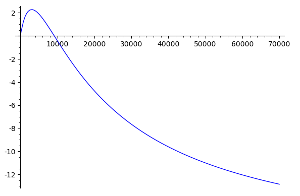

- a common attack is a sandwich attack. frontrun and backrun. intuivitely you make a profit because the victim transaction raises the price of an asset, so you buy an asset cheap, its price increases and then you sell it again for a profit.
- show vitalik picture? make an example
- It was first discussed by vitalk in 2018 and recently there has been more discussion about it in the High freuqncy trading paper https://arxiv.org/pdf/2009.14021.pdf
- can appear in the wild by observing [mempool], or smart contract that has a function without access restriction. Such functions often exist for claiming LP reward tokens and immediately swapping them for some other token.

However some fundamental questions have still not been answered:

- When is a sandwich attack profitable?
- What is the maximum profit?
- What is the optimal amount (for the attacker) to trade?

We will answer these questions for constant-product AMM types like Uniswap.

# Uniswap

The characteristic equation that describes any trade on Uniswap is the `r0 * r1 = k` equation where `r_i` are the reserves of a Uniswap pool.
In practice, Uniswap takes a fee of 0.3% on the input amount of each trade and [the equation](https://github.com/Uniswap/uniswap-v2-core/blob/master/contracts/UniswapV2Pair.sol#L182) becomes:

The amount `t1` received for trading `t0` tokens can then [be computed](https://github.com/Uniswap/uniswap-v2-periphery/blob/master/contracts/libraries/UniswapV2Library.sol#L43) as:

The sandwich attack involves frontrunning the victim trade with a trade buying the same asset. The gained tokens are sold again after (backrunning) the victim trade.
Formalized:

## Profitability of a sandwich attack

The profit of a sandwich attack is the difference between the the tokens received in the final sell and the tokens spent in the initial buy action.
The initial reserves and the victim's trade amount are fixed, the only variable under the attacker's control is the initial amount to trade in the frontrun.
Then the question becomes how to choose the trading amount to maximize the profit?

Using flash loans an attacker can basically receive infinite tokens and we can ignore setting a bound on the attacker's available funds.
One might think that trading as much tokens as possible will yield the most profit.
This would indeed be true if Uniswap didn't take any fees.
In reality, the sandwich attacker needs to pay the 0.3% fee twice and the higher the the input amount the higher the fee that needs to be paid.

> The [High-Frequency Trading on DEXes paper] does not state an optimal analytical solution. Instead it is computed numerically using binary search: "Three steps allow us to compute the optimal adversarial input amount. First, the maximum amount A can transact without breaking V ’s slippage protection (denoted by o^) is computed using a binary search. Second, we calculate if the attack is profitable if A inputs o^. As Figure 3 and 4 suggest, if an attack is not profitable at o^, then it is not profitable for any o < o^". We believe this to be wrong. Setting aside additional slippage protection of the victim trade for now, this would mean that the optimal input is indeed at infinity.

Note that the **maximum profit is the victim's trade amount** - one cannot make back more tokens in the last trade than what has been input in the first two trades.
Thus, beyond the point where the fees are higher than the victim's trade amount, the attacker does not make a profit anymore.
The (slightly simplified) profit function is a fourth degree polynomial and its shape looks like this:

Sparing the details, the optimal solution to maximize the profit in a sandwich attack can be found at:

A sandwich attack is profitable when the discriminant is non-negative.

> It is not 100% accurate as we modeled the reserve change after the first two transactions trading attacker amount `x` and victim amount `v` as a reserve change of a single trade using amount `x + v` to simplify the computation. Practically, we found this solution to be very close to the optimal solution computed using binary search.

If unexpected slippage protection is enabled on the victim's trade, the optimal solution is the minimum of the value where the slippage threshold is reached and the actual optimum.