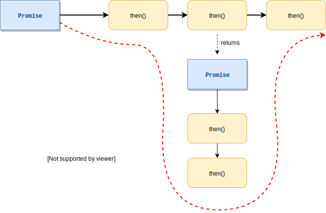

Promises provide a nice way to handle async responses by chaining functions (through `.then(value => ...)`) that get resolved sequentially.
However, sometimes you don't know how often you need to fetch something. For instance, you might want to fetch all pages, but you don't know the page count before starting the requests.  
The great thing about Promises is that you if you return a _new Promise_  in a `.then()` handler at some point in the chain, _its_ chain will be executed first before the rest of the existing chain is run.
This way you can insert new handlers at any point, effectively allowing you to create **dynamic promise chains** depending on the previously fetched data.



### Simple Code Example
```javascript
const innerPromise = (val) => Promise.resolve(console.log(val + 1))
                                    .then(() => console.log(val + 2))
                                    .then(() => {
                                        console.log(5)
                                        return 5
                                    })

const chain = Promise.resolve(console.log(0))
.then(() => console.log(1))
.then(() => console.log(2) || 2)
.then(innerPromise)
.then((five) => console.log(five + 1))

// outputs 0,1,2,3,4,5,6
```

### Fetching all pages with Promises
You can use the same principle in a `redux-thunk` to dynamically fetch all pages and dispatch an update action each time a page is done loading. It would look something like this:

```javascript
export const fetchAllPages = () => (dispatch) => {
  dispatch(fetchAllPagesStartActionCreator())
  return fetchPage()
  .then(({ data, next }) => {
    // dispatch initial chunk of data
    dispatch(firstPageActionCreator(data))

    // more pages to get for pagination?
    if (Number.isInteger(next) && next > 1) {
      // start the chain
      return fetchNextPromiseCreator(dispatch, next)
    }
    return true // otherwise resolve, no more pages to fetch
  })
  .catch((err) => {
    dispatch(fetchError(err))
  })
}

// this function helps with looping through dynamic number of pages
// by returning a promise that fetches the data and possibly calls itself again
function fetchNextPromiseCreator(dispatch, nextPage) {
  return fetchPage(nextPage)
    .then(({ data, next }) => {
      dispatch(pageUpdateActionCreator(data))
      return next
    })
    .catch((err) => {
      dispatch(fetchError(err))
    })
    .then((newNextPage) => {
      // call this function again recursively which makes it create a dynamic promise chain
      if (Number.isInteger(newNextPage) && newNextPage > nextPage) return fetchNextPromiseCreator(dispatch, newNextPage)
      return true // otherwise resolve, no more pages to fetch
    })
}

function fetchPage(page = 1) {
  return fetch(`https://api.github.com/users/MrToph/repos?page=${page}&sort=updated`)
  .then((response) => {
    const links = parse(response.headers.get('Link'))
    const next = links && links.next && parseInt(links.next.page, 10)

    if (response.ok) return response.json().then(json => ({ json, next }))
    // otherwise parse body and _throw_ its error message
    return parseThenHandleError(response.json())
  })
}
```