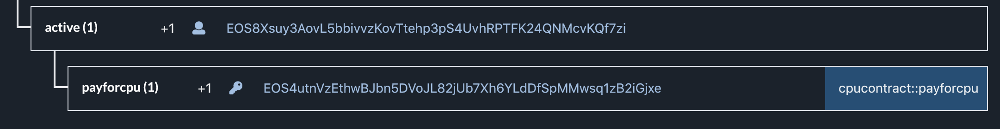

The latest trend on the EOS mainnet seems to be about earning tokens on anything: Earn EOS through REX and voter/proxy rewards, DAPP tokens through staking to DSP stake services, or [EIDOS through "CPU mining"](https://medium.com/mykey-lab/two-ways-of-thinking-about-eidos-mining-enthusiasm-48fb7aeb65e8?source=rss------blockchain-5).

Another idea for EOS token holders could be to **earn by renting out their unused CPU time to dapps or users in need of CPU**.
While similar in nature to the EIDOS idea, this proposed solution would actually help the network on top of passive earnings.

## Rent out unused CPU and earn CPU tokens

Depending on your view, the EOS mainnet is currently in a _CPU crisis_ or works _great and as expected_. However, we can all agree on that only three types of accounts can currently operate on the chain:

1. Accounts with a high amount of CPU staked.
2. Accounts that were able to rent CPU from REX in time. [More than 80% of lendable REX is currently borrowed](https://bloks.io/rex) driving the REX borrowing prices to new record highs. This went on until it became impossible to borrow from REX anymore.
3. Accounts interacting with dapps that pay for their users' CPU, or that rely on the generosity of a third-party paying for their CPU, like [Bloks](https://bloks.io/account/tippedtipped#keys) does with their free 5 transactions per day.

Most accounts seemed to be borrowing CPU from REX as it was initially a cheap way to get more CPU through the Bancor-like pricing algorithm.
**A big flaw is that REX CPU rentals last for 30 days**.
The average user just wants to make a transfer, approve an msig, or play on a casino dapp for 30 minutes until they go on with their non-blockchain lives.
But they have to rent CPU from REX for 30 days, not utilizing their allotted share of the network bandwidth most of the time.
On top of that, it's hard to estimate how much CPU time and thus staked EOS one needs for their transactions, leading to aggressive over-renting of REX resources.
This results in the EOS network still not operating at full capacity despite the high CPU prices and users complaining that they cannot use the blockchain.
It only makes sense to provide a way for users to rent our their CPU to other users when they don't need it.
Luckily, EOSIO 1.8 introduced a feature that allows anyone to pay for the costs of any transaction of any user.

**The idea would be that users open their CPU bandwidth to anyone and earn a CPU token whenever anyone uses their CPU.**
This CPU token is paid for by the one utilizing the bandwidth, meaning, using this service requires first owning a CPU token yourself and transferring it to the CPU payer.
The CPU token will be listed on DEXes and markets will evolve around it as it has a value/utility.
At this point, users can decide to "earn" and trade it against EOS, or make use of its utility to send a transaction when in need of CPU.

> ♻️ It might seem like we've gone full circle: EOSIO moves away from explicit transaction costs as implemented by Ethereum's gas model, replacing it with an implicit inflation and staking model; but now we could pay for a transaction again by owning an explicit CPU/GAS token.
> The difference is you now have a choice. Either stake your tokens or pay explicitly per transaction.

## Proof of concept

The beauty of this idea is that it can be implemented quite elegantly in a couple of lines.
Despite the CPU token, there's only a single smart contract method required:

```cpp
// pseudo code
ACTION payforcpu(name cpu_payer, name cpu_user) {
  require_auth2(cpu_payer, N(payforcpu));
  // make sure that payforcpu auth is not enough to bill
  require_auth2(cpu_user, N(active));

  // move 1 CPU token from user to payer
  transfer(cpu_user, cpu_payer, asset(1, CPU), "");
}
```

Anyone willing to earn on their unused CPU would just need to create a new `payforcpu` permission and make sure to `linkauth` it to the `payforcpu` action.



And now they _leak their private key_ for the `payforcpu` action.
This sounds like a huge security concern, but it is not.
Because of the `linkauth`, the only action one can use the key for is the `payforcpu` action.
And whenever someone uses your key and invokes this action to bill in your name, you receive 1 CPU token.
Just as desired.

In fact, we can make the process even easier if everyone agrees on a common **CPU public and private key pair**.
Let's say everyone that wants to rent out their CPU uses this key for their `payforcpu` permission:

```yml
Public key: EOS4utnVzEthwBJbn5DVoJL82jUb7Xh6YLdDfSpMMwsq1zB2iGjxe
Private key: 5Ji1r2eRS1zbB883Wt18m56fVUSsG83QerdVyUv7hou96AaEF8T
```

From a user or dapp borrower perspective, the service works like this:

1. Make sure you own some CPU tokens
2. Find someone that offers their CPU. This can be done by lenders registering themselves on the smart contract, or just by calling the `get_key_accounts` endpoint with the common CPU public key. (Some check has to be done to see if a lender actually has enough bandwidth leftover.)
3. Prepare any transaction and insert a `payforcpu` action as the first action. Declare the lender's `payforcpu` permission as the first authorization, and the permission of the payer as the second authorization. Sign it with the shared common CPU "private" key and your secret key for the payer permission. Because of the `ONLY_BILL_FIRST_AUTHORIZER` feature, the CPU costs of the transaction are _billed only to the account declared as the first authorizer_, the lender.

## Challenges

There are a couple of challenges that would still need to be solved:

1. Transactions are not equal. The unit of measurement of CPU is the execution time in _microseconds_. In an ideal world, you would instead pay 1 CPUMICROSECONDS token for each microsecond executed, but this is technically not possible in a smart contract. Smart borrowers will batch their actions into a single transaction and still only have to pay 1 CPU token.
2. Maybe lenders only want to rent part of their CPU up to a percentage, to still have some CPU for their own transactions. Setting a threshold would solve this but seems technically impossible again without going off-chain. The problem isn't as severe though, because they earned CPU tokens and can just use these instead.
3. Lenders without left-over CPU bandwidth cannot be used and should be filtered out. The good thing is that lenders are not NFTs, they are fungible 😃 It doesn't matter whose CPU we use. Someone would probably come up with a centralized API that always returns a lender with enough free CPU.
4. What would happen with REX? I imagine someone would rent CPU from REX just to rent it out again through this system as long as it's profitable.
5. There are probably other economic issues I haven't thought of.

[](https://learneos.dev#modal)
