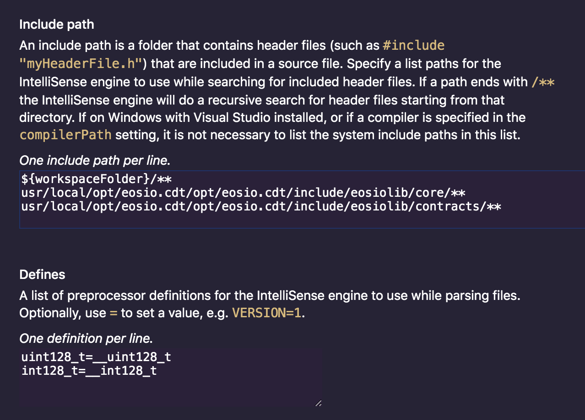
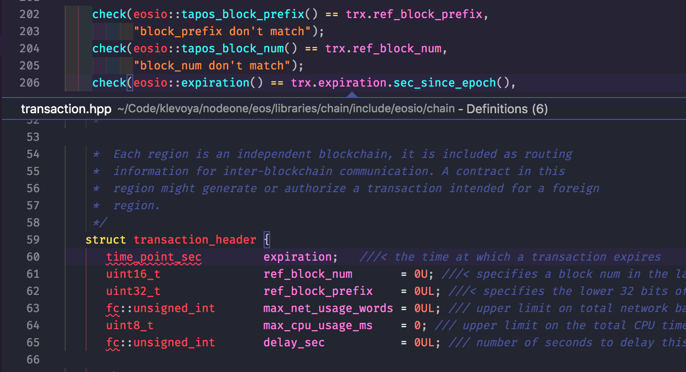

If you're a developer nowadays chances are high that you're using VSCode as your IDE of choice.
It's my favourite IDE for web development, but I also use it for C++ EOSIO smart contract development because it's free, unlike the CLion alternative.

Per default, there is no IntelliSense (code completion, jump to class definitions, etc.) for EOSIO smart contract development which is a big productivity killer.
However, there's an easy way to enable it for your VSCode workspace.

1. Install and enable the [C/C++ IntelliSense Extension](https://marketplace.visualstudio.com/items?itemName=ms-vscode.cpptools)
2. Edit C++ Configuration: `CMD + SHIFT + P` => `C/C++: Edit Configuration (UI)`
   1. In the **Include paths** sections add the path to your `eosio.cdt` include directories and optionally your whole worksapce folder.
      ```
${workspaceFolder}/**
/usr/local/opt/eosio.cdt/opt/eosio.cdt/include/eosiolib/core/**
/usr/local/opt/eosio.cdt/opt/eosio.cdt/include/eosiolib/contracts/**
      ```
   2. In the **Defines** section add definitions for `uint128_t`. (When I didn't add this I encountered error lines below each `uint128_t`.)
      ```
uint128_t=__uint128_t
int128_t=__int128_t
      ```
    

After reloading VSCode, you should be able to see the definitions when pressing CMD + clicking on expression:




[](https://learneos.dev#modal)
