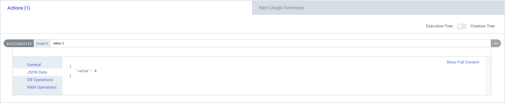

Let's make the bear market a bit more fun.
I'll be posting some EOSIO developer puzzles from now on in irregular intervals.
Here's the first one:

>  ❔ **What's the max amount of RAM that can be consumed by an EOSIO contract when storing a single uint64_t variable?**

Hint: It's not 64 bits.

Imagine you have a `struct` with a single `uint64_t` class variable and you create a table that stores this structure.
How much RAM can a single `table.emplace` call consume?

```cpp
#include <eosio/eosio.hpp>

using namespace eosio;

CONTRACT puzzle1 : public contract {
public:
  using contract::contract;
  puzzle1(eosio::name receiver, eosio::name code, eosio::datastream<const char *> ds)
      : contract(receiver, code, ds) {}

  struct [[eosio::table("puzzle")]] puzzle {
    // only variable is this one
    uint64_t value;
  };

  ACTION insert(uint64_t value) {
    puzzle_t _puzzle(get_self(), name("puzzle").value);
    _puzzle.emplace(get_self(), [&](auto &x) { x.value = value; });
  }
};
```

> ❕ I'll be giving away 5 EOS to the first person to post the correct answer on Twitter. 🤑

Here's me calling the `insert` action that stores a single `uint64_t` value.



I'll announce the winner and publish this transaction containing the correct answer in a week.

[](https://learneos.dev#modal)
