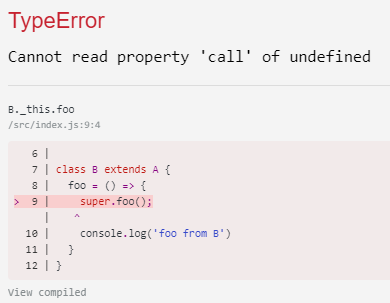

In ES6 there are two common ways to define **class methods**, but they behave completely different.

The first way is to define them as a standard class function.

```jsx
class A {
    foo() {
        console.log('foo from A')
    }
}
```

But you can also define them as an _instance specific_ function:

```jsx
class A {
    foo = () => {
        console.log('foo from A')
    }
}
```

The first difference is pretty obvious if you know ES6's _fat arrow_ functions:
It binds the `this` variable inside the function call to the `this` variable of the scope of where the function was defined.
So in our case, `this` will be bound to the current class instance.

We can achieve the same by avoiding arrow functions and use a standard class method in addition to binding it in the constructor:

```jsx
class A { 
    constructor() {
        this.foo = this.foo.bind(this)
    }

    foo() {
        console.log('foo from A')
    }
}
```

You might now think that the following class definitions have the same behavior:


However, they behave in a completely different way when we use JavaScript's class inheritance.

## Class Inheritance yields different results
Let's run the following code:

```jsx
class A { 
    constructor() {
        this.foo = this.foo.bind(this)
    }

    foo() {
        console.log('foo from A')
    }
}

class B extends A {
    foo() {
        super.foo();
        console.log('foo from B')
    }
}
new B().foo()
```

The expected result is logged:

```
foo from A
foo from B
```

Let's try the same with **fat-arrow** functions now:
```jsx
class A { 
    foo = () => {
        console.log('foo from A')
    }
}

class B extends A {
    foo = () => {
        super.foo();
        console.log('foo from B')
    }
}
new B().foo()
```

We get an error:

```
Cannot read property 'call' of undefined
```



### What's happening here?
Whenever you call `super.someFunction` in JavaScript, a lookup for a key `someFunction` is done in `__proto__` - that's the way JavaScript's class inheritance is implemented.
The reason why we get this error is because `foo` is not in `__proto__` of the object instance of `new B()`.

So, what this tells us is that **fat arrow class functions cannot be used from subclasses**.
**Fat arrow** functions can always only be defined through class **instance** properties. So what our class with [`transform-class-properties`](https://babeljs.io/docs/plugins/transform-class-properties/) actually does, is attaching the function first inside the constructor when a concrete **class instance is created**:

```jsx
class A {
    constructor() {
        this.foo = () => {
            console.log('foo from A')
        }
    }
}
```

Of course, doing it this way, `foo` does never exist in `__proto__` and makes it unusable in extended classes.
If you need a method to be callable from a derived class (and you want to use the ES6 `class` syntax), you need to define that method as a normal class method using [shorthand notation](https://developer.mozilla.org/en-US/docs/Web/JavaScript/Reference/Functions/Method_definitions):

```jsx
class A { 
    constructor() {
        this.foo = this.foo.bind(this)
    }

    foo() {
        console.log('foo from A')
    }
}

class B extends A {
    foo() {
        super.foo();
        console.log('foo from B')
    }
}
new B().foo()
```
