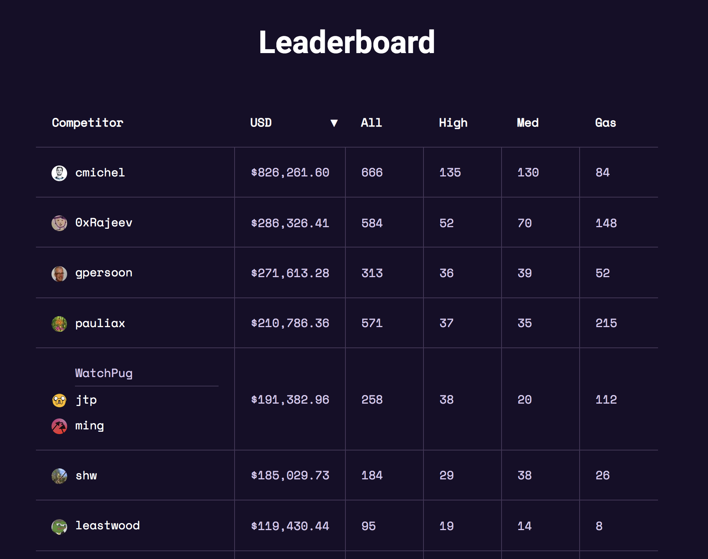

Following the tradition of [previous years](/goals-2021), I'll revisit my old goals and see what I achieved, and set new goals for 2022.

Before we dive into the review, I can already say that 2021 has financially been my best year so far by a huge margin.
I'm also still healthy, so it has been a pretty great year overall.

## Reviewing 2021's goals

> Dive into decentralized finance security auditing

✅  &nbsp; I started full-time auditing (& some bug bounties) already in February/March and am still doing it. Initially, I did part-time audits for Quantstamp and [Code4rena](https://code4rena.com/) (C4) but then transitioned into doing C4 full-time as I enjoyed the way of working there more: non-committal, work how much I want, no baby-sitting of customers that don't have their shit together (code still missing for the booked time slots, promised documentation not delivered or insufficient, etc.), no re-audits that can drag on forever.
The reward was also a lot higher, in the end, I didn't miss a single (EVM) contest and made it to #1 on the leaderboard. 🥳

I tried to give back by blogging/tweeting about Ethereum hacks, being a mentor on [Secureum's bootcamp](https://secureum.xyz/) and answering DMs I received about how to get started as an auditor.
My impression is that there has been a huge influx of security people in the past 2 months, 2022 will be interesting.

> Get back to a bi-weekly blog-post consistency.

❌ &nbsp; Failed again. This year I worked more than ever before - I maybe took ~10 days off, on all other days I've always been working for at least a couple of hours (including weekends). I didn't have the energy anymore to write two posts every month.
I also started posting with my anon and dividing the time between them is still a struggle.

The biggest series I started on this blog was [Replaying ETH hacks](/categories/replaying-eth).
I'd like to continue with it.

> Get back to a daily routine

✅  &nbsp; I more or less achieved this goal. I still go to bed late at night and sleep 8-9 hours and wake up at noon. However, I stopped my digital nomad life that I've been living for the past 3 years and it's much less stressful. Previously, I moved to a new city every 1-3 months and lived out of Airbnbs working on shitty chairs. I now have a base, bought my own furniture & decoration, joined a local gym. I developed a nice routine here.
I'll only start travelling again when governments reduce their covid travel restrictions but I doubt we'll see this any time soon.

> Be open to throwing away these goals if they become irrelevant, my priorities change, or other better opportunities come along.

✅  &nbsp; This was the best goal I set myself. Crypto moves too fast to set any specific goals. The meta changes too fast and if you want to be successful you need to adapt quickly. NFTs went from zero to every single creator talking and having an opinion on them in less than a year. Both big corporations and huge celebrities got into NFTs.

## Goals for 2022

> Get to 100k$ cash flow per month

I've been in crypto since 2017 and the biggest reason why I'm still not rich / financially independent is that I didn't have enough cash to invest in 2017. Back then I was living in a country where you pay close to 50% in taxes and where a software engineering salary of 60k EUR per year was considered great.
I bought ETH for 300$ and while I'm still holding them and this investment did more than 10x, it's still not a significant amount of money if you only bought 1 ETH per month.

The lesson I learned is that if you're not earning at least 100k$ per year, don't even bother investing. Focus on making 100k$ first (or take on more risk with the small investments than I did).

My goal is to get to a cash flow of 100k$ _per month_ that I can use to invest.
The cash flow may come from anywhere, previous investments, or simply from work.
Over time, the part coming from work ideally goes to zero.
It's an absurdly ambitious goal for me but it's not impossible. If you reframe it as a single 1M$ bug bounty per year, it actually sounds easy to pull off. 😁

> Develop or contribute to a protocol

Auditing is nice and pays well but it also fries your brain as you have to concentrate non-stop for hours.
Whereas developing a protocol is very easy and I can do it while I'm tired all while listening to music and watching Netflix.
For me, a 50:50 split between smart contract security and development would be ideal.
The goal is to contribute to a promising DAO as a protocol dev or even develop my own protocol.
(I'll do this with my anon, so please don't ask me about what I'm building.)

On a related note, I don't see myself ever going back to traditional non-DAO employment.
With Code4rena, Immunefi, Spearbit I have three great ways to work in security in a decentralized manner: It's _truly flexible_ about the workload (compared to what "flexible work hours" means in traditional companies) and I don't have anyone to report to or join weekly meetings.

I've never been happier with my work arrangements.

> Networking

As I get closer to my financial independence goals, earning more money becomes less important and making new connections with like-minded people takes priority.
I met many smart and kind people last year, I hope to continue this trend and maybe start an alpha-sharing group with them.

> New gym PRs

I recently joined a gym after doing home workouts for 3 years while travelling and gyms being closed.
I want to set new personal records (PRs), my previous ones are (for 5x5, so not technically a 1-rep max PR):
- Bench press: 90kg
- Deadlift: 140kg (issue was my grip)
- Squat: 100kg

> Be open to throwing away these goals if they become irrelevant, my priorities change, or other better opportunities come along.

As always, be flexible.
Jump on the NFT trend, on the OHM fork trend, but also get off of it quickly again. Even better, build on the trend. 🙂

---

You might notice that I didn't include the _"write two posts per month on my blog"_ goal anymore.
It's because I prefer building rep on my anon account.
I believe being anonymous is the future (for me) and while throwing away 5 years of rep on my real name to start over was a hard pill to swallow, it's the right thing to do.
The best time to go anon was when you started posting with your real name, the second-best time is now.

Part of the reasons why I think it's the future and I'm willing to go this step:
- it's more fun if nobody knows your real identity
- cancel culture is still a thing and doesn't seem to get better. I noticed I'm self-censoring because I can already predict the outrage if I post something controversial, and I don't want to deal with the negativity, so I don't post too controversial things at all and stick mostly to technical blog posts.
- safety risk: you become a target if you receive a large bug bounty or you're on the leaderboard
- the laws around crypto are still unclear and regulators are either unwilling to learn how blockchains work or have ulterior motives. They create laws that are technically impossible to comply with. Not linking every transaction to your name for eternity and publicly broadcasting what you do on social media is the obvious move.

I will also stop with my [monthly progress reports](/progress-report-november-2021/) after 5 years of writing them each month. I don't see any value in them anymore except for nostalgia reasons.
But don't be disappointed, I will of course still cover exploits on this blog and my main Twitter.

I wish you reading this a happy new year and the strength to consistently work on your goals. 🎉
