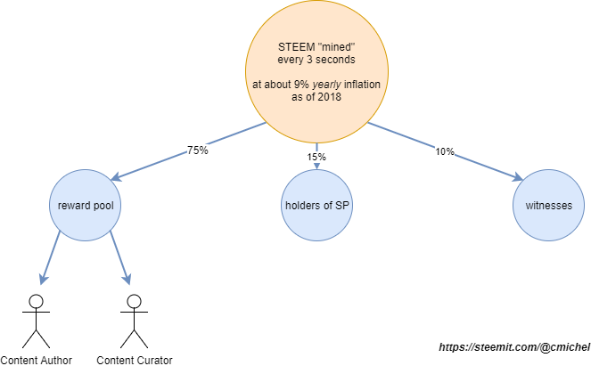
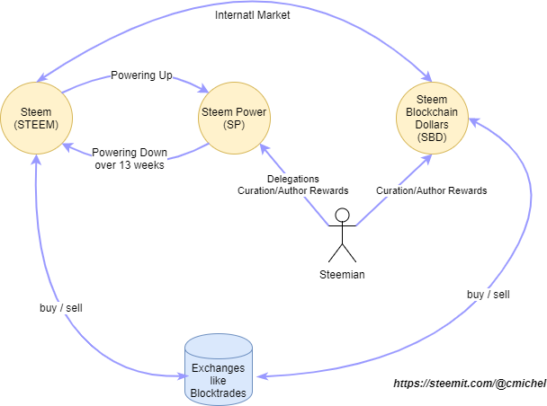
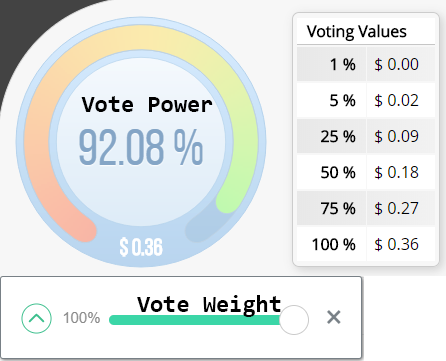
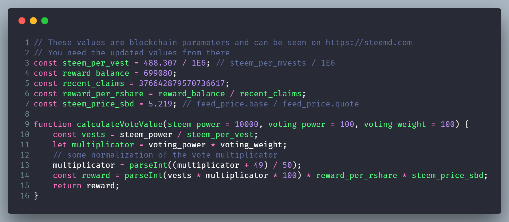

There's a lot of information about how Steem works on the surface (the [blue paper](https://steem.io/steem-bluepaper.pdf) is a nice start), but it's hard to find information if you want to dig deeper.
For example, if you google how much an upvote is worth and where that money is actually coming from, the explanations barely go beyond that it's somehow connected to the amount of Steem Power (SP) you have.
You're out of luck because there's no technical specification.

This post summarizes my findings and I hope it can clear up some things about the actual computation of rewards.

## Where does the money come from?
Like in any other blockchain, new STEEM tokens are created in a **block every 3 seconds**.

The rate at which new STEEM tokens are created started with 9.5% _per year_ in December 2016, decreasing at about 0.5% per year, until 0.95% inflation is achieved.
Right now this means about [1.668 STEEM](https://steemit.com/steem/@penguinpablo/til-how-much-steem-is-added-to-the-reward-pool-per-day) is created each _block_ (3 seconds).

These STEEM tokens are then distributed to the community (content creators, witnesses = elected block producers, curators) in a specific way:
75% goes towards the **rewards pool**, 15% to vested token holders (people holding SP), 10% to witnesses.

Intuitively, the rewards pool consists of the money that gets distributed to the people either writing posts or curating content (finding quality posts).
Whenever someone's post is upvoted he gets a small share from that reward pool.



So _how much is an upvote worth_? It's clear that it depends on the amount of STEEM tokens in the rewards pool, but it depends on a lot of other things.
We first have to look at the different currencies of the Steem blockchain:


#### Steem (STEEM)
This is the main token being traded on the exchanges.  
**Obtained through:** Exchange. Powering down SP over 13 weeks. Internal market.

#### Steem Power (SP)
Steem Power symbolizes **how much influence you have on the Steemit platform**. One SP has the same value as one STEEM, however, SP is much less liquid. You need to convert it to STEEM over 13 payments for 13 weeks.

> SP is designed to encourage long-term holding rather than short-term selling. This encourages more users to have a vested interest in the long-term success of the platform. - Steem Whitepaper

So why should you hold SP instead of STEEM if it's less liquid?
The more SP you have the more "invested" you are in the platform, and all calculations, like curation rewards or **how much an _upvote_ is worth, is solely based on your SP**. You can also counter-act the 10% STEEM inflation each year because as described earlier currently _15%_ of the mined STEEM tokens each block are distributed among the SP holders.  
**Obtained through:** Powering up STEEM. Lending (receiving delegations) from other steemians.

#### Steem Blockchain Dollars (SBD)
They are designed to be a stable currency that you can sell at any time. They're supposed to be tightly coupled to the USD, so 1 SBD = 1 USD. (This is not the case right now.)
> When a post receives a payout it takes the form of 50% SBD and 50% SP.
> Users also have the option to be paid in 100% SP, as well as decline payout on posts. When a user declines payout on a post, the money that would have been paid to them remains in the rewards pool, to be distributed to other users. - Steem Whitepaper  

**Obtained through:** Rewarded by contributing to the platform. Internal market.



So with this info, we know that the **only token that influences the payouts** from the reward pool **is Steem Power**.

## What does the payout of an upvote depend on?

### The STEEM price feed

The witnesses publish a price feed "voting" how much a STEEM token is worth. [Steem Center](https://www.steem.center/index.php?title=Steem_Witness#Price_Feed_and_Hard_Forks) describes it the following way:

> Accordingly to the @teamsteem, the price feed is used by the Steem blockchain when it calculates how many SBD it owes for its author rewards. It is also the price feed that is used to calculate the worth in $US displayed in the wallet.

> The price feed is the **median price feed of the last 3.5 days** of all the top 20 witnesses price feed. The price feed can be set manually or automatically with a piece of software called a script. Set manually it can be updated 2-3 times a day and automatically every hours or so. When set manually witnesses look at the price of Steem in sites like Coinmarketcap or elsewhere and enter **this USD price** in their witness terminal.

> Below is an example of the command line witnesses must enter to change their price feed:
> `publish_feed "teamsteem" {"base":"1.167 SBD", "quote":"1.111 STEEM"} true`
> This is reporting that STEEM is $1.167, with a 10% discount (1/.90 = 1.111) if it did "quote = 0.500 STEEM" that would be a 100% premium.

### The number of **vests** you get for your SP
Steem Power is internally converted to _vests_ when it's used for calculations.
How much SP you need for a _million vests_ is given by the global blockchain parameter `steem_per_mvests`.
You can always check the blockchain parameters (and the witnesses' price feeds) on [steemd](https://steemd.com).
This step is not that important for understanding, you're just converting SP to a different unit. 

### Vote Power and Vote Weight
With Steem, every account has a current **Vote Power** (in percentage), and every vote can be given an individual **Vote Weight** percentage again.
A vote with 100% Vote Weight reduces your Vote Power by 2%. It takes 2.4 hours to regenerate these 2% Vote Power, which results in a day to regenerate 20%.

The higher your Vote Power (and Vote Weight), the higher the payout of your vote.
So it's best to keep your Vote Power always at 100% and spread out your votes over the day if you want to maximize your upvote's value.

Your Vote Power can be seen on sites like [steemd](https://steemd.com) or [steemworld](https://steemworld.org).



### The reward pool and recent payouts

> Reward payouts are controlled by the size of the **rewards pool (`reward_balance`)** and **cumulative claims (`recent_claims`)** against the rewards pool over the past 30 days. -[@leongkhan](https://steemit.com/steemit/@leongkhan/reward-pool-analysis-why-your-rewards-are-dropping-and-when-it-may-turn-around)

The rewards pool is just the accumulated STEEM generated in each block, so there's an (almost) _constant_ steady increase of it. The _recent claims_ are intuitively the money that was payed out as author and curation rewards. Posts are paid out after 7 days, so this value can fluctuate.

(These numbers can again be seen on the right table on [steemd](https://steemd.com).)

The value of an upvote is then multiplied by this quotient `reward_balance / recent_claims`. So **the more STEEM is in the pool, the bigger the payout**. Conversely, the bigger the recent payouts, the lower your payout.

## The formula for computing the worth of an upvote
Finally, we're ready to programmatically compute the value of a Steem upvote by taking into account all of the above ideas.

Firstly, we retrieve all the blockchain parameters and the median price feed. Then, the value depends on our individual **SP, Voting Power, and Voting Weight**.



```js
// These values are blockchain parameters and can be seen on https://steemd.com
const steem_per_vest = 488.307 / 1e6; // steem_per_mvests / 1E6
const reward_balance = 699080;
const recent_claims = 376642879570736617;
const reward_per_rshare = reward_balance / recent_claims;
const steem_price_sbd = 5.219; // feed_price.base / feed_price.quote

function calculateVoteValue(
  steem_power = 10000,
  voting_power = 100,
  voting_weight = 100
) {
  const vests = steem_power / steem_per_vest;
  let multiplicator = voting_power * voting_weight;
  // some normalization of the vote multiplicator
  multiplicator = parseInt((multiplicator + 49) / 50);
  const reward =
    parseInt(vests * multiplicator * 100) * reward_per_rshare * steem_price_sbd;
  return reward;
}
```

I hope you got a better understanding now how the Steem blockchain actually works.
If you don't want to do the calculation yourself, I can recommend [steemworld](https://steemworld.org/).
It also lets you play around with different SP, VP, VW values, so you can calculate if dumping all your money into Steem is worth it. ;)

> _Note_: We've been ignoring curation rewards the whole time and focused only on **Author rewards**. All this information is accurate as of hard fork 19. Some things might change in the future.

