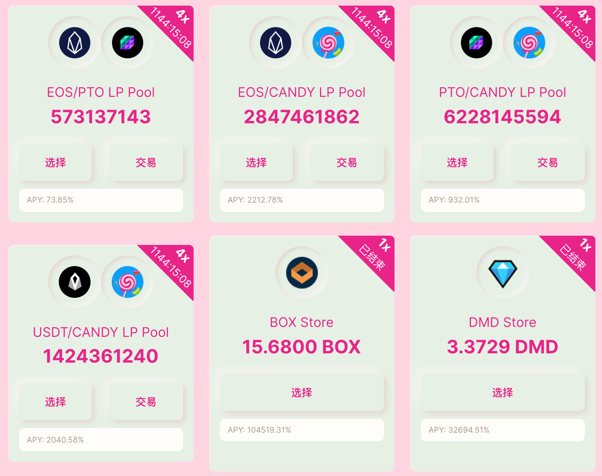

Recently, a lot of EOS "Defi yield farming projects" popped up.
I put projects in quotes because the common trait among the ones I'm talking about is that there's no working product - just a project token. Some examples:

- [dmd.finance](https://dmd.finance/) (The team behind it released a product now but it's using a different token.)
- [crl.finance](https://crl.finance/)
- [gemswap.network](http://gemswap.network/)
- [mooncake.network](http://mooncake.network/)
- [wool.finance](http://wool.finance/)
- [candy.garden](https://candy.garden/)

They all work the same way:
1. There's a project token of limited supply (call it `PROJECT`) that is paid out as a reward
2. There might or might not be a promise that future products (like Vaults) will be developed using this token
3. Receiving the project token is done by _staking_ (different) tokens to a pool. There can be several pools, each one differs in the staking token used, or in the number of project tokens that are allocated to be released for the pool. Most commonly, there's a pool for staking _EOS_, _USDT_, or a _liquidity pool token_ from [Defibox](https://defibox.io/) or [DeFis Network](http://app.defis.network/). Your share of the pool's mined tokens is proportional to _your_ staked tokens compared to the _total_ tokens staked to this pool. All in all, this results in different pools having a different **Annual Percentage Yield (APY)**.
4. The websites state an APY for each pool which is computed using the project token's **current** market price. For example, if a USDT pool generates `5 PROJECT` tokens per day, there are currently `1000 USDT` staked, and the `USDT` per `PROJECT` price is currently set at `2`, the return per day would be: `(5 * 2) / 1000 = 1%`, or annually: `1.01^365 = 3778.34%`. (Assuming the returns are reinvested.)

_Example of different pools and their APY_

## How can we exploit this?

As so often with investing, bigger returns come with more risk.
Pools that use Liquidity Pool tokens (LP tokens) - especially the ones providing liquidity for the _EOS <> PROJECT_ token pair - come with the highest APY and the most risk.
We'd like to find a way to **reduce the risk exposure** that comes with providing liquidity while still locking in the high APY.
For that, let's see how the mining actually works:
- The smart contract records the last time it paid out mining tokens
- A `harvest` mining action is periodically called by the project and computes the number of tokens that need to be released since the last mining action. New tokens to all current miners (= users that staked tokens to the pool) are paid out pro-rata. The last mining time is updated.

The interesting thing is that the `harvest` action is implemented in a bad way and only does a **spot-check**. It doesn't matter whether one staked tokens in-between mining actions, one just needs to make sure that the tokens are staked to the pool when the mining action is run.

Luckily, some project's mining actions are simply scheduled to always run at a certain time (for example, every 3 minutes at _XXmin30s_) instead of being random.
We can predict when the next mining action runs on-chain, move tokens to the pool right before it, and move out right after it.
The ideal plan would be to:

- Choose a pool with high returns that uses an LP token, let's say the LP for the EOS <> PROJECT token pair on Defibox.
- Predict when the next mining action will run
- Right before it will run: Borrow the PROJECT token from a lending platform, like [Vigor](https://vigor.ai), or [Pizza](https://pizza.live). Provide EOS <> PROJECT liquidity to Defibox and receive the LP token. Stake the LP token to the pool
- When the mining action hits, receive PROJECT tokens as the mining reward.
- Unwind your position by unstaking the LP tokens from the pool, withdrawing liquidity from Defibox, and paying back any borrowed tokens.

#### Some problems I encountered

So I wrote some scripts to test this strategy and came across some problems:

- The mining actions were not always on time and I missed some. This is a smaller issue.
- My biggest issue is that most of these project tokens are either **not listed** on lending platforms, all tokens are already borrowed, or borrowing comes with a delay and is not done in the same transaction. Therefore, I had to buy and hold onto the PROJECT tokens. (Selling and buying them every 3 minutes would have rekt me through the transaction fees.) I could still get around providing liquidity and avoid [impermanent loss](https://blog.bancor.network/beginners-guide-to-getting-rekt-by-impermanent-loss-7c9510cb2f22) for the high-risk LP pair: I barely lost EOS or PROJECT tokens while providing liquidity during the short time required for the mining action. However, I was exposed to the **price risk** for the PROJECT token the whole time this way.
That's also the reason why I ultimately ended up with a loss: These project tokens are hyperinflationary. **The only thing you can do with them is to dump them.** The only time they are bought is when someone FOMOs into buying them because they see APYs of more than 10,000%.
**You might get an expected 10% ROI per day denoted in PROJECT tokens, but the price drops by 20% a day.**

## Who profits?

The project owners obviously, otherwise, there wouldn't be so many of these projects. There are several ways I can think of for the project owners to profit:

- No funds need to be provided and they are not exposed to any risk. They create the project token but let others stake tokens and take on the risk for providing liquidity.
- Project tokens can be premined or simply issued to the team and then dumped on the users.
- The token prices of all these projects tend to go to 0 because there's no buy incentive. When the token price collapses, the project is abandoned, a new name is chosen for the next project, and the cycle repeats. This way they can extend the hype phase indefinitely until users don't fall for it anymore.
- Partnerships with Defibox. Four of these liquidity mining projects without a product [received funding from Defibox](https://support.defibox.io/hc/en-us/articles/900002945986-The-EOS-DeFi-Special-Support-Fund-DeFi-Angel-Completes-the-First-Batch-of-Funding). In addition, they also receive BOX swap + liquidity mining rewards (while not being exposed to liquidity mining risk themselves) because the LP tokens are moved to the pool contract for mining. As an example, Mooncake has received [~3,000 BOX](https://bloks.io/account/lptoken.defi?loadContract=true&tab=Tables&table=rewards&account=lptoken.defi&scope=lptoken.defi&limit=100&lower_bound=mooncakepool&upper_bound=mooncakepool) as rewards (~25,000 USD).

It's fun playing around with these projects but you really need to know what you're getting into.
I've made some easy, small profits by staking into an EOS or USDT pool (the only risk for these pools is a hack or a rug pull), but I got rekt as soon as I provided liquidity for these tokens - even while exploiting their mechanics. 😃
