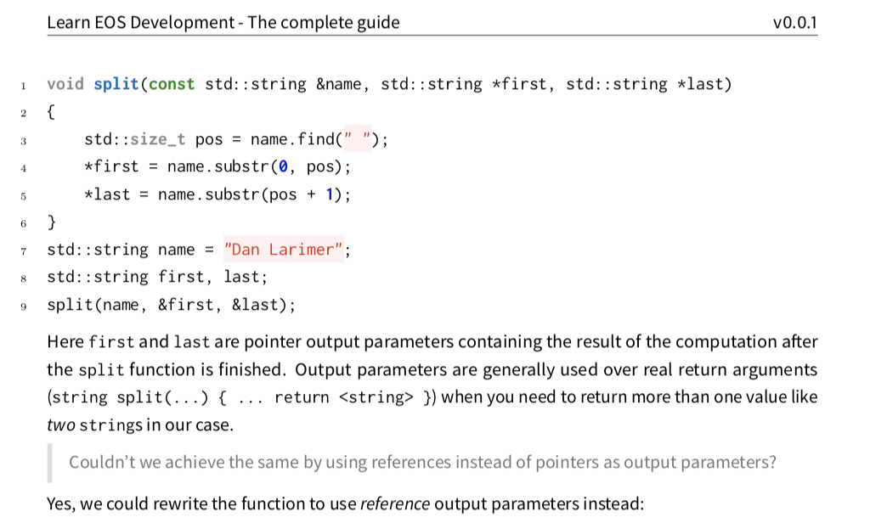
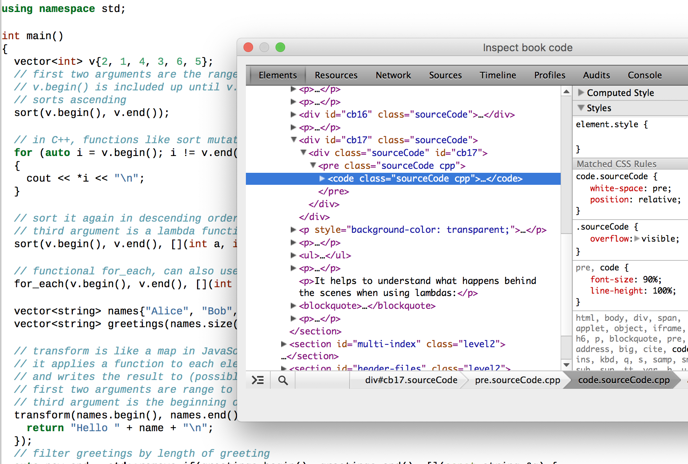
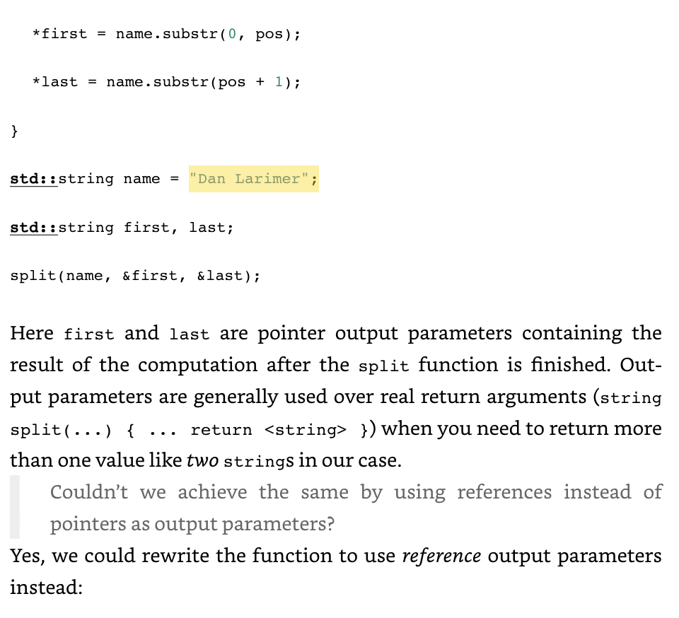
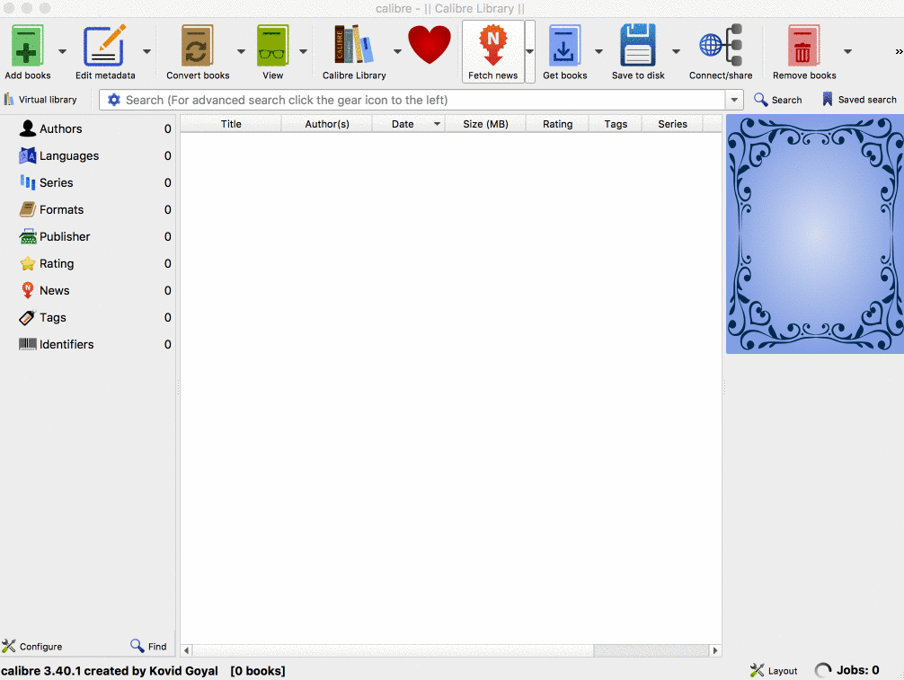
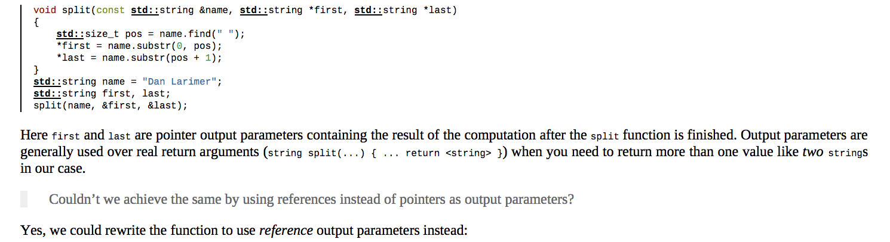

I'm currently writing a [technical ebook](https://learneos.dev) containing lots
of source code examples. While the samples look beautiful when creating the PDF
version of the ebook, I had a lot of trouble **creating a beautiful epub
version** out of my programming book.

## Setup

I'm writing the book in _Markdown_ using [pandoc](https://pandoc.org/) to create
the different ebook versions. For PDF, Markdown is converted to Latex and a PDF
version is created from the Latex files. This has the huge benefit of being able
to use a Latex template to typeset source code. For example, one can easily use
the
[listings package](http://texdoc.net/texmf-dist/doc/latex/listings/listings.pdf)
or my preferred [minted package](https://github.com/gpoore/minted) to create
beautiful source code listings in PDF.

 _Example output
when converting Markdown to Latex to PDF_

### Creating epub

#### Creating epub directly from Markdown

Pandoc also includes an option to create ebooks in the standarized **epub**
format compatible with many ebook readers. This can be done by running pandoc as
follows:

```bash
pandoc src/input1.md src/input2.md --standalone --toc -o out/book.epub --css=templates/epub.css --number-sections --top-level-division=chapter
```

The most interesting parameter is the `--css=templates/epub.css` parameter. EPUB
is basically an (X)HTML format and includes standard HTML tags like `div, blockquote, pre, code`.
Therefore, they can be styled using CSS by embedding a
CSS file in the epub output.



Many _epub.css_ files can be found online, however, most of them look really bad
when used with source code snippets. An "EPUB CSS Normalize" file can be found
in the
[CSS Boilerplate for eBooks book](http://bbebooksthailand.com/bb-CSS-boilerplate.html)
that is similar to a CSS Reset for browsers. It tries to remove the different
default behaviors of ebook readers by explicitly setting sensible defaults.
These CSS rules are then used as a base and extended with custom rules to create
a unique feel for any ebook.

```css
/* from http://bbebooksthailand.com/bb-CSS-boilerplate.html */

/* This adds margins around every page to stop ADE's line numbers from being superimposed over content  */
@page {
  margin: 10px;
}

/*===Reset code to prevent cross-reader strangeness===*/
html,
body,
div,
span,
applet,
object,
iframe,
h1,
h2,
h3,
h4,
h5,
h6,
p,
blockquote,
pre,
a,
abbr,
acronym,
address,
big,
cite,
code,
del,
dfn,
em,
img,
ins,
kbd,
q,
s,
samp,
small,
strike,
strong,
sub,
sup,
tt,
var,
b,
u,
i,
center,
fieldset,
form,
label,
legend,
table,
caption,
tbody,
tfoot,
thead,
tr,
th,
td,
article,
aside,
canvas,
details,
embed,
figure,
figcaption,
footer,
header,
hgroup,
menu,
nav,
output,
ruby,
section,
summary,
time,
mark,
audio,
video {
  margin: 0;
  padding: 0;
  border: 0;
  font-size: 100%;
  vertical-align: baseline;
}

table {
  border-collapse: collapse;
  border-spacing: 0;
}

ol,
ul,
li,
dl,
dt,
dd {
  margin: 0;
  padding: 0;
  border: 0;
  font-size: 100%;
  vertical-align: baseline;
}

/*===GENERAL PRESENTATION===*/

/*===Body Presentation and Margins===*/
/* Text alignment is still a matter of debate. Feel free to change to text-align: left; */
body {
  text-align: justify;
  line-height: 120%;
}

/*===Headings===*/
/* After page breaks, eReaders sometimes do not render margins above the content. Adjusting padding-top can help */

h1 {
  text-indent: 0;
  text-align: center;
  margin: 100px 0 0 0;
  font-size: 2em;
  font-weight: bold;
  page-break-before: always;
  line-height: 150%; /*gets squished otherwise on ADE */
}

h2 {
  text-indent: 0;
  text-align: center;
  margin: 50px 0 0 0;
  font-size: 1.5em;
  font-weight: bold;
  page-break-before: always;
  line-height: 135%; /*get squished otherwise on ADE */
}

h3 {
  text-indent: 0;
  text-align: left;
  font-size: 1.4em;
  font-weight: bold;
  margin-top: 1.4em;
}

h4 {
  text-indent: 0;
  text-align: left;
  font-size: 1.2em;
  font-weight: bold;
  margin-top: 1.2em;
}

h5 {
  text-indent: 0;
  text-align: left;
  font-size: 1.1em;
  font-weight: bold;
  margin-top: 1.1em;
}

h6 {
  text-indent: 0;
  text-align: left;
  font-size: 1em;
  font-weight: bold;
  margin-top: 1em;
}

/* Hyphen and pagination Fixer */
/* Note: Do not try on the Kindle, it does not recognize the hyphens property */
h1,
h2,
h3,
h4,
h5,
h6 {
  -webkit-hyphens: none !important;
  hyphens: none;
  page-break-after: avoid;
  page-break-inside: avoid;
}

/*===Paragraph Elements===*/
/* Margins are usually added on the top, left, and right, but not on the bottom to prevent certain eReaders not collapsing white space properly */

/*first-line indent paragraph for fiction*/
p {
  /* text-indent: 1.25em; */
  margin: 0;
  widows: 2;
  orphans: 2;
}

/* block type paragraph for non-fiction* /
/*
p
{
text-indent: 0;
margin: 1.0em 0 0 0;
widows: 2;
orphans: 2;
}
*/

/* for centered text and wrappers on images */
p.centered {
  text-indent: 0;
  margin: 1em 0 0 0;
  text-align: center;
}

/* section Breaks (can use centered-style for non-fiction) */
p.centeredbreak {
  text-indent: 0;
  margin: 1em 0 1em 0;
  text-align: center;
}

/* First sentence in chapters following heading */
p.texttop {
  margin: 1.5em 0 0 0;
  text-indent: 0;
}

/* Use for second sentence to clear drop cap's float */
p.clearit {
  clear: both;
}

/* 1st level TOC */
p.toctext {
  margin: 0 0 0 1.5em;
  text-indent: 0;
}

/* 2nd level TOC */
p.toctext2 {
  margin: 0 0 0 2.5em;
  text-indent: 0;
}

/*==LISTS==*/
ul {
  margin: 1em 0 0 2em;
  text-align: left;
}

ol {
  margin: 1em 0 0 2em;
  text-align: left;
}

/*===IN-LINE STYLES===*/
/* Recommend avoiding use of <b>, <i>, and <u>. Use span tags instead */
span.i {
  font-style: italic;
}

span.b {
  font-weight: bold;
}

span.u {
  text-decoration: underline;
}

span.st {
  text-decoration: line-through;
}

/*==in-line combinations==*/
/* Using something like <span class="i b">... may seem okay, but it causes problems on some eReaders */
span.ib {
  font-style: italic;
  font-weight: bold;
}

span.iu {
  font-style: italic;
  text-decoration: underline;
}

span.bu {
  font-weight: bold;
  text-decoration: underline;
}

span.ibu {
  font-style: italic;
  font-weight: bold;
  text-decoration: underline;
}

/* This fixes the bug where the text-align property of block-level elements is not recognized on iBooks 
 example: html markup would look like <p class="centered"><span class="ipadcenterfix">Centered Content</span></p> */

span.ipadcenterfix {
  text-align: center;
}

/*==IMAGES==*/
img {
  max-width: 100%;
}

/*==TABLES==*/
table {
  margin: 1em auto;
}

tr,
th,
td {
  margin: 0;
  padding: 2px;
  border: 1px solid black;
  font-size: 100%;
  vertical-align: baseline;
}

/* Superscripted Footnote Text */
.footnote {
  vertical-align: super;
  font-size: 0.75em;
  text-decoration: none;
}

/*==DROP CAPS==*/
span.dropcap {
  font-size: 300%;
  font-weight: bold;
  height: 1em;
  float: left;
  margin: 0.3em 0.125em -0.4em 0.1em;
}

/*==PULL QUOTE==*/
div.pullquote {
  margin: 2em 2em 0 2em;
  text-align: left;
}

div.pullquote p {
  font-weight: bold;
  font-style: italic;
}

div.pullquote hr {
  width: 100%;
  margin: 0;
  height: 3px;
  color: #2e8de0;
  background-color: #2e8de0;
  border: 0;
}

/*==BLOCK QUOTE==*/
div.blockquote {
  margin: 1em 1.5em 0 1.5em;
  text-align: left;
  font-size: 0.9em;
}

/*==eBook Specific Formatting Below Here==*/
body {
  padding: 1em;
}

pre,
code {
  font-size: 90%;
  line-height: 100%;
}

pre {
  border-left: 1px #000 solid;
  padding-left: 10px;
}

blockquote {
  color: #666666;
  margin: 1em 0;
  padding-left: 1.5em;
  border-left: 0.5em #eee solid;
}

p {
  margin: 1em 0;
}

/* used for strings in code when using HTML */
span.st {
  text-decoration: initial;
}
```

For example, I decreased the font-size for code blocks a bit and rendered a
black border on the side. Similar adjustments are done to the blockquotes.

The example is still underwhelming. It looks like creating the epub from pandoc
does not really respect the margins and line-heights. I also noticed that **the
syntax highlighting is broken on some e-readers** and a horizontal scrollbar is
shown when code lines overflow.

 _Example output when converting
Markdown to epub_

#### Creating epub by creating an intermediate HTML version

The best results for creating beautiful epub versions with source code samples
are achieved by converting the Markdown files to HTML first.

```bash
pandoc src/input1.md src/input2.md --self-contained --toc -o out/book.html --number-sections --top-level-division=chapter
```

The intermediate HTML format is then converted to epub using
[Calibre](https://calibre-ebook.com/). In Calibre one selects the HTML book
file, adds a cover image and pastes the epub CSS contents into the _Styling_
text area.



The final epub version looks a lot better than the previous one:

 _Example output when
converting Markdown to HTML to epub_

> Make sure you don't have any broken links in your Table of Contents.
> Otherwise, Kindle cannot convert your epub to its mobi format. This can be
> manually checked by selecting the "Manually fine-tune the ToC after
> converting" option in Calibre's Table of Contents tab.

Calibre comes with the
[ebook-convert commandline tool](https://manual.calibre-ebook.com/generated/en/cli-index.html)
which we can use to automate this process:

```bash
/Applications/calibre.app/Contents/console.app/Contents/MacOS/ebook-convert out/book.html out/book.epub --extra-css templates/epub.css --cover assets/book-cover.png
```

This way we now have a nice automatic pipeline to convert Markdown files to epub through HTML. 🎉
