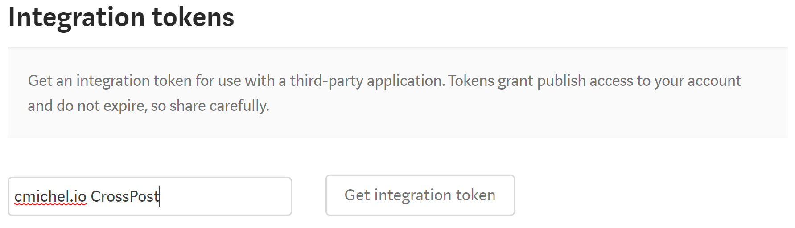

I host my blog [on my own site](/) and while this will always remain my main platform, I decided to write a _node.js script_ to cross-post my articles to [medium](https://medium.com/@cmichel). I'll show you how to cross-post **Markdown posts** to Medium using the _node_ [medium-sdk](https://www.npmjs.com/package/medium-sdk). There are several good reasons to do so. In fact, there's not a single disadvantage if you're doing it correctly.

## Why cross-post to Medium?
1. Medium already has a huge audience, which means **_new_ people will discover your content** that wouldn't have found you otherwise.
You also don't need to be afraid about Google reducing the search engine ranking of your self-hosted blog due to duplicated content because we can set the post's [canonical link](https://help.medium.com/hc/en-us/articles/217991468-SEO-and-duplicate-content), the single source of truth, in Medium to point back to the original post on our own website.
This way, there is no SEO disadvantage of having your posts on both platforms.
1. The on-site Medium Editor sucks. The _editor_ doesn't even allow you to write in Markdown directly.
Even though Medium supports Markdown (as we'll see later), there's no toggle to switch between WYSIWYG / Markdown / HTML views.
Most developers I know prefer to write in Markdown instead of inserting links/images through a toolbar.
Using the cross-posting approach, we can **write Markdown in our familiar environment** - for me, it's VS Code + gatsbyjs for live reloading.
1. Posting to Medium programmatically is **easier from a workflow perspective**.
Previously, I tried Medium's _Import Story_ feature directly on the post on my site, which often broke the formatting when reading the HTML, or to import the Markdown through tools like [markdowntomedium](markdowntomedium.com), which work well, but they pollute your GitHub account with (private) gists and set an incorrect canonical URL to the GitHub gist.
Now, with [gatsbyjs](gatsbyjs.org) or any other static site generator, my workflow looks like this:
    * Write post in Markdown
    * Push to GitHub => Netlify git-hook runs and deploys [my site](/)
    * I run my cross-post script: `npm run crosspost` which publishes the new post to Medium

If this convinced you, here's how to setup cross-posting to Medium.

## Setup
All you need is `nodejs` version 8 or higher, and a post written in Markdown. The Markdown post should have a **frontmatter** containing the **title**, **slug**, and **medium tags**,
. For instance, [this post looks like this](https://github.com/MrToph/cmichelio/blob/master/src/pages/how-to-crosspost-to-medium/how-to-crosspost-to-medium.md):

```
---
title: How to cross-post to Medium
slug: how-to-crosspost-to-medium
medium:
- programming
- javascript
- medium
---

I host my blog ...
```

### Creating credentials for the scripts
You need to set up an **app** in your [Medium account settings](https://medium.com/me/settings) and create an **integration token** to grant your script the rights to publish posts on your behalf.
#### 1. Create the app
In your Medium settings, click on **Manage Applications**, **New application** and fill in the **App details** as you please:

```
Name: Cross-Post script
Description: 
Callback URLs: http://example.com/callback/medium // We don't need this, but still it's mandatory
```

Click on save and **write down** the **Client ID** and **Client Secret** of the app you just created.

#### 2. Create an integration token
In your Medium settings, go to _Integration Tokens_, fill out the description, click on _Get Integration Token_ and write down the token.



## Cross-post Script
Here comes the fun part - we're ready to create the _node.js_ script. Let's take a look at the outline of what our script needs to do:

1. Read the Markdown file, parse it into a markdown _abstract syntax tree_ (MAST)
1. Get the _title_, _slug_, and _medium tags_ from the frontmatter.
1. Rewrite all _relative_ image and link URLs to absolute URLs prefixing our website
1. Inject custom footer backlinking to our original post
1. Use Medium API to create the post with the modified markdown post's content, correct canonical-link, and tags.

I'll go through the main ideas here, the fully functional code can be seen on [GitHub](https://github.com/MrToph/cmichelio/tree/master/scripts/publish).

### Parsing the markdown file
We will use [`remark`](https://www.npmjs.com/package/remark) with its many plugins to parse the Markdown file. `remark` works by creating a chain of plugins. This way, we start with the file's contents, and the output of each plugin is then given as the input for the next plugin in the chain. We'll use the `parse` plugin to parse the markdown file, then process the returned MAST to parse the `yaml frontmatter` node, and finally use `stringify` again to recreate markdown content out of the MAST.

```javascript
var vfile = require('to-vfile')
const frontmatterPlugin = require('remark-frontmatter')
const Remark = require(`remark`)
const parse = require('remark-parse')
const stringify = require('remark-stringify')

const transformPostFromPath = async (filePath) => {
  try {
    return new Promise((resolve, reject) => {
      new Remark()
        .data(`settings`, {
          commonmark: true,
          footnotes: true,
          pedantic: true,
        })
        // creates the MAST from markdown
        .use(parse)
        // to create a markdown yaml node in the MAST
        .use(frontmatterPlugin)
        // converts the MAST back to markdown
        .use(stringify)
        // apply it to the file
        .process(vfile.readSync(filePath), function(err, vfile) {
          if (err) return reject(err)
          const returnValue = {
            // this will be the markdown content
            content: String(vfile),
          }
          return resolve(returnValue)
        })
    })
  } catch (ex) {
    console.log(ex)
  }
}
```

We follow this pattern of putting new **custom remark plugins** into the chain for the rest of the steps we need to do.

### Getting the frontmatter
To read the frontmatter and convert it to a javascript object, we will write our first `remark` plugin.
It traverses the MAST checking for `yaml` nodes and creates a javascript object out of it.

> Remark plugins are just functions that return a `transformer` function themselves.

```js
const yaml = require('js-yaml')
const Remark = require(`remark`)
const parse = require('remark-parse')
const frontmatterPlugin = require('remark-frontmatter')
const stringify = require('remark-stringify')
const visit = require('unist-util-visit')

async function getFrontmatter(filePath) {
  let frontmatter
  function frontmatterToJs() {
    return function transformer(tree) {
      visit(tree, `yaml`, node => {
        frontmatter = yaml.load(node.value)
      })
    }
  }
  return new Promise((resolve, reject) => {
    new Remark()
      .data(`settings`, {
        commonmark: true,
        footnotes: true,
        pedantic: true,
      })
      .use(parse)
      .use(frontmatterPlugin)
      .use(frontmatterToJs)
      .process(vfile.readSync(filePath), function(err) {
        if (err) return reject(err)
        if (!frontmatter)
          return reject(new Error('No frontmatter found in markdown-AST'))
        console.log(`Found frontmatter ...`)
        return resolve(frontmatter)
      })
  })
}
```

Then our `transformPostFromPath` function can use the `frontmatter` to extract the `slug`:

```js
const url = require('url')

const transformPostFromPath = async (filePath, transformerPlugin) => {
  try {
    const frontmatter = await getFrontmatter(filePath)
    const siteUrl = `https://cmichel.io`
    const { slug } = frontmatter
    const postUrl = url.resolve(siteUrl, `/${slug}`)

    return new Promise((resolve, reject) => {
      new Remark()
        // ...
          const returnValue = {
            content: String(vfile),
            frontmatter,
            postUrl,
            siteUrl,
            slug,
          }
        // ...
    }
  }
}
```

### Resolving relative URLs to absolute URLs
Next, we need to write a plugin that transforms all relative image and link URLs to absolute URLs.
The reason is that an image hosted on our own blog, which is embedded like

```markdown

```

will not work in Medium. Therefore, we will use the `slug` to rewrite the MAST for `image`s and `link`s to have a structure like this:

```markdown

```

The plugin's code is quite simple, we use the _visitor_ pattern again to traverse the MAST and rewrite the `url` property of these nodes.

```js
const url = require('url')
const visit = require('unist-util-visit')

function urlIsRelative(url) {
  // catches http(s)://example.io but also //example.io
  const isAbsolute = new RegExp('^([a-z]+://|//)', 'i')
  return !isAbsolute.test(url)
}

function joinUrls(siteUrl, slug, relativeUrl) {
  const siteUrlWithSlug = url.resolve(siteUrl, `/${slug}`)
  return url.resolve(siteUrlWithSlug, `${relativeUrl}`)
}

function absoluteUrls(options) {
  const { siteUrl, slug } = options
  return transformer

  function replaceUrl(node) {
    if (!node.url || !urlIsRelative(node.url)) return
    const absoluteUrl = joinUrls(siteUrl, slug, node.url)
    console.log(`\tRewriting link "${node.url}" to "${absoluteUrl}" ...`)
    node.url = absoluteUrl
  }

  function transformer(tree) {
    console.log(`Rewriting image links ...`)
    visit(tree, 'image', replaceUrl)
    console.log(`Rewriting anchor links ...`)
    visit(tree, 'link', replaceUrl)
  }
}
```

```js
// use the absoluteUrl plugin
const transformPostFromPath = async (filePath, transformerPlugin) => {
  // ...
    new Remark()
      .data(`settings`, {
        commonmark: true,
        footnotes: true,
        pedantic: true,
      })
      .use(parse)
      .use(frontmatterPlugin)
      // pass the siteUrl, slug as options
      .use(absoluteUrls, {
        siteUrl,
        slug,
        postUrl,
        frontmatter,
      })
      .use(stringify)
  // ...
}
```

### Injecting the custom footer
Let's add a footer to the medium markdown post linking back to the originally published post.
We will just write a plugin which appends a `divider` and a `paragraph` to the children of the MAST.

```js
const url = require('url')

const createHorizontalRule = () => ({
  type: `thematicBreak`,
})

const createReferenceToOriginalPost = postUrl => ({
  type: `paragraph`,
  children: [
    {
      type: `text`,
      value: `Originally published at `,
    },
    {
      type: 'link',
      url: postUrl,
      children: [
        {
          type: 'text',
          value: 'cmichel.io',
        },
      ],
    },
  ],
})

const createClapImage = siteUrl => ({
  type: `image`,
  title: null,
  alt: 'Medium Clap',
  url: url.resolve(siteUrl, '/images/medium_clap.gif'),
})

function appendFooter(options) {
  const { siteUrl, postUrl } = options
  return transformer

  function transformer(tree) {
    tree.children = [
      ...tree.children,
      createHorizontalRule(),
      createReferenceToOriginalPost(postUrl),
      createClapImage(siteUrl),
    ]
  }
}

// use the plugin like this:
.use(appendFooter, {
  siteUrl,
  slug,
  postUrl,
  frontmatter,
})
```

### Using medium-sdk to publish the transformed post
Now we just need to call the `transformPostFromPath` function which sequentially executes all of our `remark` plugins, and returns the new post as _markdown_ along with the `frontmatter`.

```js
const transformedPost = await transformPostFromPath(path)
const response = await client.createPost(transformedPost)
```

The **medium client** implementation looks like this:
```js
require('dotenv').config()
const medium = require('medium-sdk')

const mediumClient = new medium.MediumClient({
  clientId: process.env.MEDIUM_CLIENT_ID,
  clientSecret: process.env.MEDIUM_CLIENT_SECRET,
})

mediumClient.setAccessToken(process.env.MEDIUM_ACCESS_TOKEN)

const client = {
  createPost({ content, frontmatter, postUrl }) {
    return new Promise((resolve, reject) => {
      mediumClient.getUser(function(err, user) {
        mediumClient.createPost(
          {
            userId: user.id,
            // markdown post
            content,
            title: frontmatter.title,
            canonicalUrl: postUrl,
            // tags for medium read out of frontmatter
            tags: frontmatter.medium,
            // format is Markdown
            contentFormat: medium.PostContentFormat.MARKDOWN,
            publishStatus: medium.PostPublishStatus.DRAFT,
          },
          function(err, post) {
            if (err) return reject(err)
            return resolve(post)
          }
        )
      })
    })
  },
}

module.exports = client
```

You need to set the correct credentials mentioned in the setup section in a `.env` file.

Again, the complete working code can be seen on [GitHub](https://github.com/MrToph/cmichelio/tree/master/scripts/publish).
After calling this function you should have a new story in your Medium account as a draft. 🎉

### Enhancements
Writing these auto-post-generator scripts is addicting. Here are some more things you could do:
* Write a remark-plugin that replaces `code` nodes with a Codepen / GitHub gist to enable syntax highlighting in Medium.
* Add a signature / an image to the footer promoting your products.
* Cross-post to other platforms. The next post will be on cross-posting to [steemit](https://steemit.com/@cmichel).
