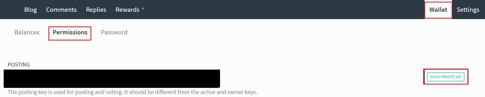

[Last time](/how-to-crosspost-to-medium) I explained how I cross-post [my blog](/) to Medium.
This time I'll write a similar _node.js script_ to cross-post articles to the [steem blockchain](https://steemit.com/@cmichel).

> _Steem is a blockchain-based rewards platform for publishers to monetize content and grow community._ - [steem.io](https://steem.io)

## Why cross-post to Steem?
1. While Steem is not as big as Medium yet, especially the dev community, you will still reach people that previously would never have found your blog. As a platform, I'm sure it will only grow in the next years because it has some nice innovative features.
1. Your posts are stored on the blockchain. This means your **posts cannot be deleted or censored by anyone** - they'll always be there. If your blog (or Medium) is offline for some reason, or gets hacked and the content deleted, nobody can find your content anymore and you better have a backup of your old posts. The blockchain is decentralized. If [steemit](https://steemit.com) is down, you just use any of the [other](https://busy.org/) [interfaces](https://stage.steemiz.io/) to the steem blockchain.  
However, unlike in Medium, you cannot set a [canonical link](https://help.medium.com/hc/en-us/articles/217991468-SEO-and-duplicate-content) that points to your original blog post, meaning the duplicated content on all of these sites might potentially hurt your SEO ranking. Though the effects of this have yet to be seen.
1. You don't just get more visibility when people upvote your posts, you can actually [**earn money**](https://medium.com/chain-cloud-company-blog/platforms-pt-2-there-is-no-free-money-on-steemit-and-golos-40152d418723) in doing so.
1. You can **write Markdown in your familiar environment** - for me, it's VS Code + gatsbyjs for live reloading. Posting it to steem is then no effort with the script.

If this convinced you, here's how to setup cross-posting to Steem.

## Setup
All you need is `nodejs` version 8 or higher, and a post written in Markdown. The Markdown post should have a **frontmatter** containing the **title**, **slug**, and **steem tags**.
For instance, [this post looks like this](https://github.com/MrToph/cmichelio/blob/master/src/pages/how-to-crosspost-to-medium/how-to-crosspost-to-steem.md):

```
---
title: How to cross-post to Steem
slug: how-to-crosspost-to-steem
steem:
- steemdev
- programming
- javascript
- technology
- steem
---

Last time I explained how ...
```

### Creating credentials for the scripts
You will need a [steem account](https://steemit.com) and your account's _posting key_.

On steemit, click on your profile, go to _Wallet_, then _Permissions_, click on **Show Private Key** and take note of your _Posting Private Key_.



## Cross-post Script
A lot of the ideas and code from the [medium crosspost script](/how-to-crosspost-to-medium) also apply when posting to Steem. Let's take a look at the outline of what our script needs to do:

1. Read the Markdown file, parse it into a markdown _abstract syntax tree_ (MAST)
1. Get the _title_, _slug_, and _steem tags_ from the frontmatter.
1. Rewrite all _relative_ image and link URLs to absolute URLs prefixing our website
1. Inject custom footer backlinking to our original post
1. Gather additional data that needs to be saved in the blockchain
1. Use Steem API to create the post with the modified markdown post's content, the additional data, and tags.

The first four steps are exactly the same as in my [medium crosspost script](/how-to-crosspost-to-medium), so I suggest first reading that post if you haven't yet. 

Here's a quick reminder of our main function that transforms the markdown post given by a path to the modified markdown. We're using [`remark`](https://www.npmjs.com/package/remark) and its plugin system.

```js
const transformPostFromPath = async (filePath) => {
  try {
    const frontmatter = await getFrontmatter(filePath)
    const siteUrl = `https://cmichel.io`
    const { slug } = frontmatter
    const postUrl = url.resolve(siteUrl, `/${slug}`)

    return new Promise((resolve, reject) => {
      new Remark()
        .data(`settings`, {
          commonmark: true,
          footnotes: true,
          pedantic: true,
        })
        // parse markdown to MAST
        .use(parse)
        // creates a `yaml` node in MAST
        .use(frontmatterPlugin)
        // resolves relative URLs to absolute ones
        .use(absoluteUrls, {
          siteUrl,
          slug,
          postUrl,
          frontmatter,
        })
        // MAST to markdown text
        .use(stringify)
        .process(vfile.readSync(filePath), function(err, vfile) {
          if (err) return reject(err)
          const returnValue = {
            content: String(vfile),
            frontmatter,
            postUrl,
            siteUrl,
            slug,
          }
          return resolve(returnValue)
        })
    })
  } catch (ex) {
    console.log(ex)
  }
}
```

As always, the fully functional code can be seen on [GitHub](https://github.com/MrToph/cmichelio/tree/master/scripts/publish).

### Gathering additional data from the post
It's not officially documented anywhere what fields a post must contain. For that, I found it to be easiest to just look at the steem blockchain data of a post I made through [steemit](https://steemit.com) and replicate its fields.
There are several block explorers, for instance [steemdb](https://steemdb.com/test/@cmichel/progress-report-october-2017/data) lists all fields for the post.
The interesting one for us is `json_metadata` where additional metadata is stored by steemit.

```json
{
    "links": [
        "https:\/\/cmichel.io\/progress-report-september-2017",
        "https:\/\/cmichel.io\/progress-report-october-2017\/rescueTime.png",
        "https:\/\/cmichel.io\/redirects\/rescuetime",
        "https:\/\/trakt.tv\/shows\/mr-robot\/seasons\/3",
        "https:\/\/trakt.tv\/shows\/stranger-things\/seasons\/2",
        "https:\/\/trakt.tv\/shows\/curb-your-enthusiasm\/seasons\/9",
        "https:\/\/www.amazon.com\/Complete-Software-Developers-Career-Guide-ebook\/dp\/B073X6GNJ1",
        "https:\/\/cmichel.io\/progress-report-october-2017\/admob-income.png",
        "https:\/\/cmichel.io\/progress-report-october-2017\/website-traffic.png",
        "https:\/\/twitter.com\/cmichelio"
    ],
    "app": "steemit\/0.1",
    "image": [
        "https:\/\/cmichel.io\/progress-report-october-2017\/rescueTime.png",
        "https:\/\/cmichel.io\/progress-report-october-2017\/admob-income.png",
        "https:\/\/cmichel.io\/progress-report-october-2017\/website-traffic.png"
    ],
    "tags": [
        "test",
        "test2"
    ],
    "format": "markdown"
}
```

As we can see, the `format` (markdown) is saved along with its `tags` and the `app` that was used for creating the posts.
The more interesting fields are `links` and `image`. Besides the inconsistent naming, both fields save _an array_ of all link/image URLs that are in the post.

I haven't done any deeper digging on what these fields are used for in the steemit frontend, but they are probably there for a reason. 🤷 So let's just write a `remark` plugin that creates the same `json_metadata` structure and appends our footer.

```js
const visit = require('unist-util-visit')

const createHorizontalRule = () => ({
  type: `thematicBreak`,
})

const createReferenceToOriginalPost = ({ postUrl, siteUrl }) => ({
  type: `paragraph`,
  children: [
    {
      type: `text`,
      value: `Originally published at `,
    },
    {
      type: 'link',
      url: postUrl,
      children: [
        {
          type: 'text',
          value: siteUrl,
        },
      ],
    },
  ],
})

const collectUrlsFactory = () => {
  const urls = []
  const urlCollectorVisitor = node => {
    urls.push(node.url)
  }
  urlCollectorVisitor.urls = urls
  return urlCollectorVisitor
}

function transformerPlugin(options) {
  const { siteUrl, postUrl } = options
  return transformer

  function transformer(tree, vfile) {
    const imageUrlsVisitor = collectUrlsFactory()
    visit(tree, 'image', imageUrlsVisitor)
    const linkUrlsVisitor = collectUrlsFactory()
    visit(tree, 'link', linkUrlsVisitor)

    tree.children = [
      ...tree.children,
      createHorizontalRule(),
      createReferenceToOriginalPost({ postUrl, siteUrl }),
    ]
    // additional data will be passed to the publish method along with
    // stringified markdown
    // save it in the data field of vfile for later
    vfile.data.images = imageUrlsVisitor.urls
    vfile.data.links = linkUrlsVisitor.urls
  }
}
```

We then insert the plugin into our plugins chain:
```js
const transformPostFromPath = async (filePath) => {
  // ...
  return new Promise((resolve, reject) => {
    new Remark()
      // ...
      .use(transformerPlugin, {
        siteUrl,
        slug,
        postUrl,
        frontmatter,
      })
      .use(stringify)
      .process(vfile.readSync(filePath), function(err, vfile) {
        if (err) return reject(err)
        const returnValue = Object.assign(
          {
            content: String(vfile),
            frontmatter,
            postUrl,
            siteUrl,
            slug,
          },
          // merge with custom data returned by transformerPlugin
          vfile.data
        )
        return resolve(returnValue)
      })
  })
}
```

The function now returns all necessary data for publishing the post to steem.

### Using steem-api to publish the transformed post
Now we just need to call the `transformPostFromPath` function which sequentially executes all of our `remark` plugins, and returns the data.

```js
const transformedPost = await transformPostFromPath(path)
const response = await client.createPost(transformedPost)
```

The **steem client** implementation looks like this:
```js
require('dotenv').config()
const steem = require('steem')
const trim = require('lodash/trim')

const accountName = `cmichel`
const slugTransform = s => trim(s, '/').toLowerCase()

const client = {
  async createPost({ content, frontmatter, slug, images, links }) {
    const category =
      Array.isArray(frontmatter.steem) && frontmatter.steem.length > 0
        ? frontmatter.steem[0]
        : 'programming'
    // https://steemit.com/steemdev/@jfollas/write-a-steemit-web-app-part-11-posting-content
    // https://steemdb.com/test/@cmichel/progress-report-october-2017/data
    const query = {
      parent_author: '',
      // main tag
      parent_permlink: category,
      permlink: slugTransform(slug),
      json_metadata: {
        tags: frontmatter.steem,
        format: 'markdown',
        app: 'steemit/0.1',
        links,
        image: images,
      },
    }
    const result = await steem.broadcast.commentAsync(
      process.env.STEEM_POSTING_KEY,
      query.parent_author /* empty for new posts */,
      query.parent_permlink /* category */,
      accountName /* author */,
      query.permlink /* slug */,
      frontmatter.title,
      content,
      query.json_metadata
    )
    if (result.error) throw new Error(result.error)
    return result
  },
}

module.exports = client
```

You need to set the correct credentials mentioned in the setup section in a `.env` file.

We use the `steem.broadcast.commentAsync` function of [`steem`](https://www.npmjs.com/package/steem) to publish our post. The name says _comment_, but it's actually a really generic function used for all sorts of text interaction.
That's also why we need to use the indescriptive fields `parent_author`, `parent_permlink`, and `perm_link` for the main category and slug.

### Checking if a post already exists on Steem
We cannot delete (but always update) existing posts from the blockchain, so a sanity check if the post already exists would be nice.
For my posts, the slugs are the unique identifier and we use the same slugs from my blog also for the steem blockchain (stored in `permlink`). This way we can write a simple function that checks if a specific slug already exists for an account. It works by first retrieving all posts and then searching for the slug:

```js
const steem = require('steem')
const trim = require('lodash/trim')

const accountName = `cmichel`
const slugTransform = s => trim(s, '/').toLowerCase()

const client = {
  async postExists({ slug }) {
    const postSlugs = []
    // iterate over all posts
    let pagination = {
      start_permlink: undefined,
      start_author: undefined,
    }
    let result
    do {
      const query = Object.assign(
        {
          // max allowed limit
          limit: 100,
          tag: accountName,
          // no retweets, only posts by author himself
          select_authors: [accountName],
          // we don't care about the content 
          truncate_body: 1,
        },
        pagination
      )
      result = await steem.api.getDiscussionsByBlogAsync(query)
      if (result.error) throw new Error(result.error)

      postSlugs.push(...result.map(({ permlink }) => permlink))

      if (result.length > 0) {
        const lastPost = result.slice(-1).pop()
        pagination = {
          start_permlink: lastPost.permlink,
          start_author: lastPost.author,
        }
        // console.log(postSlugs.length, lastPost.permlink)
      }
    } while (result.length >= 100)

    // Set to remove doubles that come from pagination
    const postSlugsNoDuplicates = [...new Set(postSlugs)]
    console.log(
      `Found ${postSlugsNoDuplicates.length} existing posts for account "${
        accountName
      }". Checking if post already exists ...`
    )

    const slugTrimmed = slugTransform(slug)
    return postSlugsNoDuplicates.some(
      postSlug => slugTrimmed === slugTransform(postSlug)
    )
  },
}
```

Again, the complete working code can be seen on [GitHub](https://github.com/MrToph/cmichelio/tree/master/scripts/publish).

You should now be able to cross-post your blog articles to the steem blockchain by simply running a script. 🎉

### Enhancements
Sadly, syntax-highlighting for Markdown code does not work on steemit. You could write another remark-plugin that automatically replaces `code` nodes with a screenshot / Codepen / GitHub gist.