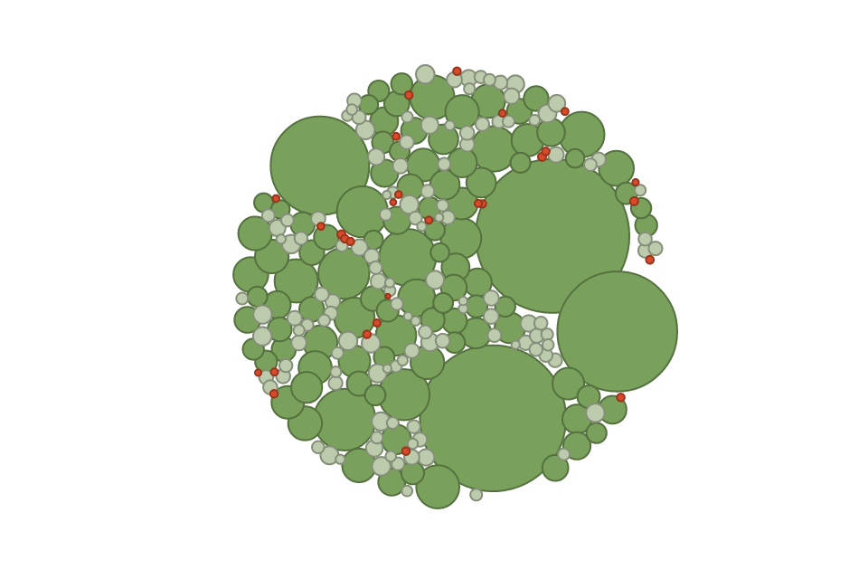

The problem with using **D3.js** with **React** is that both libraries try to take control over the rendering of the DOM. **D3.js** modifies the DOM through selections and appending + updating children, **React** through rendering elements in its `render` function whenever the component's properties or state changes. Let's take a look at these approaches and a way to combine them.

## Using React to render
React can handle rendering **svg elements** directly in JSX, so we don't need to make use of D3's rendering capabilities at all - rather, we will use it for its helper functions: [d3-scale](https://github.com/d3/d3-scale), [d3-request](https://github.com/d3/d3-request), [d3-path](https://github.com/d3/d3-path), etc. allow an easy loading, manipulation and formatting of the data. We can then create React components that take care of the rendering.

```js
d3.csv('data.csv', (err, data) => {
    if (err) {
        console.log(err)
        return
    }
    ReactDOM.render(
        <App width={960} height={640} data={data} />,
        document.getElementById('root'),
    )
})

function App({width, height, data}) {
    return (
        <svg width={width} height={height}>
            <Bubbles data={data} />
        </svg>
    )
}

function Bubbles({data}) {
    const bubbles = data.map( ({id,x,y,r}) => <Bubble key={id} x={x} y={y} r={r} />)
    return (
        <g className="bubbles">
            {
                bubbles
            }
        </g>
    )
}

function Bubble({x,y,r}) {
    return (
        <circle cx={x} cy={y} r={r} />
    )
}
```

### Pros
* Better structure of the chart
* More readable

### Cons
* No usage of `d3.transition` and other d3 functions that _directly_ modify the DOM possible.
* Animating the components' `props` and re-rendering is slower than using D3's animations, see [this comparison between React and pure D3](http://bl.ocks.org/JMStewart/f0dc27409658ab04d1c8).

## Using D3 to render
Another option is to disable React's rendering by using

```js
shouldComponentUpdate() { return false }
```

and letting D3 create the `svg elements`. We create a single React component that renders a single `svg` container, and let D3 handle creating the DOM depending on the data changes given in the `constructor(props)` and `componentWillReceiveProps(nextProps)` functions. Animations are usually triggered by external events, for example, a button click would propagate through the React component tree, call `componentWillReceiveProps` on our D3 component, which then uses D3's update selection to trigger transitions.

```js
export class App extends React.Component {
    state = {
        g: null,
    }

    onRef = (ref) => {
        this.setState({ g: d3.select(ref) }, () => this.renderBubbles(this.props.data))
    }

    renderBubbles(data) {
        const bubbles = this.state.g.selectAll('.bubble').data(data, d => d.id)

        // Exit
        bubbles.exit().remove()

        // Enter
        const bubblesE = bubbles.enter().append('circle')
            .classed('bubble', true)
            .attr('r', 0)
            .attr('cx', d => d.x)
            .attr('cy', d => d.y)

        // Update
        // ...

        // can use animations like this now
        bubblesE.transition().duration(2000).attr('r', d => d.radius)
    }

    componentWillReceiveProps(nextProps) {
        // we have to handle the DOM ourselves now
        if (nextProps.data !== this.props.data) {
            this.renderBubbles(nextProps.data)
        }
    }

    shouldComponentUpdate() { return false }

    render() {
        const { width, height } = this.props
        return (
            <svg width={width} height={height}>
                <g ref={this.onRef} className="bubbles" />
            </svg>
        )
    }
}
```

### Pros
* Can use all of D3's powers like animations with `d3.transition`

### Cons
* Less structure by putting the whole chart in one component. Tight-coupling between the individual parts can occur.
* Less readable

## The Hybrid Approach
What I like to do is to take a hybrid approach. I prefer the structure and readability that comes by using React components, but I also like using the transitions directly on the DOM elements. So what I do is I combine both approaches: **Let React render every (mostly) static component (Container, Title, Axis, Legend) and D3 everything that needs to be animated (Data Series).**
For an example implementation of this you can check out my [Bubble Chart on GitHub](https://github.com/MrToph/react-d3-bubblechart).
([Or play with it here.](http://cmichel.io/projects/react-d3-bubblechart/))



Everything except the `Bubbles` component is static and won't change, so I render these in their own React components. 
The `Bubbles` component renders and animates the circles in D3 using a [**force layout**](https://github.com/d3/d3-force).
`App.js` then looks like this:

```js
export default class App extends React.Component {
  state = {
    data: [],
    grouping: 'all',
  }

  onGroupingChanged = (newGrouping) => {
    this.setState({
      grouping: newGrouping,
    })
  }

  render() {
    const { data, grouping } = this.state
    return (
      <div className="App">
        <GroupingPicker onChanged={this.onGroupingChanged} active={grouping} />
        <BubbleChart width={width} height={height}>
          <Bubbles data={data} forceStrength={0.03} center={center} yearCenters={yearCenters} groupByYear={grouping === 'year'} />
          {
            grouping === 'year' &&
            <YearsTitles width={width} yearCenters={yearCenters} />
          }
        </BubbleChart>
      </div>
    )
  }
}
```

### Pros
* Good independent structure of the chart
* Can directly use `d3` where it makes sense (animations)

## Conclusion
There are many [great articles](http://ahmadchatha.com/writings/article1.html) that talk about how to use D3.js in React with either letting React or D3 do all the rendering.
For me, it's best to use a hybrid approach by letting React render all the _static_ parts of the chart and making use of D3's powers to handle the _dynamic_ parts of the visualization with the familiar `d3.transition`.