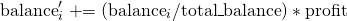
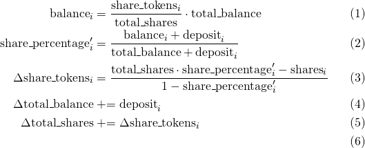

A blockchain makes it possible to distribtue ownership of a product and its funds to thousands of individuals in a verifiable way.
For example, casino dapps might crowd-source the funds required for the _house_ and in return distribute all profits back to the supporters proportional to their share in the total house funds.
Similarly, on EOSIO users can lend their CPU from staked EOS tokens to the resource exchange (REX) and earn their share everytime someone takes a CPU loan from REX.

To make this profit sharing trustless and verifiable it must be implemented in a smart contract. The challenge is that this must be done efficiently as we want to support hundreds of thousands of users. (REX on EOS mainnet currently has [21,580 REX holders](https://eosauthority.com/rex/statistics?network=eos)).

This post explains how to implement efficient dividend tokens by exploring and gradually building up on ideas.

## Storing the balance per user

The simplest way would be to just store the balance per users at each time.
Assume there are 4 users depositing 25 _TOKENS_ each.

| User | Balance | % Share |
| ---- | ------- | ------- |
| 1    | 10      | 25%     |
| 2    | 10      | 25%     |
| 3    | 10      | 25%     |
| 4    | 10      | 25%     |

If there's a profit of 20 TOKENS, it should be split in a way that each user receives the appropriate share of 5 TOKENS.

The new balance for user _i_ is computed as:

<!-- $$balance_i' \mathrel{+=} (balance_i / TOTAL_BALANCE) * PROFIT$$ -->



The updated balance looks like this:

| User | Balance | % Share |
| ---- | ------- | ------- |
| 1    | 15      | 25%     |
| 2    | 15      | 25%     |
| 3    | 15      | 25%     |
| 4    | 15      | 25%     |

This requires **iterating through all users whenever there is a profit to be shared**.
One could mitigate this by letting the profits accumulate in a pool and only periodically distribute the funds.
However, as we'll see there are better options.

A useful insight at this point is that while the absolute balances for each user change with each profit distribution, their **percentage in the total share stays constant**.
Their share as a percentage only changes when a user makes a deposit or withdrawal.

#### Requirements:

1. Requires storing the users' balances, and the total sum of balances of all users.
2. Profit distribution: Requires iterating over all users.
3. Deposit / Withdrawal: Requires only changing that user's balance and the total amount.

## Storing the percentage of total share per user

Assuming profit distributions occur more frequently than users joining / leaving the system, using the previous insight we can implement a more efficient scheme by storing each user's share percentage instead of the balance.

This improvement is useful for casinos where a profit distribution can happen with each bet.

| User | % Share | (Available Balance) (not stored) |
| ---- | ------- | -------------------------------- |
| 1    | 25%     | (10)                             |
| 2    | 25%     | (10)                             |
| 3    | 25%     | (10)                             |
| 4    | 25%     | (10)                             |

When a profit happens, we don't need to do anything because the profit is distributed proportional to each user's share anyway, meaning each user's share remains the same.
Only if you actually wanted to transfer the profit to each user you would need iterate over all users and recompute the values.
The same is true for deposits and withdrawals for users because they are in itself just transfers of funds.

#### Requirements:

1. Requires storing the users' share percentages, and the total sum of balances of all users.
2. Profit distribution: Nothing to update.
3. Deposit / Withdrawal: Requires changing the share percentage of **each user** and the total amount.

## Creating a dividend token

Both previous approaches still require iterating over all users when either distributing profits or when doing a single withdraw / deposit.
We can avoid this by introducing a **new token**.
This token represents the _share_ of funds belonging to the user - proportional to the total token supply.

With the previous example as our baseline, the initial number of share tokens each user has is just the same as the actual share percentage.

| User | Share Tokens | % Share | (Available Balance) (not stored) |
| ---- | ------------ | ------- | -------------------------------- |
| 1    | 25           | 25%     | (10)                             |
| 2    | 25           | 25%     | (10)                             |
| 3    | 25           | 25%     | (10)                             |
| 4    | 25           | 25%     | (10)                             |

`Total Balance: 100. Total Shares: 100`

As the share token just represents the share, it shouldn't change when new profits are distribtued as we have seen that each user's individual share (percentage) remains the same.
We could achieve the same with the previous approach of just storing the percentage directly, but introducing a share **token** allows us to only **update a single user upon deposits/withdraws**.
Let's assume user 4 deposists 10 more value tokens:

| User | Share Tokens | (% Share) (not stored) | (Available Balance) (not stored) |
| ---- | ------------ | ---------------------- | -------------------------------- |
| 1    | 25           | 20%                    | (10)                             |
| 2    | 25           | 20%                    | (10)                             |
| 3    | 25           | 20%                    | (10)                             |
| 4    | 50          | 40%                    | (20)                             |

`Total Balance: 50. Total Shares: 125`

The only thing that changed with a deposit is the share tokens for user 4, the share tokens for every other users did not need to be updated.
Note how the each users' share tokens divided by the total share tokens still equals their share percentage.
This fact allows us to compute the number of new share tokens that need to be issued for the user:


<!-- 
\begin{align}
\mathrm{balance}_i &= \frac{\mathrm{share\_tokens}_i}{\mathrm{total\_shares}} \cdot \mathrm{total\_balance} \\
\mathrm{share\_percentage}_i' &= \frac{\mathrm{balance}_i + \mathrm{deposit}_i}{\mathrm{total\_balance} + \mathrm{deposit}_i} \\
\Delta \mathrm{share\_tokens}_i &= \frac{\mathrm{total\_shares} \cdot \mathrm{share\_percentage}_i' - \mathrm{shares}_i}{1-\mathrm{share\_percentage}_i'} \\
\Delta \mathrm{total\_balance} &\mathrel{+}= \mathrm{deposit}_i \\
\Delta \mathrm{total\_shares} &\mathrel{+}= \Delta \mathrm{share\_tokens}_i \\
\end{align}
-->




All variables can be computed from the total token amounts and the individual share tokens of the users.

```
share_percentage' = (10 + 10) / (40 + 10) = 2/5 = 0.4
Δshare_tokens = (100 * 0.4 - 25) / (1 - 0.4) = 15 / 0.6 = 25
```

Meaning, 25 new share tokens need to be issued to user 4 in order for the share tokens to represent the new share percentage.
The same computation works for withdrawaks by considering negative deposits.

> The reason why we could save on recomputing the share percentage of all users is because introducing a new token allows to not only issue new tokens for a single user, but also adjusts the **total amount of share tokens**. (The baseline for the inflexible share "percentage" computation always had to remain at 100 and thus requried recomputation.)

Introducing the share token allows to implement very efficient distributed dividend tokens that only require updating a single user.


#### Requirements:

1. Requires storing the users' share token amounts, total share tokens, and the total sum of balances of all users.
2. Profit distribution: Nothing to update.
3. Deposit / Withdrawal: Requires changing the share percentage of **a single user** and the total amounts.


[](https://learneos.dev#modal)
