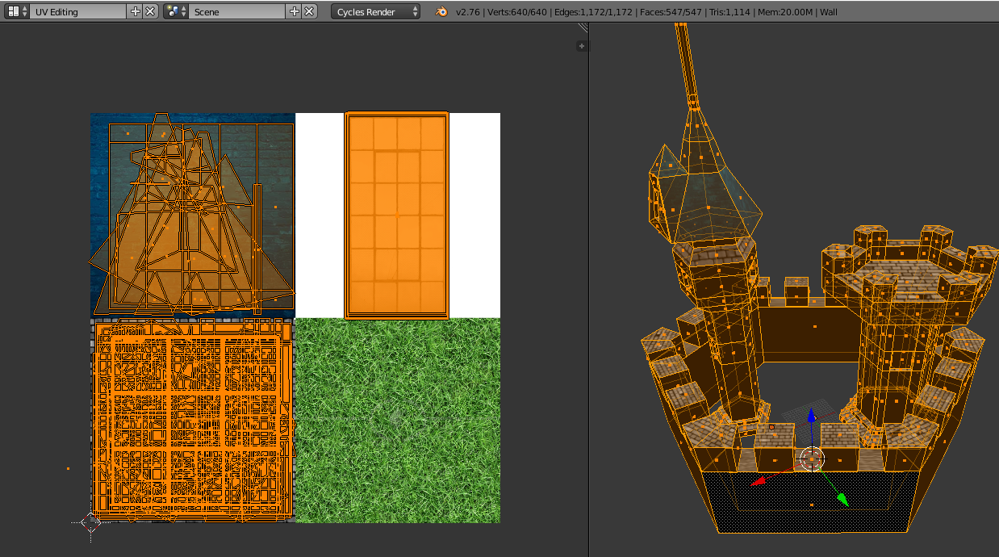
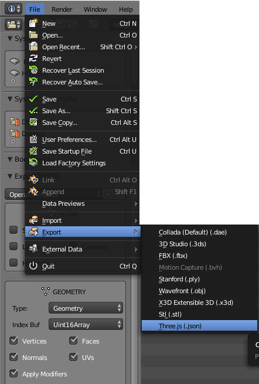
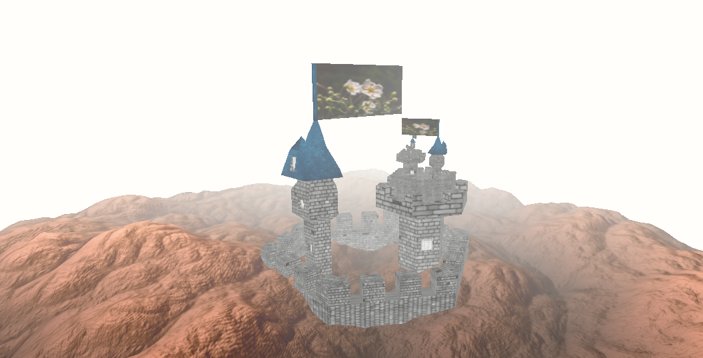

[Three.js](https://threejs.org/) is the de-facto standard when working with 3D in the browser.
It's great with creating and manipulating 3D objects, but it only ships with standard geometry (cubes, spheres, etc.), so at some point, you 'll want to import your own 3D model to Threejs.

I'll walk you through the process of exporting the model in Blender to a Threejs compatible JSON format, and importing it correctly in Threejs with its texture.

I like to bundle several models directly within Blender to a single one. So if you have a castle consisting of individual models - the outer wall, and two towers - join them into a single object. In Blender, you select all the objects and press `CTRL + J` (Join). I also like to use a single texture map that I subdivide for each previously individual model, each quadrant gets its own model. This has the benefit that we can export a single object in Blender, and thus only need to load one file for the geometry, and one file for the texture image later in Threejs.



You need to install the **Three.js Blender Export** plugin from the [Threejs GitHub repo](https://github.com/mrdoob/three.js/tree/dev/utils/exporters/blender):
Copy the `io_three` directory to your `Blender/2.7x/scripts/addons` directory, and activate the plugin in the `File -> User Preferences -> Add-ons` Dialog (search for `Three.js`).

You should now be able to select `Three (JSON)` from the `File -> Export` dialog. Make sure to export it as `Type: Geometry` and include `UVs`:



## Importing the Blender Model with Texture in Three.js
Notice that we didn't export any materials from Blender, because it's easier to create the material in Threejs.
Threejs creates a geometry out of the `JSON` file **including its UV mapping**, and a material out of the loaded image texture.
Then we combine them into a mesh.

```js
import * as THREE from 'three'

const createCastle = async scene => {
    const loader = new THREE.JSONLoader()
    const castleTexture = new THREE.TextureLoader().load(`/static/models/castle_texture.jpg`)
    const castleMaterial = new THREE.MeshBasicMaterial({ map: castleTexture })
    const castleGeometry = await new Promise(resolve => {
        loader.load(`/static/models/castle.json`, geometry => {
            resolve(geometry)
        })
    })
    const castle = new THREE.Mesh(castleGeometry, castleMaterial)
    scene.add(castle)
}
```

Adjust the scaling of your mesh to fit the scene.
```js
// in createCastle
const scale = 0.1
castle.scale.set(scale, scale, scale)
```

You should now be able to see the rendered result in the browser:

