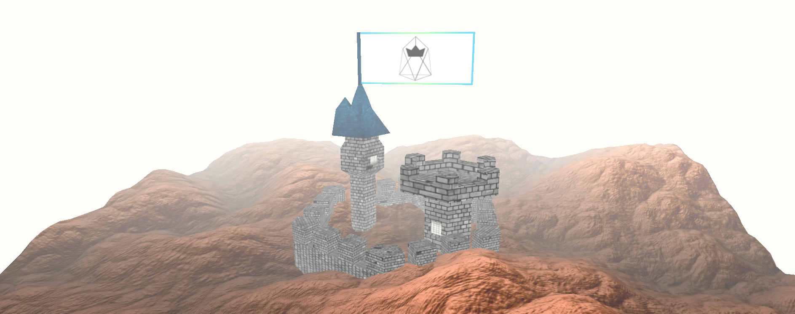

# King of EOS
[King of EOS](https://kingofeos.com) is the first **decentralized game on the** newly launched **EOS blockchain**.
All EOS accounts can battle for the throne.

As it has become the standard for cryptocurrencies, the [first game](https://kingoftheether.com) has to resemble characteristics of a pyramid scheme, and - quite bluntly - so does King of EOS. 🤴🏻
You can dethrone the current king by paying an increased throne price, and becoming king has several advantages:
* You can **promote your project/block producer** as a king by adding a description and uploading a banner picture. This is the first thing people will see when visiting [kingofeos.com](https://kingofeos.com). Like a real king, you're the owner of a 3D castle and your banner image is used as the flag of the tower.
    
* **Earn EOS**: When a new person becomes king, the higher price he paid will go to **the previous king** making the previous king a **big profit (`30%`)**. So you don't actually have to be sad when someone else claims your throne, because **you are guaranteed a profit when that happens**!

The game's rules are fully _controlled and enforced_ by its smart contract:

1. The round starts with a price of **`1.0000 EOS`** to become king. 👑
1. Becoming a king comes at a cost. You can dethrone the current king by **paying 1.35x** the price he paid for the throne. 🤴🏿
1. If you are the king and someone else claims your throne, _you_ will get the price _he_ paid. Meaning you will **make a profit of** roughly **a third of what you paid** for the throne! (There's a small commission charge.) 
1. If you stay king for **7 consecutive days**, the kingdom will be forever yours and a new kingdom (round) will start! You will be immortalized as the ruler of this kingdom on the EOS blockchain and in the **Hall of Fame**. 😎

> This means as long as anyone claims your throne within 7 days you will earn 130% of your EOS back. The hard part is estimating human greed and knowing when to stop. 🤑

# How to play?
First, you need an **EOS Account**. If you don't have one already, you can [buy one here](https://www.zeos.co/) without any fees - thanks to CryptoLions.

Next, you'll need an EOS wallet holding your private keys. I recommend [Scatter](https://get-scatter.com/) - it's a secure browser extension for Chrome and Firefox that makes it easy to interact with websites using the EOS blockchain.

> Scatter is a way to sign transactions and provide private data without exposing keys and unnecessary information while interacting with web applications communicating with the EOS & Ethereum Blockchains.

Try the [demos to become familiar with Scatter](http://www.demos.scatter-eos.com/#/). Then create an identity within Scatter, import your private key and **link your account on the EOS Mainnet**.

Setup is done. 🎉

You can now become the _King of EOS_. Navigate to [https://kingofeos.com](https://kingofeos.com) and check the current throne price.

Clicking the `Claim` button allows you to customize your kingdom. You can set a **Kingdom Name** and upload a **Flag Image**.
Then, you should unlock your Scatter, click on Claim, select your identity in Scatter and accept the transaction.
Make sure to double check the transaction's amount of EOS and the receiving account should be `eoskingofeos`. 

This is all.
Good luck! 🤞
