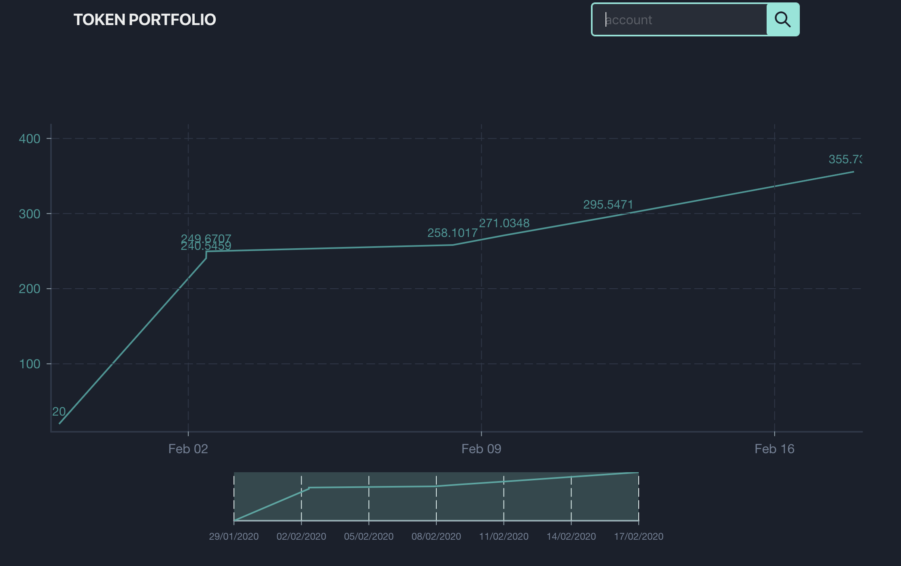
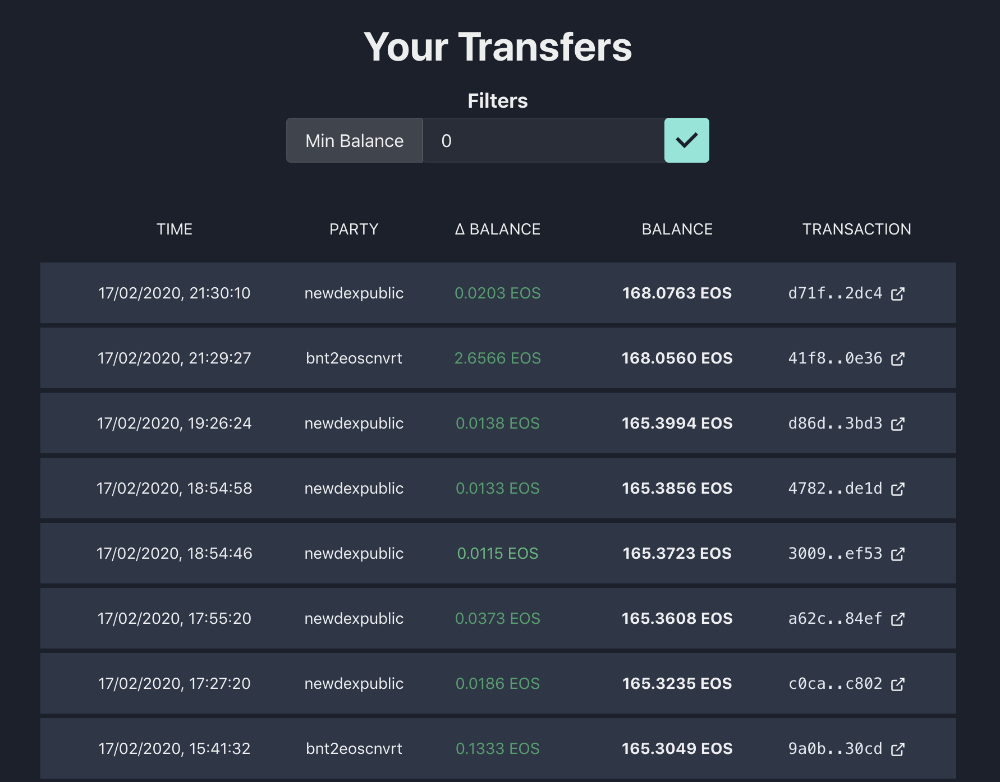

Traditional block explorers make it hard to see how your token balances evolve over time - something I always wanted to see for my own dapp accounts, but also for analyzing other accounts.
This is mainly because they show all transactions instead of only the relevant transfer actions, the filters are not working well, in addition to the pagination being very slow.
Some block explorers only show the date of the transactions on hover, and none of them show your token balances over time.

That's why I quickly built [EOS Token Portfolio](https://mrtoph.github.io/token-portfolio/) over the last week.
A website listing **all EOS transfers** on the EOS mainnet for an account and visualizing the result in a chart.

_Balance over time_

_Table listing all transfers_

It can be really useful in the following scenarios:

* Getting a list of all incoming and outgoing EOS transactions for an account, for example, for tax purposes. (Okay, I was too lazy to implement a CSV/PDF export. If someone pays me a lump sum, I 'll implement the feature. Or, if you can code you can add it yourself.)
* Analyzing how profitable trading bots are, and how my trading bot compares to them.
* Analyzing if people still fall for scams. They do. A Voice token claim scam made ~2,500.0000 EOS from about 10 victims.
* Getting a quick overview of where funds are flowing.

The code is [open-source on GitHub](https://github.com/MrToph/token-portfolio) and [the website is accessible here](https://mrtoph.github.io/token-portfolio/).

