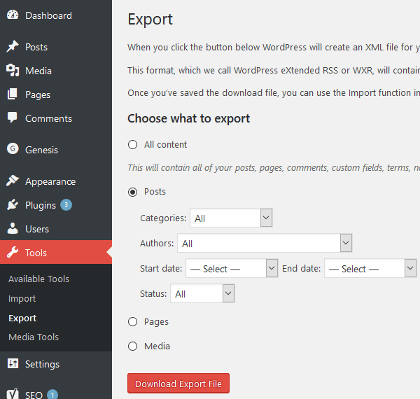

I recently decided to [move my **WordPress Blog**](http://cmichel.io/wordpress-to-static-site-generator/) to a static site generator. You can read about the reasons [here]().
I'm using [phenomic](https://phenomic.io) as my static site generator which takes _markdown posts_ and converts them to HTML and embeds them in a web page that is fully customizable with
**React components**. However, my old posts in WordPress are still written in HTML and use WordPress Plugins, and I had to **migrate them from WordPress to phenomic**.
Here's how I did it.

## Convert WordPress posts to Markdown
### Export Posts from WordPress
You don't want to do this by hand and luckily you don't have to. The first step is to **export your WordPress** posts so they can be processed by other programs. You can do that by going
to your Wordpress Dashboard and selecting `Tools - Export - Posts`. Download the xml file.



### Convert Posts to Markdown
The `.xml` file you just downloaded contains all your posts in HTML and there are several **HTML to Markdown converters**. The one I used (which was the only one that worked)
is [**Exitwp**](https://github.com/thomasf/exitwp). You 'll need __Python 2__ to run it, so if you haven't installed it, go ahead and do so. After that, you can follow
the installation instructions for Exitwp (`pip install --upgrade -r pip_requirements.txt`). Then put the `wordpress.xml` file you downloaded into the `wordpress-xml` folder.  
Running `python exitwp.py` should now convert all your posts to Markdown and create files in `build/jekyll/*domain*/_posts`.

#### Adjusting the Parser
The python parser creates **jekyll** compliant Markdown posts which are similar to **phenomic**'s post types. However, you might still want to adjust some settings to cater
to your specific posts' HTML which might depend on the WordPress plugins you used. You can define custom **RegExp** to apply in `exitwp.py` - Mine looked like this:

```yaml
body_replace: {
  #'<pre.*?lang:(\w*?)\W.*?>': '```\1\n',
  '<pre.*?>': '```javascript\n',
  '</pre>': '\n```\n',
  '<code.*?>': '`',
  '</code>': '`',
  '\[latex\]': '\(',
  '\[/latex\]': '\)',
  '\[caption[\s\S]*?\]': '',
  '\[/caption\]': '',
}
```

You can also adjust the __frontMatter__ of your posts by reading through `exitwp.py` and editing the corresponding lines. For instance, I added phenomic's route parameter so no
links are broken by phenomic, and also the `disqus_identifier` of the standard Disqus WordPress plugin so no comments will be lost.

```python
yaml_header = {
    'title': i['title'],
    'route': '/' + i['link'][len('http://cmichel.io/'):],
    'author': i['author'],
    'date': datetime.strptime(
        i['date'], '%Y-%m-%d %H:%M:%S').replace(tzinfo=UTC()),
    'slug': i['slug'],
    'disqus_identifier': i['wp_id'] + ' http://cmichel.io/?p=' + i['wp_id'],
}
```

In the end, you should have automated most parts of the posts, so the only thing you need to fix manually is some bad formatting. 
Also remember that you can always have HTML tags in your Markdown which will then simply pass through your parser and end up unchanged in your final HTML file.

## Replace Image URLs
WordPress stores its images in `wp-content/uploads/*year*/*month*` and your `` elements in your converted posts will still point to this path.
If you don't mind the chaos, you can of course leave the images there, but I wanted to link the images in a clean way to point to __phenomic's `assets`__ folder. 
So log into your FTP account, download `wp-content/uploads` and put its contents into the `content/assets` folder of phenomic. 
To link the `src` attribute of the `img` elements to this new folder I found it easiest to just search **all files** for `content/uploads` and replace the string with
`assets`. This can easily be done in a single click with a good text editor like Sublime Text, Atom, or my current favourite `Visual Studio Code`.

Run `npm start` now to check if the sites are parsed correctly by your static site generator. 
