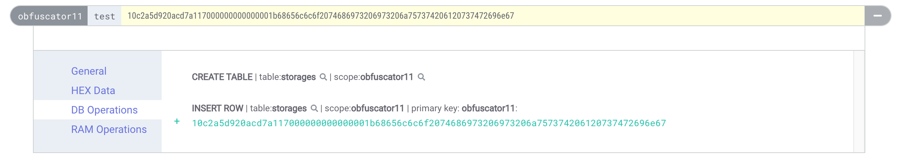
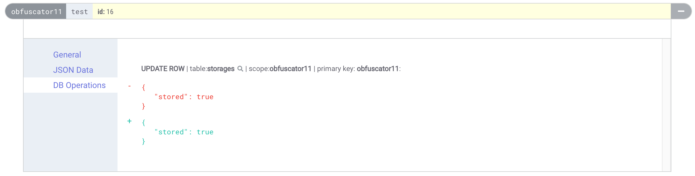

There are classes of smart contracts where one would rather not reveal how they work internally.
It's a common theme with private smart contracts that are not intended for other users, for example, trading bot smart contracts because arbitrage trading is a very competitive zero-sum game.

> In software development, [obfuscation](<https://en.wikipedia.org/wiki/Obfuscation_(software)>) is the deliberate act of creating source or machine code that is difficult for humans to understand. [Wikipedia](<https://en.wikipedia.org/wiki/Obfuscation_(software)>)

Usually, this refers to changing the source code to an unreadable mess that is hard to reverse engineer, like writing JavaScript using only [`[]()+!`](http://www.jsfuck.com/) characters.
EOSIO smart contracts are compiled to WebAssembly and stored in this format on-chain. Meaning, the obfuscation needs to happen on the WebAssembly level as well.
Remember that this only makes it _harder_ for an attacker to reverse engineer the contract but not impossible - given enough time the attacker will still succeed (["Security" by Obscurity](https://en.wikipedia.org/wiki/Security_through_obscurity)).

> We are not talking about the cryptographic area of _Indistinguishability obfuscation_ here which can transform a program into a new one that is **proven** to not reveal anything besides its input-output behaviour. This would actually allow you to include private keys in the program and to implement signature creation in a smart contract but as of 2020, it's impracticable (even outside of smart contracts).

In this first part we'll look at the simplest form of obfuscation: Changing the contract's ABI.
This is very simple to implement and already has a big effect as it shows hex values on block explorers forcing someone to dive into the WASM code to decipher action arguments and table structures.
Let's look at some approaches.

### 1. ABI with obfuscated names

This is the most common approach I've seen on-chain.
Instead of using meaningful names for the action parameters one simply names them `a`, `b`, `c` or similar.
This is also the worst obfuscation because it retains all _type information_ of action parameters and table structures.

I believe the reason why it is still so popular is that it allows easy interaction with the smart contract due to the correct ABI being on-chain and tools like `cleos`, `eosjs` or any wallets still work with this approach as they can serialize the actions.

### 2. No ABI

A different approach is to upload no ABI at all.
This results in block explorers not being able to deserialize the data, instead, showing the plain hex data - losing all type information and how many arguments an action has.
Let's test it with this example contract:

```cpp
CONTRACT obfuscate : public contract {
public:
  using contract::contract;
  obfuscate(eosio::name receiver, eosio::name code,
            eosio::datastream<const char *> ds)
      : contract(receiver, code, ds), _storages(receiver, receiver.value) {}

  TABLE storage {
    name account;
    uint64_t value;
    std::string message;

    uint64_t primary_key() const { return account.value; }
  };
  typedef eosio::multi_index<"storages"_n, storage> storage_t;

  storage_t _storages;

  ACTION test(const name &account, const uint64_t &value, const string &message) {
    auto storage = _storages.find(account.value);
    if (storage == _storages.end()) {
      _storages.emplace(get_self(), [&](auto &x) {
        x.account = account;
        x.value = value;
        x.message = message;
      });
    } else {
      _storages.modify(storage, get_self(), [&](auto &x) {
        x.value += value;
        x.message = message;
      });
    }
  }
};
```

We can now set this contract code using the `eosio::setcode` action but not upload the ABI.
Invoking the `test` action will look like this on eosq:


_Invoking an action on a contract with no ABI_

The action data and table row simply show the plain hex data which is a lot better than the previous approach. But how do we actually call the contract action without the ABI? We need to serialize the action data ourselves.
The easiest way to interact with such a contract is by using `eosjs` and defining a custom `AbiProvider`.

The AbiProvider is responsible for fetching the ABI for any contract which is then used to serialize the action data upon sending a transaction with `api.transact`.
We can write our own AbiProvider that reads our contract's ABI from the file system and tries to fetch the ABI from the chain for any other contract.

```js
import { JsonRpc, Api, Serialize } from "eosjs";
import { AbiProvider, BinaryAbi } from "eosjs/dist/eosjs-api-interfaces";
import { TextEncoder, TextDecoder } from "util";

// converts JS object ABI to serialized ABI
const jsonToRawAbi = (json) => {
  // ...
};

const privateAbis: { [key: string]: Buffer } = {};
// load obfuscator ABI from file
privateAbis[`obfuscator11`] = jsonToRawAbi(require(`./obfuscate.abi.json`));

export default class PrivateAbiProvider implements AbiProvider {
  rpc: JsonRpc;

  constructor(rpc) {
    this.rpc = rpc;
  }

  async getRawAbi(account): Promise<BinaryAbi> {
    // if we're interacting with the obfuscator contract use local ABI
    if (privateAbis[account])
      return {
        accountName: account,
        abi: privateAbis[account],
      };

    return (await this.rpc.getRawAbi(account)).abi as any;
  }
}
```

Using this custom AbiProvider in eosjs' API object is simple:

```js
const signatureProvider = new JsSignatureProvider(keys)
const customAbiProvider = new PrivateAbiProvider(rpc)
const api = new Api({
  rpc: rpc,
  signatureProvider,
  abiProvider: customAbiProvider,
  textDecoder: new TextDecoder(),
  textEncoder: new TextEncoder(),
})

// send test action
const actions = [
  {
    account: `obfuscator11`,
    name: `test`,
    data: {
      account: `obfuscator11`,
      value: 23,
      message: `hello this is just a string`,
    },
    authorization: [{ actor: `obfuscator11`, permission: `active` }],
  },
]

await api.transact(
  {
    actions,
  },
  {
    broadcast: true,
    sign: true,
    blocksBehind: 3,
    expireSeconds: 300,
  }
)
```

### 3. Fake ABI

We can go one step further with confusing anyone looking at the action in block explorers. Instead of uploading no ABI, we create a fake ABI where the action arguments and table structure types don't match the original ones.
We can write the ABI file ourselves or let `eosio-cpp` do it for us:

```cpp
CONTRACT obfuscate : public contract {
// ...

  // no TABLE anymore
  struct storage {
    // ... same as before
  };
  typedef eosio::multi_index<"storages"_n, storage> storage_t;
  storage_t _storages;

  // no ACTION anymore
  void test(const name &account, const uint64_t &value, const string &message) {
    // ... same as before
  }

  // this will just be used to create the fake ABI
  struct [[eosio::table("storages")]] fake_storage {
    bool stored;

    uint64_t primary_key() const { return 0; }
  };
  [[eosio::action("test")]] void fake_test(const uint8_t &id) {}
};

extern "C" {
void apply(uint64_t receiver, uint64_t code, uint64_t action) {
  if (code == receiver) {
    switch (action) { EOSIO_DISPATCH_HELPER(obfuscate, (test)) }
  }
  eosio_exit(0);
}
}
```

We remove the `ACTION` macro from the original action (and therefore have to implement a custom `apply` function) and create a fake ACTION with the same action name. Same for the table.
This leads to the ABI generator picking up the fake types for the correct action/table names which the block explorers will use to deserialize the data.

In our eosjs' AbiProvider we still use the correct ABI. The resulting action looks like this on eosq:



_Invoking an action on a contract with a fake ABI_

It looks like we send a `test` action with a single `uint8_t id` parameter and as if we stored a single boolean `stored`.
The remaining bytes that we used are just not deserialized and not shown at all.
It's very easy to trick someone this way unless they check the action traces and look at the actual hex data.

This already works well for protecting your contract from someone trying to make sense by looking at the actions or tables in a block explorer. 
In the next post, we'll look at obfuscating WebAssembly code.

[](https://learneos.dev#modal)
