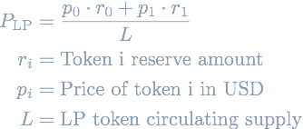
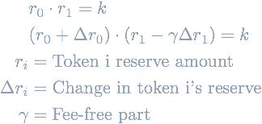
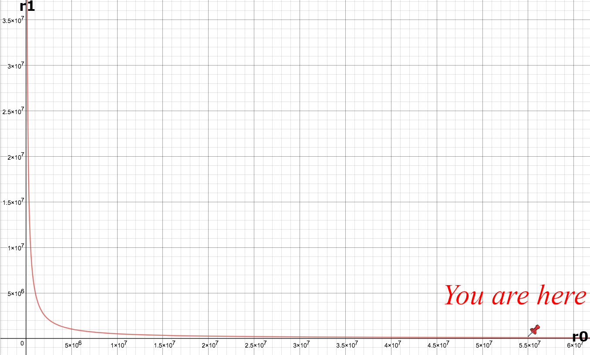
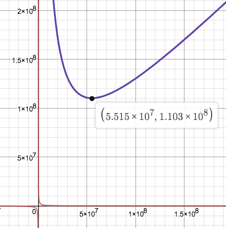
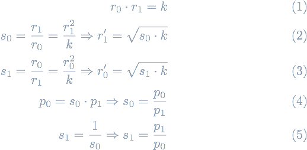
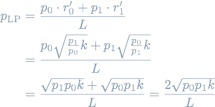

This article explores the pricing of liquidity pool (LP) tokens and discusses the recent Warp Finance hack that is closely related to it.

## Warp Finance Hack

Warp Finance is a lending platform on Ethereum allowing LP token collateral deposits and borrowing other assets against them.
Like any other lending platform, all loans must be over-collateralized, meaning, the value of the LP tokens as collateral must be higher than the loan.
Therefore, they need a way to price LP tokens.

A detailed write-up of [the hack](https://twitter.com/warpfinance/status/1339751975450267648) can be [found here](https://www.rekt.news/warp-finance-rekt/), in short, this happened:

1. Take out flash loans
2. Use ~5.8M $ to provide liquidity to the DAI <> WETH pool. Receive LP tokens
3. Swap the remainder of the flash loan in the same DAI <> WETH pool. **This changes the LP reserves and leads to Warp Finance using a wrong LP price**.
4. Use LP tokens as collateral in Warp Finance
5. Borrow ~7.8M $ dollar from Warp Finance due to higher evaluations.
6. Pay back flash loans, let Warp Finance loan go bust.

The exploit is in the pricing function of LP tokens but it's not as simple as other explanations make it out to be.
Warp Finance did indeed use [Uniswap V2's time-weighted average price data (TWAP)](https://uniswap.org/docs/v2/core-concepts/oracles/) for their calculation.
They use two TWAP oracles for the price calculation of DAI <> WETH LP tokens (one for the USDC / WETH price, and one for USDC / DAI price).
So what's really the issue here?

## Determining prices of LP tokens 

How to price LP tokens?
The first idea is that the price of an LP token can be computed by dividing the total value locked (TVL) by the total LP token supply.
The TVL itself is just the **sum of the value of the reserve assets**.
The equation is thus:

<!-- 
P_{\text{LP}} &= \frac{p_0 \cdot r_0 + p_1 \cdot r_1}{L} \\
r_i &= \text{Token i reserve amount} \\
p_i &= \text{Price of token i in USD} \\ 
L &= \text{LP token circulating supply} -->



This is indeed what Warp Finance [implemented](https://github.com/warpfinance/Warp-Contracts/blob/b25a6db4b430fb162d3b0bce1f3529c9f2761321/contracts/UniswapLPOracleFactory.sol#L154-L167):

```solidity
(uint256 reserveA, uint256 reserveB) = UniswapV2Library.getReserves(
    factory,
    instanceTracker[oracleAdds[0]],
    instanceTracker[oracleAdds[1]]
);

// TWAP p0 * r0
uint256 value0 = oracle1.consult(
    instanceTracker[oracleAdds[0]],
    reserveA
);
// TWAP p1 * r1
uint256 value1 = oracle2.consult(
    instanceTracker[oracleAdds[1]],
    reserveB
);

// ... later in _calculatePriceOfLP

uint256 totalValue = value0 + value1;
uint16 shiftAmount = supplyDecimals;
uint256 valueShifted = totalValue * uint256(10)**shiftAmount;
uint256 supplyShifted = supply;
uint256 valuePerSupply = valueShifted / supplyShifted;
```

It's not immediately clear why this is wrong, however, some [Goblin on Twitter](https://twitter.com/GriphookETH/status/1339742240684400643) says this is the root cause of the exploit. So, let's investigate and learn about the fundamentals of constant-product Uniswap AMMs. 😃

<blockquote class="twitter-tweet"><p lang="en" dir="ltr">You can&#39;t just do reserves[0]*prices[0] + reserves[1]*prices[1] when computing TVL in Uniswap LP or you will get rekted. Your code: <a href="https://t.co/GEBQ7XKEO7">https://t.co/GEBQ7XKEO7</a><br><br>Correct way is to derive ideal reserve values from K and the underlying prices. See our code: <a href="https://t.co/I6LhJn5Kq2">https://t.co/I6LhJn5Kq2</a> <a href="https://t.co/ELdFnUSp4k">https://t.co/ELdFnUSp4k</a> <a href="https://t.co/ECjjdCnhF8">pic.twitter.com/ECjjdCnhF8</a></p>&mdash; griphook.eth 🧙‍♂️👺 $ALPHA (@GriphookETH) <a href="https://twitter.com/GriphookETH/status/1339742240684400643?ref_src=twsrc%5Etfw">December 18, 2020</a></blockquote> <script async src="https://platform.twitter.com/widgets.js" charset="utf-8"></script>


## Constant-product Automated Market Makers (CP-AMMs)

[CP-AMMs](https://medium.com/bollinger-investment-group/constant-function-market-makers-defis-zero-to-one-innovation-968f77022159) with two reserve assets define the following invariant which gives them their name:

<!-- & r_0 \cdot r_1 = k \\
& (r_0 + \Delta r_0) \cdot (r_1 - \gamma \Delta r_1) = k \\
r_i &= \text{Token i reserve amount} \\
\Delta r_i &= \text{Change in token i's reserve} \\
\gamma &= \text{Fee-free part} -->




Trading any asset `Δr0` for asset `Δr1` in the pool must keep the _product_ of the reserves _constant_ (ignoring fees).
This causes AMM pools to be able to handle any amount of trade size - increasing the trade size always increases the output, albeit, one receives less and less output for each further input token.
Usually, this is called infinite liquidity, but the term is misleading because even though infinitely large trade orders are accepted, one obviously cannot receive more tokens than the finite amount of tokens in the reserve.

The [graph](https://www.desmos.com/calculator/abc2gngztt) of a CP-AMM is a hyperbola (`r1 = k / r0`). The DAI (`r0`) - WETH (`r1`) Uniswap AMM as of Dec 17th 2020 looks like this:





## The Exploit

Warp Finance's algorithm uses `r0 * p0 + r1 * p1` for the TVL computation. Even though `k` is constant, it doesn't necessarily mean the TVL stays constant.
In fact, why should it? There's no explicit `k` in the equation.
Indeed, if we [plot](https://www.desmos.com/calculator/abc2gngztt) the `TVL = r0 * p0 + r1 * p1` function we see that it has its global minimum at `r0_min = sqrt(k*p1/p0)` at around 110M $.



Moving away from this point only increases the TVL and thus the price of an LP token (TVL divided by total LP supply).
One can freely "move" to a different point on this curve because it's easy to get a multi-million dollar flash loan.
That's what the attacker did.
The flash loan was worth more than 200M $ and doing a huge swap significantly increased the TVL according to this broken computation.

### How to prevent it?

Intuitively, the issue is that even though the individual price oracles are time-weighted, the reserves are not. They are snapshots which are malleable by flash loans.
[Alpha Finance came up with the idea of _fair reserves_](https://blog.alphafinance.io/fair-lp-token-pricing/). They don't rely on the specific reserve amounts but instead derive _fair reserve_ amounts `r0'`, `r1'`.
One can think of them as **time-weighted average reserves (TWARs)** because they are fully derived from the oracle TWAPs and the `r0*r1 = k` invariant.

Let's derive the new equation for computing the price of an LP token that does not involve the reserve amounts directly.
<!-- 
\begin{align}
r_0 \cdot r_1 = k \\
 s_0 = \frac{r_1}{r_0} = \frac{r_1^2}{k} \Rightarrow r_1' = \sqrt{s_0 \cdot k} \\
 s_1 = \frac{r_0}{r_1} = \frac{r_0^2}{k} \Rightarrow r_0' = \sqrt{s_1 \cdot k} \\
p_0 = s_0 \cdot p_1 \Rightarrow s_0 = \frac{p_0}{p_1} \\
s_1 = \frac{1}{s_0} \Rightarrow s_1 = \frac{p_1}{p_0}
\end{align}
 -->




The relative spot prices `s_i`  and the CP-AMM invariant define the fair reserves `r_i'`.
For instance, the DAI <> WETH pool derives the USDC/DAI price `p0` as multiplying the WETH/DAI spot price `s0` by the USDC/WETH price `p1`.

The result is Alpha Finance's equation for pricing LP tokens:


<!-- \begin{align*}
p_{\text{LP}} &= \frac{p_0 \cdot r_0' + p_1 \cdot r_1'}{L} \\
&= \frac{ p_0 \sqrt{ \frac{p_1}{p_0} k } + p_1 \sqrt{ \frac{p_0}{p_1} k }  }{L} \\
&= \frac{ \sqrt{ p_1 p_0 k } + \sqrt{ p_0 p_1 k }  }{L} = \frac{ 2\sqrt{ p_0 p_1 k }  }{L}
\end{align*} -->





Notice how the price is now only a function of the TWAPs `p0`, `p1` and `k`. Thus, using this calculation, **swaps do not change the price of LP tokens**  and it seems like it would prevent these kinds of attacks that move along AMM curves.
However, we still didn't reason if and why this is secure when `k` changes (and with it the total LP supply `L`) **when depositing or withdrawing liquidity**. I couldn't prove this yet.

## Conclusion

Writing secure code requires in-depth knowledge of the used protocols. What seems like the obvious, canonical approach can turn out to be fatal.
Uniswap's AMM is based on a very simple model, imagine what can go wrong when building on top of more complicated lending protocols.
A big reason why we keep seeing weekly hacks in Defi is that the community does a poor job of explaining why things are exploitable.
We have seen many hacks that work by manipulating AMMs through flash loans and I don't think that this was news to the Warp Finance developers either.
It's more that there is no real understanding of _why_ the exploits work.

All incident reports gloss over details and just say it's an oracle attack, [like this one](https://peckshield.medium.com/warpfinance-incident-root-cause-analysis-581a4869ee00).
I would hardly consider this an oracle attack as the developers correctly used Uniswap TWAP oracles and did **not** use Uniswap spot prices. Using any other oracle would not have prevented this hack unless they really used an oracle for the _LP_ token instead of oracles for the LP's underlying assets.
The root issue is that, due to a lack of understanding of AMMs, the price data was incorrectly combined to compute an LP token price.
As a developer myself, I haven't learned anything about how to really prevent this attack by reading any of the public incident reports.
A tweet nudged me in the right direction but in the end, the best and only way to deeply understand something is by working through the problem yourself and trying to prove things correct mathematically.
In my opinion, we need more technical posts like this to educate developers.
This takes a lot of time but I hope it's useful.

## Resources

- [Fair Uniswap's LP Token Pricing 🦄](https://blog.alphafinance.io/fair-lp-token-pricing/)
