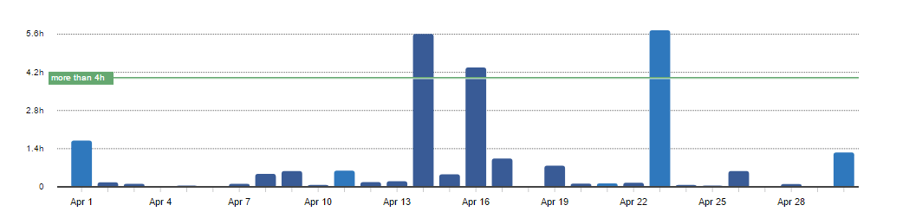
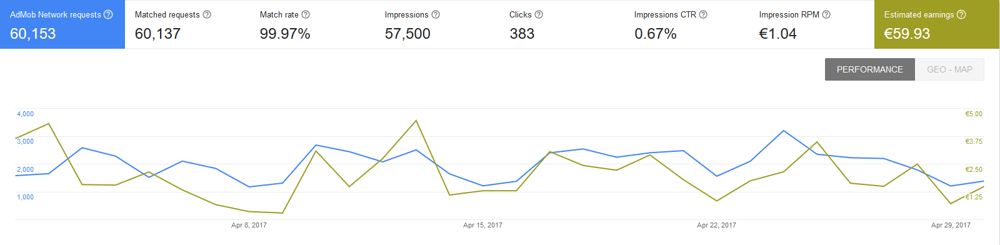
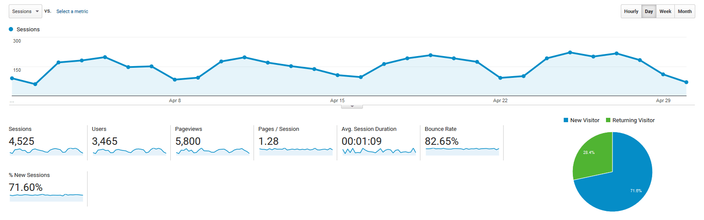

# Progress Report - April 2017
I post a progress report showing what I did and how my products performed each month.
Last month's report can be seen [here](/progress-report-march-2017).

## What did I do

I worked 25 _productive_ hours. (Tracked using [RescueTime](/redirects/rescuetime).)  
I started watching [Better Call Saul S3](http://www.imdb.com/title/tt3032476/episodes?season=3), [Fargo S3](http://www.imdb.com/title/tt2802850/episodes?season=3), [Attack On Titan S2](http://www.imdb.com/title/tt2560140/episodes?season=2).  

Didn't work much on my side projects this month. Been settling down in a new city.

## Apps
### Downloads
Downloads have been stable. In sum, my apps were downloaded **931** times this month. I received no new reviews.

However, I've received quite some feature requests for my fitness apps. One recurring request was to add a _Finish_ button that prematurely completes the workout. It's easy to implement, so I'll add it this month.

### In-App Purchases
In-app Purchases went further down this month from 7 to only 5.
I made an estimated **13.20€** (-5.49€) this way.

### Ad Revenue
Ad revenue was stable. I made **59.93€** (-0.36€) for 57500 Google AdMob banner impressions.

### Total App Income
In total, this month's app income was 73.13€ (-2.88€).

IAPs | Ads | Total
--- | --- | ---
13.20€ | 59.93€ | 73.13€

## Platform Growth
### Website
Website traffic went down this month, as I didn't write any new blog posts and got no promotions.

### Subscribers
My twitter followers went up to 149. (+7)

## What's next
I didn't try my **live coding** experiment, so I will tackle it in the new month.
I 'm still working on my new app and hope to get some blog posts out of it. I already have some topics in mind, so you should again see more activity in May here on my blog.