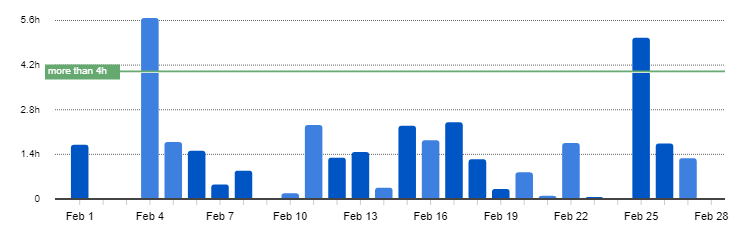
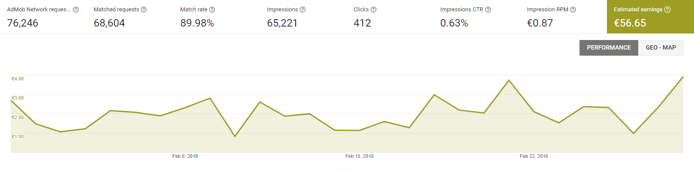

I post a progress report showing what I did and how my products performed each month.
Last month's report can be seen [here](/progress-report-march-2018).

## What did I do

I worked 64 _productive_ hours. 💪 (Tracked using [RescueTime](/redirects/rescuetime).)  
I 'm watching [Atlanta S2](https://trakt.tv/shows/atlanta/seasons/2), [Sneaky Pete S2](https://trakt.tv/shows/sneaky-pete/seasons/2), [Last Man On Earth S4](https://trakt.tv/shows/the-last-man-on-earth/seasons/4).

I read [Skin In The Game by Nassim Taleb](https://www.amazon.com/Skin-Game-Hidden-Asymmetries-Daily/dp/0241300657).

April was a good month, I was able to put in quite some productive hours. Still, I didn't finish my EOS app - it 's a lot more than I initially expected.
I'm currently working on the frontend, I hope it will be ready soon after the [DAWN 3.0](https://steemit.com/eos/@choibo21c/urgent-news-eos-dawn-3-0-complete-day-announced) public testnet release.

But back to my Android apps that I haven't updated in years 😅

## Apps
### Downloads
Total downloads of all my apps went back to **835** this month. Lost roughly 150 downloads compared to last month.

### In-App Purchases
In-app Purchases stayed at 4 orders. (+0)

I made an estimated **13.65€** (+3.41€) this way.

### Ad Revenue
My ad revenue stayed at **56.57€** (-0.08€) for 71,000 AdMob banner impressions.

### Total App Income
In total, this month's app income was 70.22€ (-0.08€).

IAPs | Ads | Total
--- | --- | ---
13.65€ | 56.57€ | 70.22€

## Platform Growth
### Website
I lost roughly 2000 sessions on my website. I wonder if this is because people switched to Medium / Steemit instead to read my blog.
I should track these stats, too.

Again, I still stuck to my bi-weekly post schedule:

1. [Thoughts on making EOS development easier](/thoughts-on-making-eos-development-easier/)
1. [Lazy-loading images with React and Semantic UI](/lazy-load-images-with-react/)

### Subscribers
My [twitter](https://twitter.com/cmichelio) followers increased by _7_ to 241.

## What's next
I'm sick of reporting my Android apps that I developed over a year ago. Time to make a new product that earns some money to showcase here.
Users of my next EOS app will actually pay with EOS, so I'm excited to see how that will work out.
