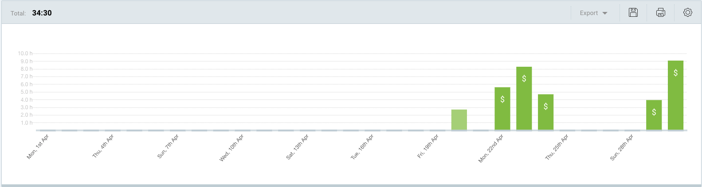
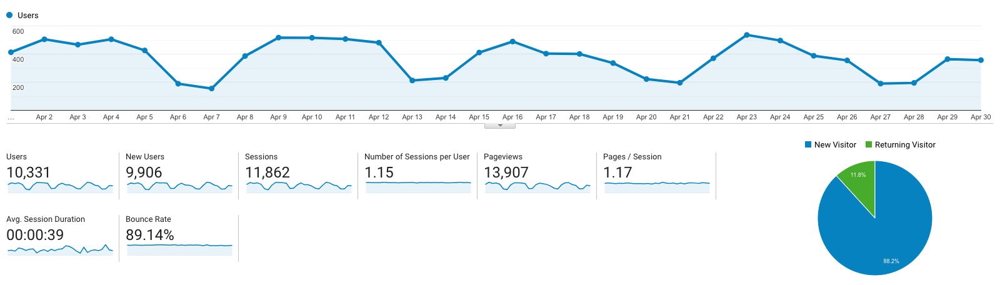

I post a progress report showing what I did and how my products performed each month.
Last month's report can be seen [here](/progress-report-march-2019).

## What did I do

I didn't accurately track my time last month as I moved to a new time tracker, Clockify, because their API is free and easier to use.

_Hours worked on **side-projects** in April_

* **Article of the Month**: [A Nihilist's Guide to Meaning](https://meltingasphalt.com/a-nihilists-guide-to-meaning/)
* **Song of the Month**: [Lil Nas X - Old Town Road](https://open.spotify.com/track/6u7jPi22kF8CTQ3rb9DHE7)
    <iframe src="https://open.spotify.com/embed/track/6u7jPi22kF8CTQ3rb9DHE7" width="300" height="80" frameborder="0" allowtransparency="true" allow="encrypted-media"></iframe>

* **TV series of the Month**: [One-Punch Man Season 2](https://trakt.tv/shows/one-punch-man/seasons/2)

### What was worked on

* I redesigned my blog as you can see. 😃
* I partnered with 5 EOS projects for my [Learn EOS Development](https://learneos.dev) book.
* Lots of business talk.

## Platform Growth

### Website

Sessions went up a bit to **11,862** on my website.

I again did **not** stick to my bi-weekly schedule of releasing a blog post.
I was sick for a good chunk of the month.
However, I could write one post about my blog redesign.

1. [Blog redesign with Gatsby and TailwindCSS](/blog-redesign-with-gatsby-and-tailwindcss/)

### Subscribers

My [twitter](https://twitter.com/cmichelio) followers increased by _26_ to **457**.

### Learn EOS Development Subscribers

I currently have **412** email subscribers for [my book](https://learneos.one). (+68 😱 in last 30 days)
I received tons of subscribers and book sales at the beginning of April, but I can already see that it slowed down drastically towards the end of the month.
Let's see how the book sales develop.
Maybe I need to do another marketing push.

## What's next

Work on [eosiac](https://github.com/MrToph/eosiac) and start one of the EOS projects I have in mind.

> `eosiac` (**EOS** **I**nfrastructure-**a**s-**c**ode) is an [Infrastructure-as-code](https://en.wikipedia.org/wiki/Infrastructure_as_code) tool to manage EOS accounts for complex dapps.
> Dapps involve many accounts that require non-trivial setup (permissions, code, tokens, RAM, CPU, NET) often in multiple environments (mainnet, testnet, dev).
> `eosiac` automates the whole process by defining these environments in a **declarative way** through [**human-readable files**](#configuration-example) that are easy to understand even for non-developers.

