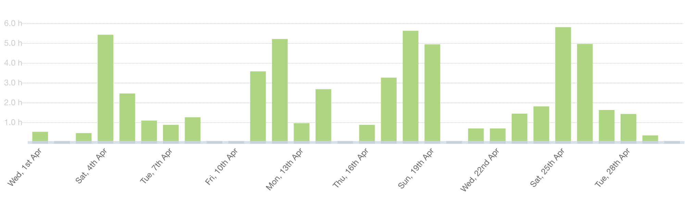
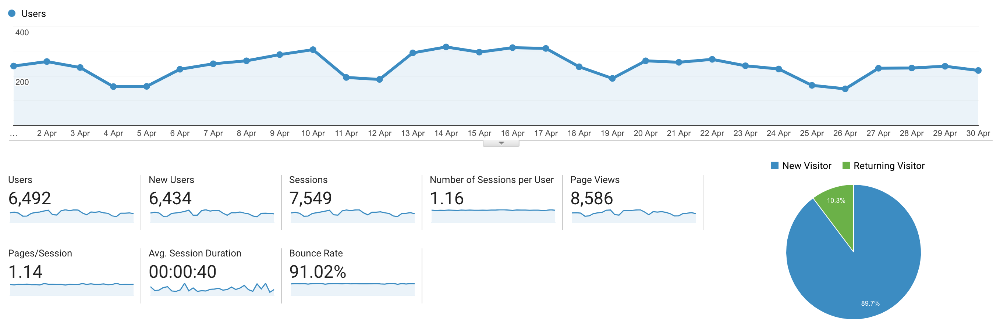

I post a progress report showing what I did and how my products performed each month.
Last month's report can be seen [here](/progress-report-march-2020).

## What did I do

_Hours worked on **side-projects** in April_

I worked **58** _productive_ on side projects hours last month.

To make these progress reports a bit more interesting, from now on I'll post my favourite song, TV show, and article I read last month.

* **Video of the Month**: [How Open Source Changed My Life with Max Stoiber](https://www.youtube.com/watch?v=ifq3xhik8tE)
* **Song of the Month**: [Lance Butters - Loner](https://open.spotify.com/track/3rahbqSvvYHaz6TdwPft6M)
    <iframe src="https://open.spotify.com/embed/track/3rahbqSvvYHaz6TdwPft6M" width="300" height="80" frameborder="0" allowtransparency="true" allow="encrypted-media"></iframe>

* **TV series of the Month**: [Dave](https://trakt.tv/shows/dave)

### What was worked on

- Personal news: I joined the great team at [EOS Titan](https://eostitan.com) to work with them on some very interesting and innovative projects. More info coming soon.
- Besides my main jobs, I mostly worked on VIGOR.
The app is fully functional now, the next steps are polishing and bug fixing to be ready for the launch. 🚀
- I didn't start a new side project.
- I've been reading more and more about [Rust](https://www.rust-lang.org/). I'd love to learn it, but I have a hard time finding a use-case that is not already covered by my Node.js skills. It's also not really there yet in terms of third-party libraries, especially regarding GUI development.

## Platform Growth

### Website

Sessions went up to **7,549** on my website.

April was a good month for my blog! I stuck to my bi-weekly schedule of releasing a blog post, I even overachieved my goals here.
It feels good to make up for the lack of posts in March.
I managed to write four blog posts.

1. [Testing EOSIO smart contracts with Hydra](/testing-eosio-smart-contracts-with-hydra/)
2. [Implementing efficient Dividend tokens](/implementing-efficient-dividend-tokens/)
3. [EOSIO C++ IntelliSense in VSCode](/eosio-c-intelli-sense-in-vs-code/)
4. [8 EOSIO WASM intrinsics you might not have heard about](/eosio-wasm-intrinsics-you-might-not-have-heard-about/)

### Subscribers

My [twitter](https://twitter.com/cmichelio) followers increased by _19_ to **592**.

## Sales

#### Learn EOS Development

I sold 5 [books](https://learneos.dev) last month.

#### Trading

I made 431 EOS last month trading crypto.
I got really lucky though, arbitrage trading has become a lot more competitive.
I need to step up my game. 👨‍💻

## What's next

As always, there are some interesting things in the pipeline that I 'm not allowed to talk about yet.
