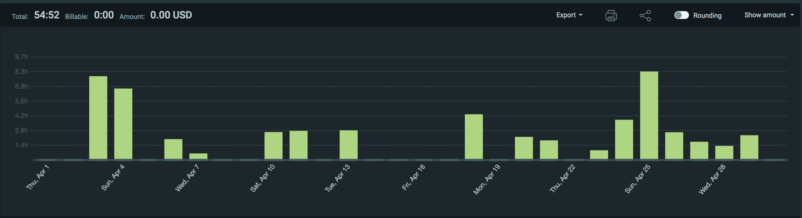
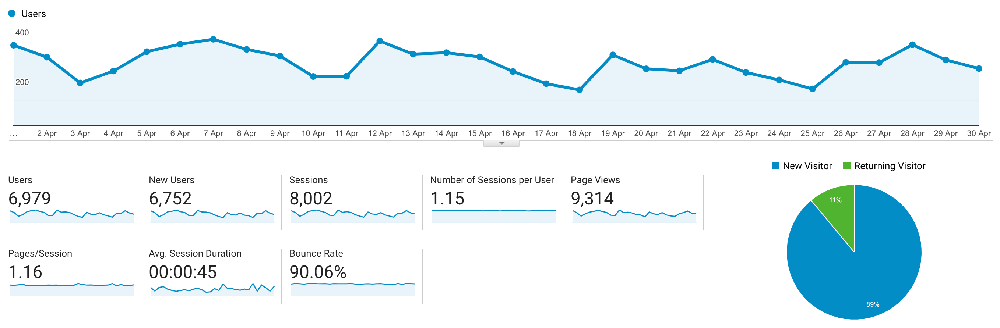

I post a progress report showing what I did and how my products performed each month.
Last month's report can be seen [here](/progress-report-march-2021).

## What did I do

_Hours worked on **side-projects** in April_

I worked **55** _productive_ on side projects hours last month.

To make these progress reports a bit more interesting, from now on I'll post my favourite song, TV show, and article I read last month.

* **Article of the Month**: [Paradigm CTF 2021 - swap](https://samczsun.com/paradigm-ctf-2021-swap/) (A type of exploit I've never seen before.)
* **Song of the Month**: [Naval Ravikant & Akira the Don - More than you value yourself](https://open.spotify.com/track/6HVV0am3W5DSVYrG9m9wVo)
    > You should be working on your product, you should be exercising and eating healthy. That's all you have time for.
    <iframe src="https://open.spotify.com/embed/track/6HVV0am3W5DSVYrG9m9wVo" width="300" height="80" frameborder="0" allowtransparency="true" allow="encrypted-media"></iframe>

* **TV series of the Month**: I watched [Hunter X Hunter](https://trakt.tv/shows/hunter-x-hunter-2011) for the first time, it's been on my to-watch list for a long time.

### What was worked on

Besides client work, I participated in _all_ C4 contests. New results of old contests are not in yet, so I can't provide an update on my current #1 spot on the [leaderboard](https://code423n4.com/leaderboard).
I got called a wizard though if that's worth something. 🧙‍♂️

## Platform Growth

### Website

Sessions went down to **8,000** on my website.

I did **not** stick to my bi-weekly schedule of releasing a blog post.
I missed all of this month's post as I spent all weekends on C4 contests. 😁 They provide a better ROI and I love the team and competing here, even though I'm usually not a competitive person at all and I could care less if I win or not.

There were some interesting hacks this month, I covered most of them on Twitter instead.

### Subscribers

My [twitter](https://twitter.com/cmichelio) followers increased by _36_ to **824**.

## Sales

#### Learn EOS Development

I sold **8 books** last month.

#### Trading

I made 52 EOS = 346.32 USD last month arbitrage-trading crypto on EOS.
I don't like the new powerup system, CPU prices have increased drastically.
This is completely passive, so I'll just keep it running while it slowly fades out.

## What's next

I'm pretty happy with how I allocated my time this month, I just hope to write a new blog post again.
