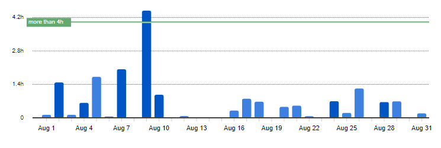
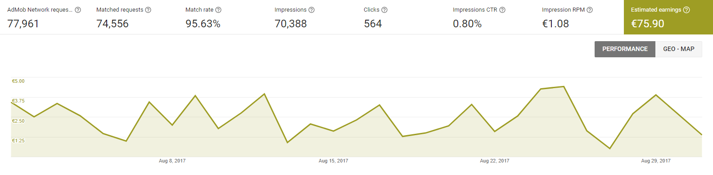
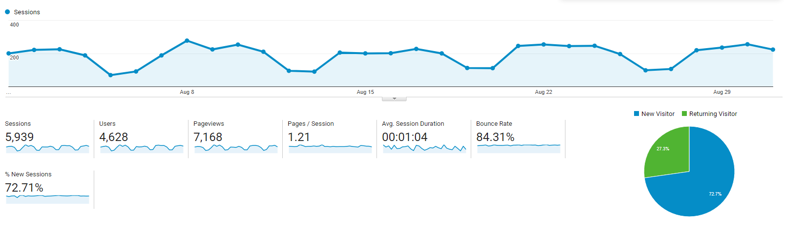

# Progress Report - August 2017
I post a progress report showing what I did and how my products performed each month.
Last month's report can be seen [here](/progress-report-july-2017).  

## What did I do

I worked 18 _productive_ hours. (Tracked using [RescueTime](/redirects/rescuetime).)  
I watched [Preacher Season 2](http://www.imdb.com/title/tt5943662/), [Rick and Morty Season 3](http://www.imdb.com/title/tt2861424/episodes?season=3).  
I read [Rework](https://www.amazon.de/Rework-Jason-Fried/dp/0307463745).  

I wrote a [headless Chrome script](https://github.com/MrToph/progress-report-headless) to scrape the web pages and create the images for these Progress Reports.
It's only a small save in time, but a huge investment in keeping my sanity.

## Apps
### Downloads
Downloads went down by 100. In sum, my apps were downloaded **918** times this month.

### In-App Purchases
In-app Purchases went down to 9 orders this month. (-5)

I made an estimated **30.80€** (-17.12€) this way.

### Ad Revenue
In contrast, ad revenue incrased for some reason. The last months I made about 60 euros, this month I made **75.90€** (+14.12€) for 70388 Google AdMob banner impressions.

### Total App Income
In total, this month's app income was 106.70€ (-3.00€).

IAPs | Ads | Total
--- | --- | ---
30.80€ | 75.90€ | 106.70€

Third month in a row where I made over 100€, I hope I can keep this up and it was not just a summer trend that declines now.

## Platform Growth
### Website
Website traffic was mostly stable again. I released no new blog posts.

### Subscribers
I lost 2 [twitter](https://twitter.com/cmichelio) followers.

<iframe src="https://giphy.com/embed/rwrfMjnhSknw4" width="480" height="203" frameBorder="0" class="giphy-embed" allowFullScreen></iframe>

## What's next
I'm doing the [serverless stack tutorial](https://serverless-stack.com) and rewriting my backend for the new app to use DynamoDB + AWS Lambda instead.
It's a really great tutorial so far, you should definitely check it out.
