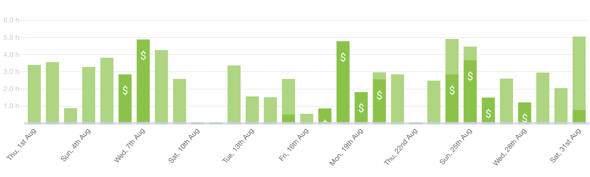
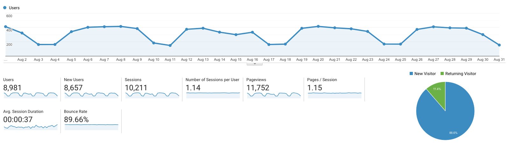

I post a progress report showing what I did and how my products performed each month.
Last month's report can be seen [here](/progress-report-july-2019).

## What did I do

_Hours worked on **side-projects** in August_

I worked **80** _productive_ hours last month.

* **Article of the Month**: [Paul Graham on Cities and Ambition](http://www.paulgraham.com/cities.html) - Really interesting as I'm travelling right now and never thought about cities in this way. Until now the determining factor for a city was always just quality of life and cost of living.
* **Song of the Month**: [Manowar - The Gods Made Heavy Metal](https://open.spotify.com/track/2wE7eJkf3IvxKwqiK3UoiO?si=1AxYUkjKT16ddyDBXYAfOg)
    <iframe src="https://open.spotify.com/embed/track/2wE7eJkf3IvxKwqiK3UoiO" width="300" height="80" frameborder="0" allowtransparency="true" allow="encrypted-media"></iframe>
* **TV series of the Month**: [The Boys](https://trakt.tv/shows/the-boys-2019)

### What was worked on

I was voted a [VIGOR stablecoin](https://www.vigorstablecoin.com/) [DAC custodian](https://vig.ai/vote-custodians) this month. 🎉
I always wanted to be part of a [DAC/DAO (decentralized autonomous corporation)](https://medium.com/universablockchain/decentralized-autonomous-organization-what-is-a-dao-company-eb99e472f23e) and learn more about stablecoins, so this was a perfect fit.
For now, I'll be leading the frontend development of the new app. Feel free to have a look - everything is [open-source](https://github.com/vigorstablecoin) and we just moved the project management to GitHub as well to make it as open and transparent as possible.

## Platform Growth

### Website

Sessions remained the same at **10,221** on my website.

I didn't write a single post this month. 😱
I had lots to do with the projects I'm working on and there was no blog post on my mind.

### Subscribers

My [twitter](https://twitter.com/cmichelio) followers _decreased_ by _1_ for the first time to **483**. Again, I'm finding the content on twitter less and less informative.

### Learn EOS Development Subscribers

I currently have **509** email subscribers for [my book](https://learneos.dev). (+26 in last 30 days)
I only sold 3 books in August.

## What's next

Nothing new is planned. It's all about working on my existing projects.
