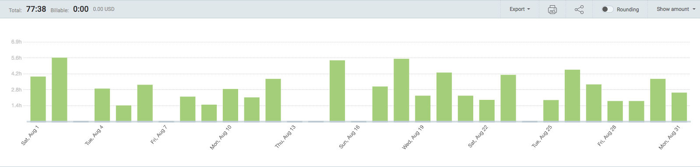
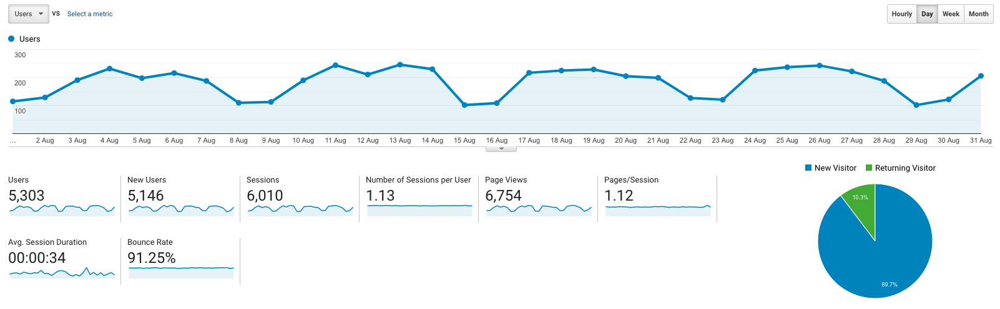

I post a progress report showing what I did and how my products performed each month.
Last month's report can be seen [here](/progress-report-july-2020).

## What did I do

_Hours worked on **side-projects** in August_

I worked **78** _productive_ on side projects hours last month.

To make these progress reports a bit more interesting, from now on I'll post my favourite song, TV show, and article I read last month.

* **Article of the Month**: [ETH Hedging back-test. Better than hodling?](https://alfablok.substack.com/p/eth-hedging-back-test-better-than)
* **Song of the Month**: [Daniel Lehmann - Echoes](https://open.spotify.com/track/4FY2a2zicJB5nfco2874Il)
    <iframe src="https://open.spotify.com/embed/track/4FY2a2zicJB5nfco2874Il" width="300" height="80" frameborder="0" allowtransparency="true" allow="encrypted-media"></iframe>

* **TV series of the Month**: [Dorohedoro](https://trakt.tv/shows/dorohedoro/seasons/all)

### What was worked on

This month I started having a life again. It was nice but I'd rather go back to having no life next month. 🙃
There are a lot of interesting ideas I want to work on and during these Corona times, the opportunity cost is low.
I'm also reading and absorbing so many related DeFi projects on EOS / ETH again, the excitement is similar to the 2017 bull run.

I changed the architecture of my on-chain EOS trading bot to make it easier to add new DEXes / AMMs.
The competition is still beating me, I only make about 1 EOS per day from arbitrage trading at the moment.
But there are a lot more improvements I want to add.

I also did another EOS first - [emojis in the ABI](https://bloks.io/transaction/bc191e8069207851eef47528a47d59733d8d5993ba0abead335a7cc593b4801c) combined with my [ABI obfuscation approach](/obfuscating-eosio-smart-contracts/).

## Platform Growth

### Website

Sessions stayed at **6,010** on my website.

I did **not** stick to my bi-weekly schedule of releasing a blog post.
I didn't write any new post at all. 😅
I had to do some research though that would warrant a blog post and I have a lot of drafts/ideas in the pipeline.

### Subscribers

My [twitter](https://twitter.com/cmichelio) followers increased by _3_ to **623**.

## Sales

#### Learn EOS Development

I sold 3 books last month.

#### Trading

I made 7 EOS last month trading crypto.

## What's next

* Improve the arbitrage bot and beat the competition.
