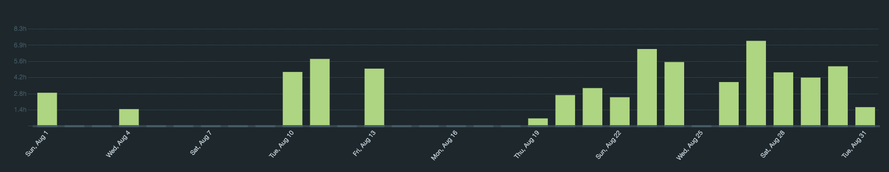
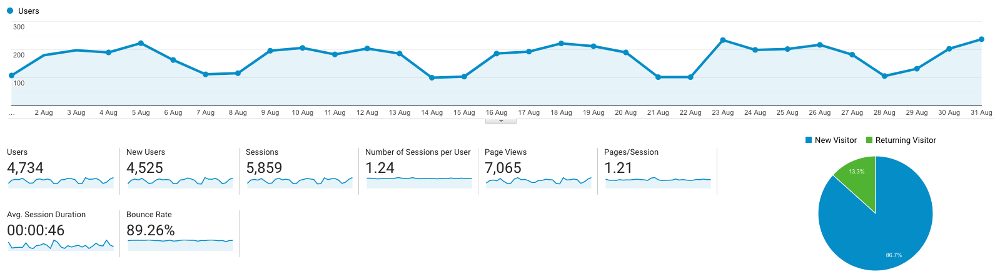

I post a progress report showing what I did and how my products performed each month.
Last month's report can be seen [here](/progress-report-july-2021).

## What did I do

_Hours worked on **side-projects** in August_

I worked **68** _productive_ on side projects hours last month.

To make these progress reports a bit more interesting, from now on I'll post my favourite song, TV show, and article I read last month.

* **Article of the Month**: [STARK 101 - Build your own STARK prover from scratch](https://starkware.co/developers-community/stark101-onlinecourse/). I haven't finished the tutorial yet but so far I'm loving it. I also highly recommend reading [this](https://vitalik.ca/general/2021/01/26/snarks.html) and [this](https://dankradfeist.de/ethereum/2020/06/16/kate-polynomial-commitments.html) if you're interested in ZK-snarks.
* **Song of the Month**: [Dopplereffekt - Die Reisen](https://open.spotify.com/track/5p0g8oO4utxbvtqyeUnQnK)
    <iframe src="https://open.spotify.com/embed/track/5p0g8oO4utxbvtqyeUnQnK" width="300" height="80" frameborder="0" allowtransparency="true" allow="encrypted-media"></iframe>
    I'm on a Gerald Donald trip again.

* **TV series of the Month**: Didn't watch anything worth mentioning.

### What was worked on

Not much to report this month as I had some personal events to attend as you can see from my "Hours worked" chart.

- Participated in all [C4](https://code423n4.com/) contests again.
- After buying my first NFT last month, I further developped my NFT addiction and minted a [MAYC](https://opensea.io/collection/mutant-ape-yacht-club). The announcement and minting was at 3AM local time, luckily I still haven't fixed my sleep schedule.

## Platform Growth

### Website

Sessions went down **5,859** on my website.

I did **not** stick to my bi-weekly schedule of releasing a blog post.
It's just not a priority at the moment as there are too many other rewarding things I'm working on.

### Subscribers

My [twitter](https://twitter.com/cmichelio) followers increased by _88_ to **1336**.

## Sales

#### Learn EOS Development

I sold 4 books last month.

#### Trading

My trading bot still somehow made ~30 EOS last month.

## What's next

I should at least write the next part of my [Replaying ETH Hacks series](/categories/replaying-eth) at some point.
