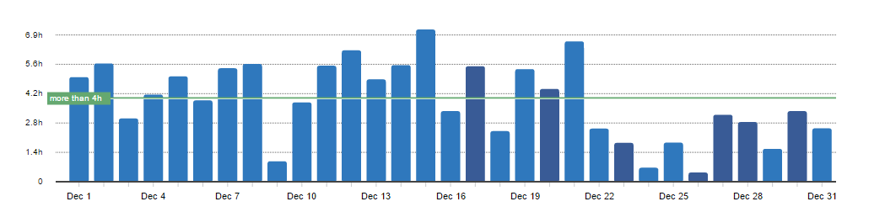
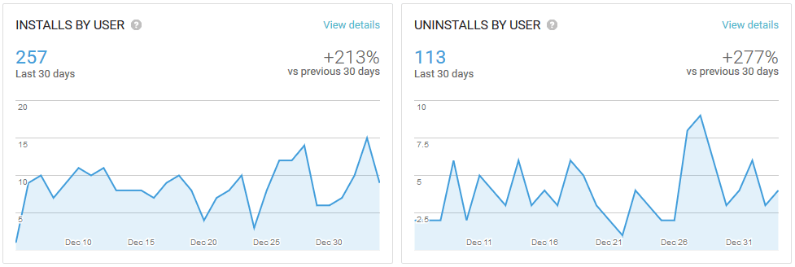
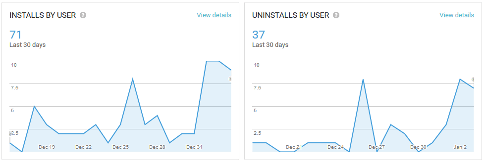
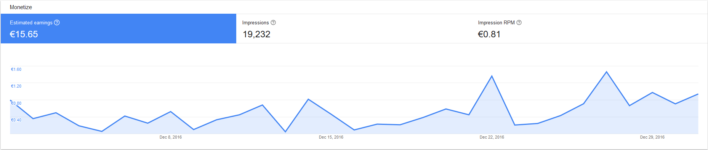
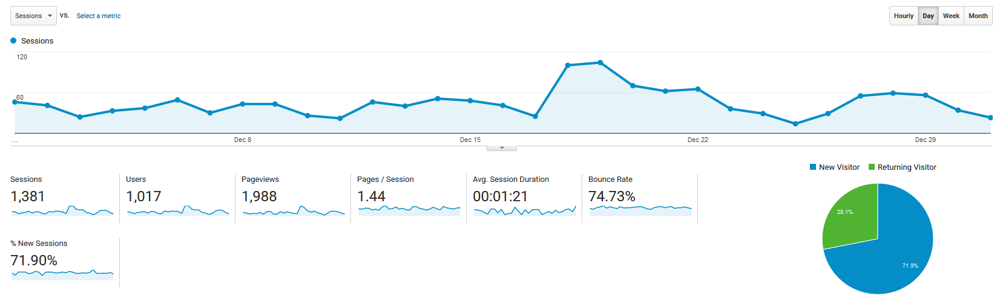

# Progress Report - December 2016
I post a progress report showing what I did and how my products performed each month.
Last month's report can be seen [here](/progress-report-november-2016).

## What did I do

I worked 121 _productive_ hours. (Tracked using [RescueTime](/redirects/rescuetime).)  
I watched [Westworld](http://www.imdb.com/title/tt0475784/).  
I read [On Writing Well](/on-writing-well/).  

In the first two weeks I released my fourth React Native app - [Motivational Alarm Clock](/released-fourth-react-native-app/).
Then Christmas slowed me down and I didn't work as much.

## Apps
### Downloads
Downloads of my fitness tracker apps went up this month. This chart is for the [PPL Workout Log](https://play.google.com/store/apps/details?id=io.cmichel.ppl):

I was afraid that the [Motivational Alarm Clock](https://play.google.com/store/apps/details?id=io.cmichel.motivation) wouldn't get any downloads at all, because there already is an app with the same name on the store. When it was released, it didn't even appear on the first row of search results for its name.
(Still, the keyword was the best choice in my opinion.)
I guess my blog post about it drove some initial traffic to it and luckily it is now discoverable for other people.
I'm curious to see how it will grow in January.

### Apps Income
App income increased to **15.65€** (+4.80€).

## Platform Growth
### Website
Website traffic stayed consistent in December:

### Subscribers
Twitter is currently at 59 followers. (+19)

## What's next
Some people left a review demanding an option to remove the Ad banners from the apps, so I 'll add an In-App Purchase to do that.
I also have some other updates to the fitness tracker apps in mind.
