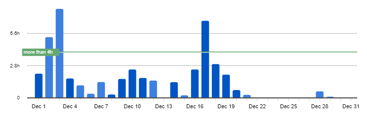
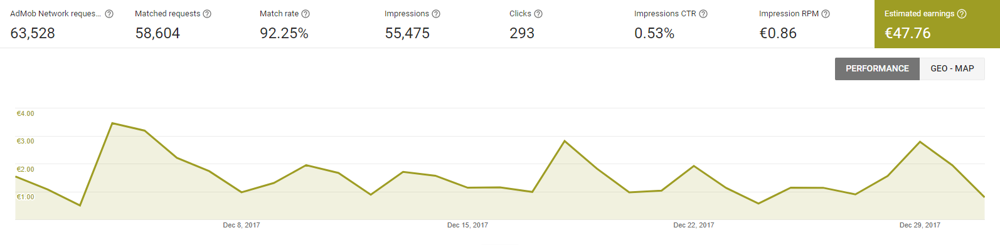
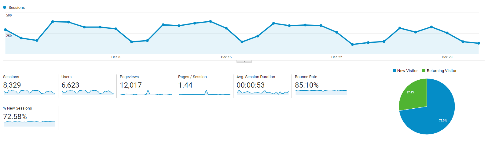

I post a progress report showing what I did and how my products performed each month.
Last month's report can be seen [here](/progress-report-november-2017).

## What did I do

I worked 45 _productive_ hours. (Tracked using [RescueTime](/redirects/rescuetime).)  
I watched [Manhunt: Unabomber](https://trakt.tv/shows/manhunt-unabomber/seasons/1) and [DARK Season 1](https://trakt.tv/shows/dark/seasons/1).

I didn't read any new books.  

I did my annual blog rewrite. This time I'm using [gatsby](https://www.gatsbyjs.org) instead of phenomic. The GraphQL source layer just gives me more flexibility and writing custom plugins is really easy and nice in gatsby.
I'm now also on [Medium](http://medium.com/@cmichel) and [Steemit](http://steemit.com/@cmichel). I wrote [some](/how-to-crosspost-to-medium) [scripts](/how-to-crosspost-to-steem) that cross-post to these platforms.

Some of my posts were translated [into](http://webframeworks.kr/tutorials/weplanet/react-native-progress-circle/) [Korean](http://webframeworks.kr/tutorials/weplanet/how-to-use-react-in-markdown/).

## Apps
### Downloads
Total downloads of all my apps stayed at **744** this month. This is only because my [new app](/released-my-fifth-react-native-app) got a bit more traction and went from 10 downloads to 90 downloads.

### In-App Purchases
In-app Purchases went down to 3 orders this month. (-4)

I made an estimated **10.24€** (-13.71€) this way.

### Ad Revenue
My ad revenue also went down. I made **47.76€** (-7.48€) for 55,475 Google AdMob banner impressions.  

### Total App Income
In total, this month's app income was 57.84€ (-21.35€).

IAPs | Ads | Total
--- | --- | ---
23.95€ | 55.24€ | 79.19€

December was a really bad month revenue-wise. Let's see if it's just a seasonal trend and it goes back up in 2018 or if I have to be more concerned.

## Platform Growth
### Website
Finally, something interesting happened here. While my sessions and users stayed the same my page views still went up quite a lot. The only thing I changed is the blog migration., so it must have something to do with the new blog?

1. [How to cross-post to Medium](/how-to-crosspost-to-medium)
1. [How to cross-post to Steem](/how-to-crosspost-to-steem)

### Subscribers
My [twitter](https://twitter.com/cmichelio) followers increased by _32_ to 213. My [cross-post to Medium tweet](https://twitter.com/cmichelio/status/945481231872950272) was really successful.

## What's next
Now that my blog migration is finished, I 'll start working on a new side project again.
It's still unclear what it will be, but I'll keep you updated.
I didn't set goals for 2017, and now I regret not having a way to see if I achieve what I'm set on.
So, the next post will be about my goals for 2018.
