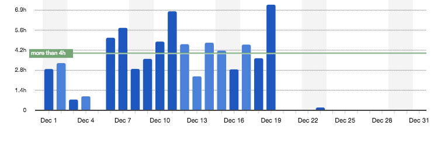
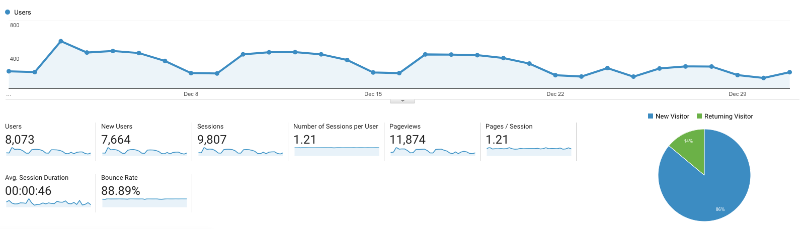

I post a progress report showing what I did and how my products performed each month.
Last month's report can be seen [here](/progress-report-november-2018).

## What did I do

I worked **72** _productive_ hours last month. Pretty good, considering I didn't work over the Christmas holidays.
I watched [The Haunting of Hill House](https://trakt.tv/shows/the-haunting-of-hill-house).

I installed a new VS Code theme, [One Dark Space Gray](https://marketplace.visualstudio.com/items?itemName=fivepointseven.vscode-theme-onedark-spacegray).
It's absolutely beautiful. 😍

I discovered [MusicForProgramming.net](http://musicforprogramming.net) and I can indeed listen to it while programming without being distracted.
I even think it helps me focus.
Usually, I don't listen to music while coding or sometimes listened to low-fi hip hop, but there I still found _some_ songs to be too distracting.

Business-wise I finished both the smart contract and the frontend integration of my battleship-style decentralized game for my [Learn EOS Development book](https://learneos.one).
The book will go into detail about building EOS dapps by using this game as an example.
I wrote a couple of sub-chapters for the smart contract chapter for the game.
I severely underestimated how much is still left to write and how long it takes even if you have the code already. 😞

Another hurdle was that the book is written in MarkDown and compiled to `PDF` using `pandoc`.
And I had to write my own custom [pandoc-code-file-filter](https://github.com/MrToph/pandoc-code-file-filter) which can include sections of code from files.
This way I don't have to manually copy & paste code from my repositories to the MarkDown file anymore.
It was especially annoying when I did small code changes or even only changed the formatting.
Other pandoc code include filters only work by annotating the source code itself, which I did not want to do, and had a limited set of features.
At least, I can now write my own book compilation pipeline. 😃

## Platform Growth

### Website

Sessions went down to **9,807** on my website.

I wrote two new posts:

1. [Difference Boolean Constructor and Double Negation](/difference-boolean-constructor-and-double-negation/)
1. [Deferred Transactions on EOS](/deferred-transactions-on-eos/)

### Subscribers

My [twitter](https://twitter.com/cmichelio) followers increased by _9__ to **361**.
This number is extremely low, I wonder why. 🤔

### Learn EOS Development Subscribers

I currently have **253** email subscribers for [my book](https://learneos.one). (+29 in a month)
I just sent out a new email newsletter with short updates on EOS + the book.
The book is still going well.
I need to finally release it, hopefully in the next month.

## What's next

Full focus on the last chapters of the book.

* Write tutorials for free and link to my book.
    Collect email addresses.
    All while actually writing the book.
