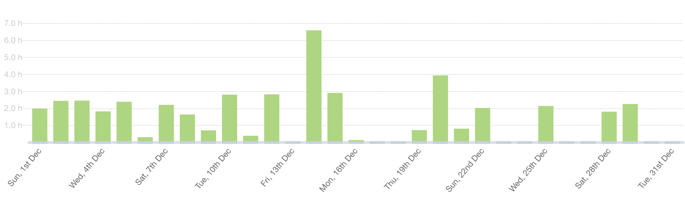
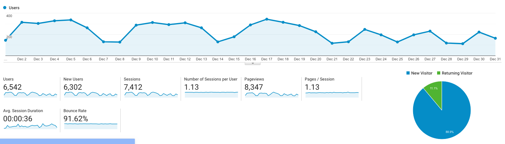

I post a progress report showing what I did and how my products performed each month.
Last month's report can be seen [here](/progress-report-november-2019).

## What did I do

_Hours worked on **side-projects** in December_

I worked **46** _productive_ hours on side-projects last month.

To make these progress reports a bit more interesting, from now on I'll post my favourite song, TV show, and article I read last month.

* **Article of the Month**: Not an article this time, but I love [Blockhead's short stories](https://twitter.com/OhYouBlockhead/status/1200946068172820484) [as tweets](https://twitter.com/OhYouBlockhead/status/1209890261574148099) 😆
* **Song of the Month**: [Galv - Klemmende Fahrstuhltür](https://open.spotify.com/track/14YQmHx1mRYdbBzt6YKRu7?si=n7uP3jEOQGWHDEg7g8uVDw)
    <iframe src="https://open.spotify.com/embed/track/14YQmHx1mRYdbBzt6YKRu7" width="300" height="80" frameborder="0" allowtransparency="true" allow="encrypted-media"></iframe>

* **TV series of the Month**: [The Killing](https://trakt.tv/shows/the-killing-2010)

### What was worked on

Despite Christmas and the holidays I still managed to get a lot of things done.
I appeared on two interviews ([here](https://www.youtube.com/watch?v=EdNIwHfZ50Q) and [here](https://www.eoswriter.io/165661_meet-the-custodians-episode-3-christoph-michel.eos)) and could sort out lots of boring bureaucratic business-related things.

I also have a great idea for a new side project that could be completed within a month, but still, it's hard to make time.
Maybe, I'll get to it within the next months and post about it, or even live-stream the coding of it.

## Platform Growth

### Website

Sessions went down to at **7,412** on my website.
It's really low, although I had a good month in terms of new posts released.
I'm probably too much in my EOSIO bubble and nobody outside of it cares about these posts.
In contrast to my older posts that would reach a wider audience.
Anyway, I'm doing this for fun, and I currently enjoy writing EOSIO-related posts.

It's been a while but I finally maintained my **bi-weekly schedule of releasing a blog post**. 🥳

1. [EOSIO Dev Puzzle](/eosio-dev-puzzle-1-max-ram/)
2. [How to pay for users' CPU](/eosio-how-to-pay-for-users-cpu/)
2. [De-anonymizing eosblender.com](/de-anonymizing-eosblender-com/)

I just noticed I never resolved the EOSIO dev puzzle as nobody participated. 😅
Look out for an update to the post soon.

I also wrote another [interview on eoswriter](https://www.eoswriter.io/165661_meet-the-custodians-episode-3-christoph-michel.eos), which has even been translated to [Chinese](http://cn.eoswriter.io/6970_vigor-chris.eos) and Spanish by the awesome Vigor community. 🙏

### Subscribers

My [twitter](https://twitter.com/cmichelio) followers increased by _20_ to **556**.

### Learn EOS Development Subscribers

I currently have **574** email subscribers for [my book](https://learneos.dev). (+23 in last 30 days)

I sold **3 books** last month.

## What's next

I didn't think much about what's next in my life yet and if I want to change anything.
I'll reflect on that in my annual yearly goals posts that I'll write next.
