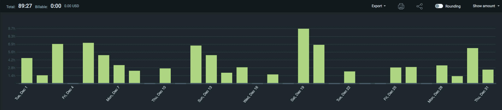
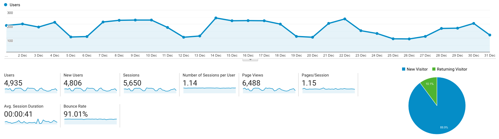

I post a progress report showing what I did and how my products performed each month.
Last month's report can be seen [here](/progress-report-november-2020).

## What did I do

_Hours worked on **side-projects** in December_

I worked **90** _productive_ on side projects hours last month.

To make these progress reports a bit more interesting, from now on I'll post my favourite song, TV show, and article I read last month.

* **Article of the Month**: [Open Problems: Optimal Uniswap Fees](https://research.paradigm.xyz/uniswap-fees)
* **Song of the Month**: [Ansu - HONDA](https://open.spotify.com/track/3VANAqbKN3Tcjh44xFTSGQ)
    <iframe src="https://open.spotify.com/embed/track/3VANAqbKN3Tcjh44xFTSGQ" width="300" height="80" frameborder="0" allowtransparency="true" allow="encrypted-media"></iframe>

* **TV series of the Month**: [The Promised Neverland S01](https://trakt.tv/shows/the-promised-neverland)

### What was worked on

Besides the usual work, I did a lot of programming challenges and CTFs to wind down.

* I did [Advent of Code 2020](https://adventofcode.com/) to learn more Rust. Here are my [Rust solutions](https://github.com/MrToph/adventofcode-2020) up to day 11. Then I got bored because it's mostly parsing the input and doing some easy transformations.
* Instead, I solved the [Damn Vulnerable Defi](https://www.damnvulnerabledefi.xyz/) CTF challenges which was a lot of fun. The challenges were quite easy however I got to practice my solidity skills and learned about the awesome [Hardhat Ethereum dev environment](https://hardhat.org/). The [mainnet forking](https://hardhat.org/guides/mainnet-forking.html) feature is just awesome.
* I was hooked and then went on to do the first challenges of the old school [Capture the Ether](http://capturetheether.com/). Still need to finish these in January.
* I added a new feature to my arbitrage bot to farm Defi Network's lucky egg.

## Platform Growth

### Website

Sessions stayed at **5,650** on my website.

I did **not** stick to my bi-weekly schedule of releasing a blog post.
I managed to write a single post only.
It's a very technical post but a very interesting one.

1. [Pricing LP tokens | Warp Finance hack](/pricing-lp-tokens/)

### Subscribers

My [twitter](https://twitter.com/cmichelio) followers increased by _13_ to **671**.

## Sales

#### Learn EOS Development

I sold 8 books last month.

#### Trading

I made 180 EOS last month trading crypto.
