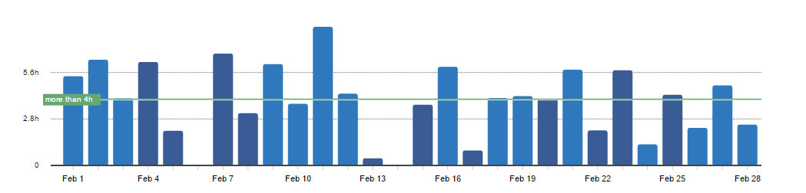
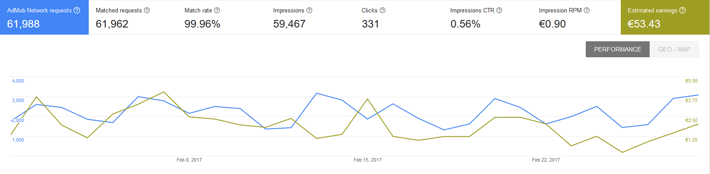
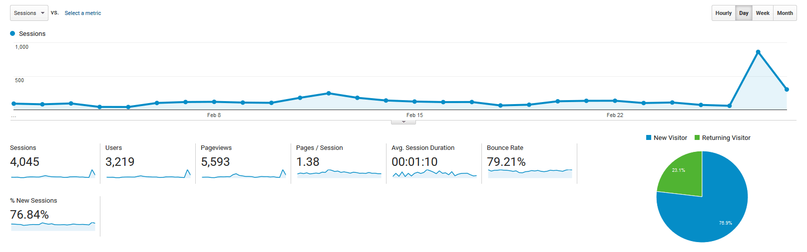

# Progress Report - February 2017
I post a progress report showing what I did and how my products performed each month.
Last month's report can be seen [here](/progress-report-january-2017).

## What did I do

I worked 109 _productive_ hours. (Tracked using [RescueTime](/redirects/rescuetime).)  
I watched [The OA](http://www.imdb.com/title/tt4635282/).

I added [Google Drive Backup Support](/google-drive-in-react-native) to my React Native apps and some more features.

## Apps
### Downloads
Download growth has been stable for two of my four apps. Another app's downloads growth increased by 60%, whereas the other one decreased by 49%. The reason is probably because of two 1 star reviews it received in January, creating a score of only 3.8 stars.

In sum, my apps were downloaded **1034** times this month.

### In-App Purchases
I introduced In-app Purchases (to remove ads) for all my apps last month, and to my surprise I could earn the same amount in February as I did in January.
I made **28.88€** (+1.51€).

### Ad Revenue
Ad revenue was also stable, the increased and decreased downloads canceled each other out. I made **53.43€** (-2.66€) for 59500 Google AdMob banner impressions.

### Total App Income
In total, this month's app income was 82.31€ (-1.15€).

IAPs | Ads | Total
--- | --- | ---
28.88€ | 53.43€ | 82.31€

## Platform Growth
### Website
My blog was shared quite a bit this month, most noticeable by this [Top React Blogs reddit post](https://reddit.com/r/reactjs/comments/5t8loz/what_are_your_top_reactreact_native_blogs_that/) and by a JavaScript Daily tweet about [void](/javascript-void-keyword/). (Thanks!)

### Subscribers
This also increased my twitter followers to 120. (+58)

## What's next
I'm currently working on the backend of a new app. Stay tuned.