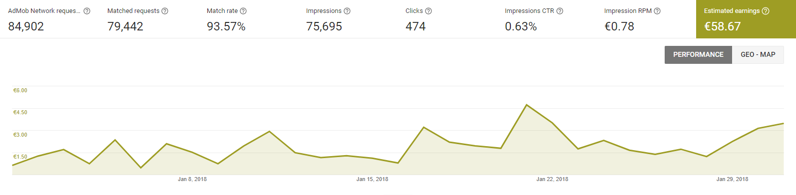

I post a progress report showing what I did and how my products performed each month.
Last month's report can be seen [here](/progress-report-january-2018).

## What did I do

I worked 49.5 _productive_ hours. (Tracked using [RescueTime](/redirects/rescuetime).)  
I watched The End of The F***ing World](https://trakt.tv/shows/the-end-of-the-f-ing-world/seasons/1).  

I read [Attack of the 50 Foot Blockchain](/book-review-attack-of-the-50-ft-blockchain).  

I finally got to live-coding on Twitch. I still lack all of the equipment, but I'll get a microphone soon and then I try to have a regular schedule. Probably, sometime on Sunday afternoon like most live-coders. Topics will be my side-projects, mostly web dev, and blockchain.

## Apps
### Downloads
Total downloads of all my apps increased drastically to **1079** (+353) this month. You can see that my apps are mostly fitness apps, and all the New Year's resolutions are reflected in my download numbers.

### In-App Purchases
In-app Purchases are still at an all-time low at 3 orders this month. (+0)

I made an estimated **10.24€** (+0.00€) this way.

### Ad Revenue
My ad revenue went up. I made **58.67€** (+10.91€) for 75,695 (!) Google AdMob banner impressions. That's 20,000 impressions more than normal, but my RPM went down.

### Total App Income
In total, this month's app income was 68.91€ (+10.91€).

IAPs | Ads | Total
--- | --- | ---
10.24€ | 58.67€ | 68.91€

February was a good month, let's hope it continues this way.

## Platform Growth
### Website
Sessions increased again.

I stuck to my bi-weekly post schedule, I was even able to post a bit more:

1. [Goals for 2018](/goals-2018/)
1. [How does Steem work, anyway?](/how-does-steem-work/)
1. [Book Review - Attack of the 50 Foot Blockchain](/book-review-attack-of-the-50-ft-blockchain/)
1. [Splitting your app into micro-processes](/splitting-app-into-micro-processes/)

### Subscribers
My [twitter](https://twitter.com/cmichelio) followers increased by _3_ to 216.

## What's next
I only watched one new TV show this month. Time to catch up.
Also, I should be able to finish a smaller side project in February. If you're curious follow me on social media.
