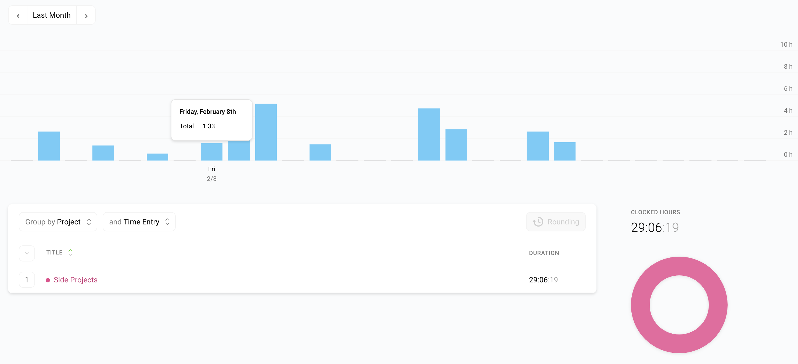
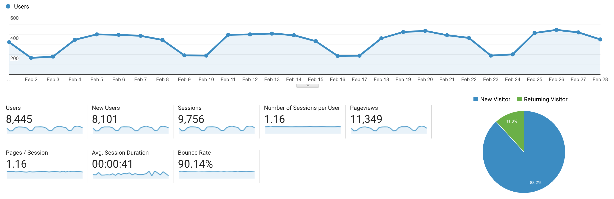

I post a progress report showing what I did and how my products performed each month.
Last month's report can be seen [here](/progress-report-january-2019).

## What did I do

I worked **29** _productive_ hours last month. I had a lot going on this month, that's why the number is rather low.
I did not start watching any new TV shows.

I finished all the book contents of [Learn EOS Development](https://learneos.dev). 🎉
What's left is formatting, general editing, and including reviewer's feedback.
Unfortunately, the reviews from Block One are not finished yet.
As I really want to release the book this month as a lot of people are already waiting for it, I'll include their feedback in an update of the ebook version.

## Platform Growth

### Website

Sessions on my website went down a bit for the short month to **9,756**.

I did **not** stick to my bi-weekly schedule of releasing a blog post.
I completely missed writing a new blog post. 🙁
I need to get back on track here again.

### Subscribers

My [twitter](https://twitter.com/cmichelio) followers increased by _10_ to **374**.

### Learn EOS Development Subscribers

I currently have **298** email subscribers for [my book](https://learneos.dev). (+21 in last 30 days)
So close to the 300 subscribers I wanted for March for the book launch.
The trend is _slowly_ declining, but the main reason is because I didn't post blog articles about EOS anymore and every traffic in the past month is organic SEO traffic.

## What's next

Full focus on finishing all the tiny details that are still left:
Integrating feedback, reviewing, editing, formatting, ...

Then checking [Side Project Check List](https://www.sideprojectchecklist.com/marketing-checklist/) and doing the launch.
