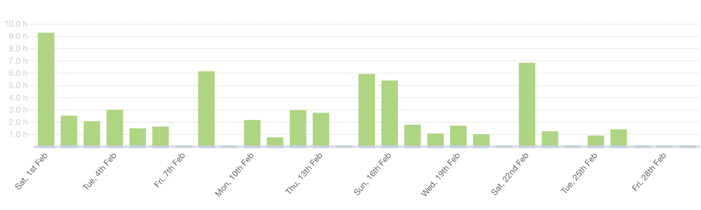
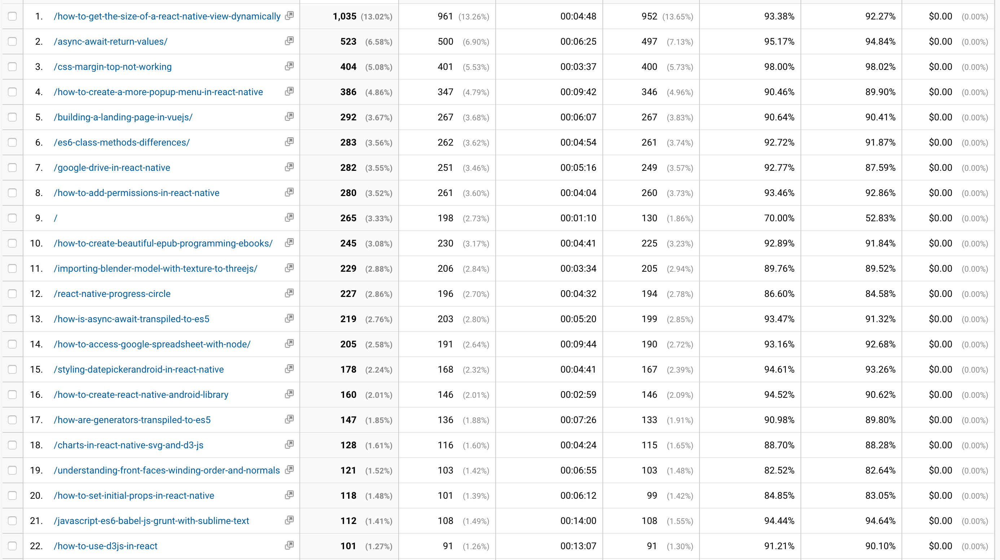
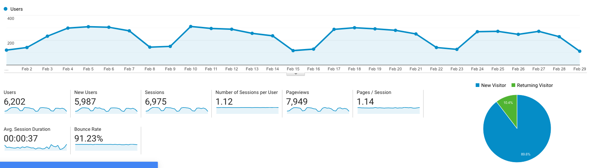

Two months of 2020 already passed by.
I post a progress report showing what I did and how my products performed each month.
Last month's report can be seen [here](/progress-report-january-2020).

## What did I do

_Hours worked on **side-projects** in February_

I worked **62** _productive_ hours on side-projects last month.

To make these progress reports a bit more interesting, from now on I'll post my favourite song, TV show, and article I read last month.

* **Article of the Month**: [bZx Flashloan Hacks](https://www.lesswrong.com/posts/Kbm6QnJv9dgWsPHQP/schelling-fences-on-slippery-slopes)
* **Song of the Month**: [Kool & The Gang - Summer Madness](https://open.spotify.com/track/5hBCrlxAhj6LVKDR2PGZcs)
    <iframe src="https://open.spotify.com/embed/track/5hBCrlxAhj6LVKDR2PGZcs" width="300" height="80" frameborder="0" allowtransparency="true" allow="encrypted-media"></iframe>
* **TV series of the Month**: [Curb Your Enthusiasm S10](https://trakt.tv/shows/the-order-2019)

### What was worked on

I worked on and launched [EOS Token Portfolio](https://mrtoph.github.io/token-portfolio/), a website charting your EOS balance over time.

## Platform Growth

### Website

Sessions went down again to **6,975** on my website.
It hasn't been that low for years.
I guess the long-tail of my more popular posts reaching a wider audience (React, Redux, JS) is slowly dying off.

_Most viewed blog posts in February_

Seems like my suspicion is correct.
The top posts are mostly about React Native and two years old - which is understandable because React Native is a piece of shit where even the simplest things don't work. 😁

> Disclaimer: I can only talk about the state of React Native from 2 years ago.

I could keep up with my bi-weekly schedule of releasing a blog post.

1. [How to deploy a create-react-app with github-actions](/create-react-app-github-actions/)
2. [Launching EOS Token Portfolio](/launching-eos-token-portfolio/)
3. [How to check if an EOS account has a smart contract](/how-to-check-if-an-eos-account-has-a-smart-contract/)

### Subscribers

My [twitter](https://twitter.com/cmichelio) followers increased by _13_ to **584**.

## Sales

#### Learn EOS Development

I sold 2 books last month.

#### Trading

A new category, yay! 😃
I made 371 EOS last month trading crypto.

## What's next

I'm a bit disappointed by B1's Voice launch.
First, it's super restricted to about 400 (?) US residents for now.
The bigger issue is that it's still very unclear if it'll ever launch on a public EOSIO chain. Personally, I don't believe it ever will, there are just too many regulatory eyes on B1 watching every step they do, continuously checking if there are any ties between B1 and the EOS mainnet.
It's also unclear if there's product-market fit. I see lots of backlash on Twitter about doing KYC and having your full name displayed - which I personally don't mind.

Meaning, I won't be developing any products on top of Voice anytime soon.
Time to think about some other side project.
