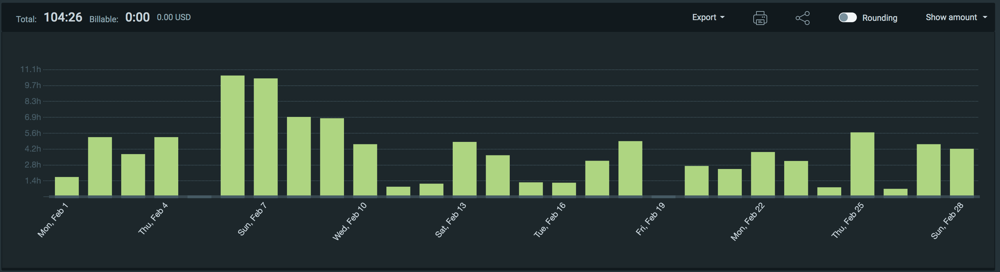
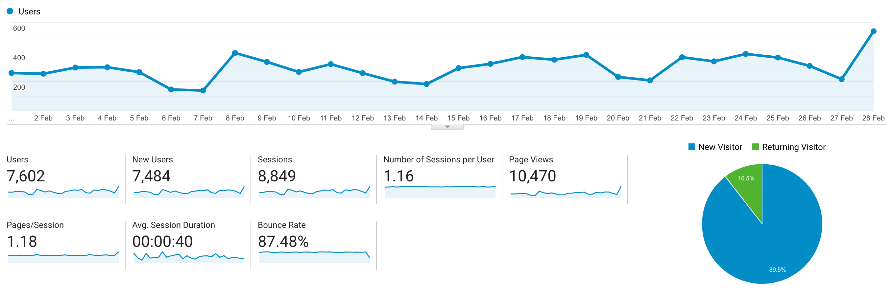

I post a progress report showing what I did and how my products performed each month.
Last month's report can be seen [here](/progress-report-january-2021).

## What did I do

_Hours worked on **side-projects** in February_

I worked **104** _productive_ on side projects hours last month.

To make these progress reports a bit more interesting, from now on I'll post my favourite song, TV show, and article I read last month.

* **Article of the Month**: [Curve Vulnerability Report](https://medium.com/@peter_4205/curve-vulnerability-report-a1d7630140ec). (It's old but I only came across it now.)
* **Song of the Month**: [Bitcoin pls go to moon 1hr](https://www.youtube.com/watch?v=_PXU0thDHCU). Relevant again.

* **TV series of the Month**: [Jujutsu Kaisen S01](https://trakt.tv/shows/jujutsu-kaisen)

### What was worked on

* I took part in the [Paradigm CTF](https://ctf.paradigm.xyz), scored well and got introduced to a lot of great people.
* Most of my allocated free time was spent looking at ETH hacks and writing blog posts. I started a new series, _Replaying Ethereum Hacks_.
* business-related tasks

## Platform Growth

### Website

Sessions on my website went up to **8,849**.
I think it's because I'm writing more blog posts to a wider audience again. Plus, these posts are included in some ETH newsletters.

I stuck to my bi-weekly schedule of releasing a blog post. ✅
I even wrote _three_ blog posts instead of just two!

1. [Paradigm CTF 2021 Solutions](/paradigm-ctf-2021-solutions/)
2. [Replaying Ethereum Hacks - Introduction](/replaying-ethereum-hacks-introduction/)
3. [Replaying Ethereum Hacks - Furucombo](/replaying-ethereum-hacks-furucombo/)

### Subscribers

My [twitter](https://twitter.com/cmichelio) followers increased by _56_ to **742**.

## Sales

#### Learn EOS Development

I sold 6 books last month.

#### Trading

I made 93 EOS last month arbitrage-trading crypto.

## What's next

* Investigate more interesting hacks and write about them. I thought about making the Replaying Hacks posts a video series on YouTube. I become more and more a visual learner myself and watching a video is more relaxing than reading. 😁 I could create a gitcoin grant to promote it. But first I need better equipment ...