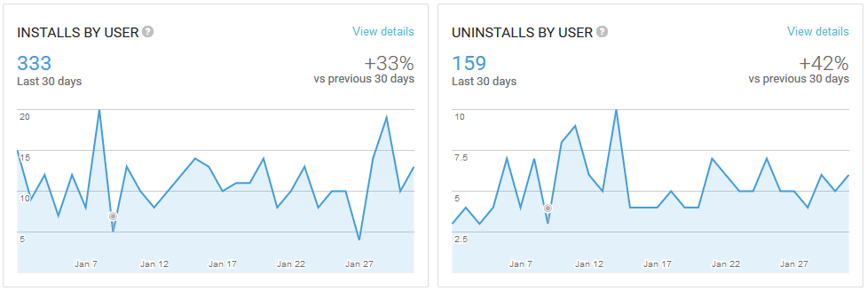
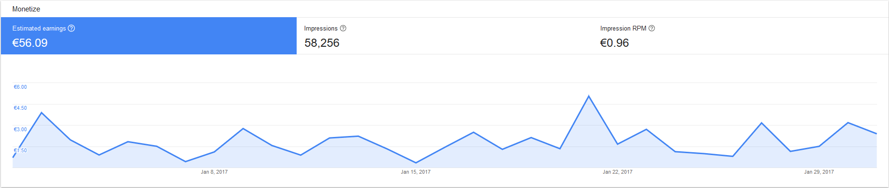
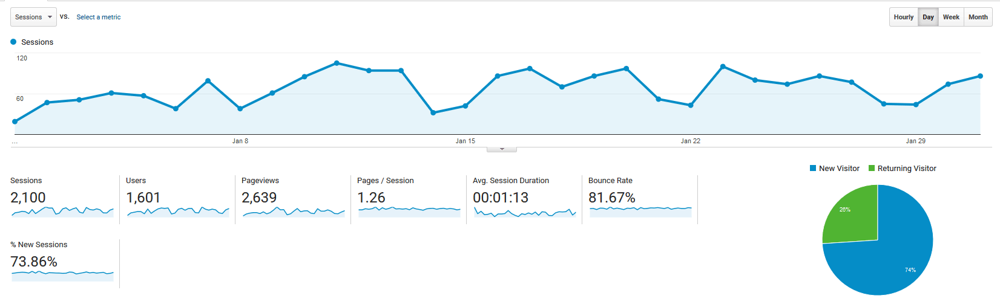

# Progress Report - January 2017
I post a progress report showing what I did and how my products performed each month.
Last month's report can be seen [here](/progress-report-december-2016).

## What did I do

I worked 133 _productive_ hours. (Tracked using [RescueTime](/redirects/rescuetime).)  
I watched [Sherlock Season 4](http://www.imdb.com/title/tt1475582/).  
I read [Heard on the Street](/on-writing-well/) and [The Visual Display of Quantitative Information](https://www.amazon.de/Visual-Display-Quantitative-Information-Edward/dp/0961392142).

On January 10th I released In-App purchases for all of my React Native Android apps that remove their ads.

## Apps
### Downloads
Download growth for all of my apps has increased again compared to the previous month. Around 30%-50% more downloads compared to December for two of my apps, and 200% for the other two. It's nice to see, especially as I'm just doing passive ASO and not running ads or promoting them in any other way. This chart shows the new downloads for [this fitness tracker](https://play.google.com/store/apps/details?id=io.cmichel.ppl) in this month:

### In-App Purchases
I added some new features to my apps and released a new version on January 10th. It seems like pushing a new version to the App store gives it temporarily more visibility, as I could see some spikes in the number of downloads on release day.
Among the new features was an option to remove ads. I'm still experimenting with the concrete prices - for now I tested 3.99$ for the fitness trackers and 2.99$ for the Alarm Clock (excluding country-specific VAT). I got **ten orders** and after taking away the 30% Google cut, I made **27.37€** with In-App purchases.

If I interpret the orders correctly, there is one Australian guy that bought _all four of my apps_. 🤗  

I expect the number of IAPs to go down in February as this month benefited from releasing the feature to _all_ existing customers instead of just February's new customers.

### Ad Revenue
App income increased a lot more than the downloads to **56.09€** (+40.44€) for 58000 Google AdMob banner impressions, so you can expect 1€ per thousand impressions [(RPM)](https://en.wikipedia.org/wiki/Revenue_per_mille) in the sports category. (December's RPM was only 0.80€.) This big jump from only 15€ in ad revenue last month is quite surprising, maybe there is indeed a New Year effect going on.

### Total App Income
All in all, this month's app income was 83.46€.

IAPs | Ads | Total
--- | --- | ---
27.37€ | 56.09€ | 83.46€

## Platform Growth
### Website
I didn't post as much as I wanted, mostly from a lack of content as I didn't build a new app and was busy otherwise. Still, my old posts pulled in more people from Google Search than ever before.

### Subscribers
Twitter is currently at 62 followers. (+3)

## What's next
It's funny how this "Ideas are worthless, execution is key" spirit is repeated everywhere, while my problem right now is legit good ideas. I'm itching to build another app and see how it plays out. Let's see what I come up with in February.