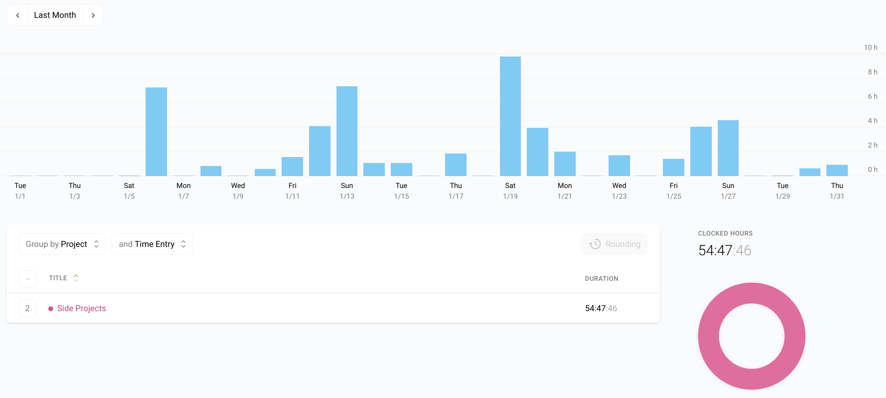
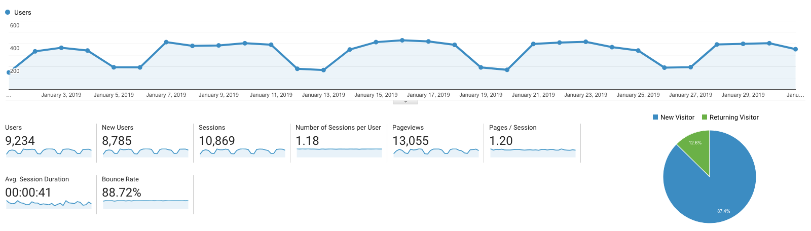

I post a progress report showing what I did and how my products performed each month.
Last month's report can be seen [here](/progress-report-december-2018).

## What did I do

I worked **55** _productive_ hours last month. Pretty good start into the year.
I watched [Titans](https://trakt.tv/shows/titans-2018).

I 'm still on the last chapter of [Learn EOS Development](https://learneos.dev), which I will finally finish in February.
Then the editing and reviewing process begins.
Actually, the reviewing process already began.
I send out some drafts to technical reviewers.
Even Block One, the company behind EOS, reached out to me and offered me their help with reviewing. 
Really nice move. 👌

## Platform Growth

### Website

Sessions stayed at **10,896** on my website.

I did **not** stick to my bi-weekly schedule of releasing a blog post.
I missed this week, but I was too busy doing other things.
Still, I managed to write two blog posts.

1. [Goals for 2019](/goals-2019/)
1. [How to write pandoc plugins in Nodejs](/how-to-write-pandoc-plugins-in-nodejs/)

### Subscribers

My [twitter](https://twitter.com/cmichelio) followers increased by _3_ to **364**.
I need to tweet more.
Or maybe not.
There's so much to work on and improve, you need to choose your battles wisely.
I think a bigger Twitter audience would be nice but not that beneficial.
I should focus on growing the book email subscribers because I'm getting close to launch.

### Learn EOS Development Subscribers

I currently have **277** email subscribers for [my book](https://learneos.dev). (+24 in last 30 days)
That's pretty nice, I should be able to get 300 subscribers next month and then hopefully launch in March.

## What's next

Full focus on finishing the book content-wise. Should be done this month.
Then a lot of reviewing and editing ... 🤓

I researched some merchants and [gumroad](https://gumroad.com) seems like the best choice.
It's relatively cheap (3.5% fees + 0.30$) if you buy their plan for 10$ a month.
Especially as they handle EU VAT on their part and I don't have to get involved at all in this complete mess of paying taxes for each individual country in the EU.
The only down-side is that they don't accept crypto payments.
If anyone knows a merchant that handles EU VAT and also accepts crypto payments, please let me know.

