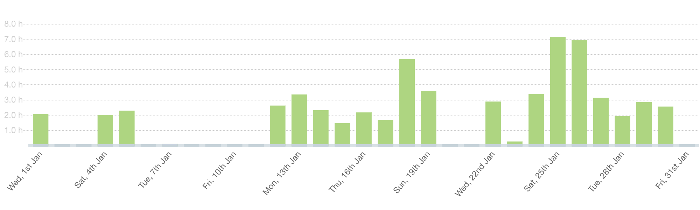
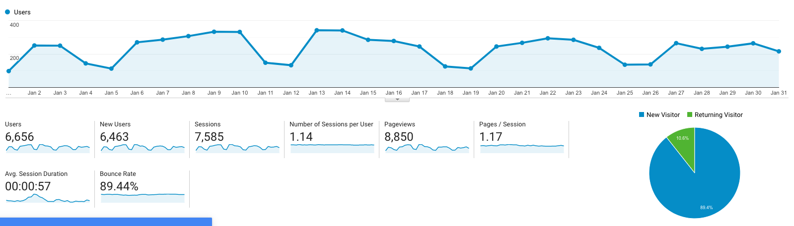

I post a progress report showing what I did and how my products performed each month.
Last month's report can be seen [here](/progress-report-december-2019).

## What did I do

_Hours worked on **side-projects** in January_

I worked **61** _productive_ hours last month. I really made use of those weekends. 💪

To make these progress reports a bit more interesting, from now on I'll post my favourite song, TV show, and article I read last month.

* **Podcast of the Month**: [Pieter Wuille talking about his contributions to Bitcoin](https://podcast.chaincode.com/). I loved listening to this highly-technical podcast from one of the bitcoin core contributors and how Bitcoin evolved over the 10 years he worked on it.
* **Song of the Month**: [Kofi Stone - Lost to the Streets](https://open.spotify.com/track/3pmmc8lfNbcnvTTAtdDsz0?si=S6jm5XgaQK6VBqURdn8axQ)
    <iframe src="https://open.spotify.com/embed/track/3pmmc8lfNbcnvTTAtdDsz0" width="300" height="80" frameborder="0" allowtransparency="true" allow="encrypted-media"></iframe>

* **TV series of the Month**: [Boku No Hero Academia S04](https://trakt.tv/shows/my-hero-academia/seasons/4)

### What was worked on

We finished the [Vigor DAC landing page](https://vigor.ai).
I started working on a new _eosjs helper library_ - there are just so many tasks I keep reimplementing over and over.
It's time to bundle them and make them reusable. I'll share more news when it's in a beta version.

Just in time for the end of the month, I finished the MVP for my first side project of 2020.
An _on-chain EOS arbitrage trading bot_ for Bancor <> NewDex. I'm really curious to see if it can outperform the existing ones.
I'll gradually keep adding more features and trading pairs to it.
I also think this would make an interesting post series - I had to overcome quite some oddities of DEXes trying to shut down auto-trading.

## Platform Growth

### Website

Sessions went down to **7,585** on my website.

I wrote two small posts on my blog.

1. [Goals for 2020](/goals-2020/)
2. [How to rollback to an older EOSIO.CDT](/how-to-rollback-to-an-older-eosio-cdt-version-with-brew/)

### Subscribers

My [twitter](https://twitter.com/cmichelio) followers increased by _15_ to **571**.

#### Learn EOS Development Sales

I sold 4 books last month.

## What's next

Do the 20% on the trading bot that'll bring 80% of the results until B1's Voice launch.
There'll probably be some nice opportunities for developing products around Voice.

