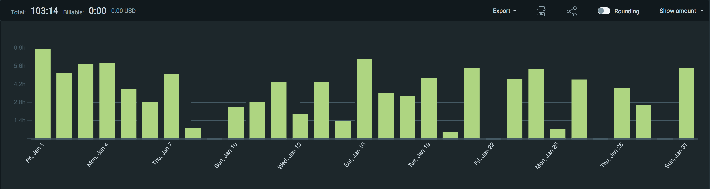
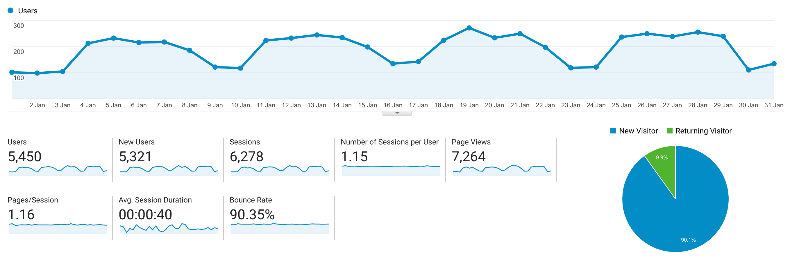

I post a progress report showing what I did and how my products performed each month.
Last month's report can be seen [here](/progress-report-december-2020).

## What did I do

_Hours worked on **side-projects** in January_

I worked **103** _productive_ on side projects hours last month.

To make these progress reports a bit more interesting, from now on I'll post my favourite song, TV show, and article I read last month.

* **Article of the Month**: [Quantifying Blockchain Extractable Value: How dark is the forest?](https://arxiv.org/pdf/2101.05511.pdf)
* **Song of the Month**: [Ambient Watts Playlist](https://soundcloud.com/spacekittyisyou/sets/ambient-watts)
* **TV series of the Month**: [The Promised Neverland S02](https://trakt.tv/shows/the-promised-neverland/seasons/2/)

### What was worked on

* Did the Capture the Ether CTF challenges
* Did the Ethernaut CTF challenges
* Received a bug bounty for discovering a contract vulnerable to sandwich attacks
* I've been reading up a lot on what's currently happening in the Ethereum ecosystem. Really impressed by the work Starkware is doing with their [Cairo programming language](https://cairo-lang.org/docs/how_cairo_works/cairo_intro.html) to write zero-knowledge proof programs. I've never seen this dual witness-creating-proofer / simple-verifier programming style before.

    > A hint is a piece of python code, which contains instructions that only the prover sees and executes. From the point of view of the verifier, these hints do not exist.
* Have also been reading a lot about [MEV and flashbots](https://hackmd.io/@flashbots/rk-qzgzCD).
* Small blog update: include featured image headers on the actual blog post page instead of only on the index page.

## Platform Growth

### Website

Sessions stayed at **6,287** on my website.

Finally, I stuck to my bi-weekly schedule of releasing a blog post - great start into the year!
I even wrote more than two posts this month.

1. [Damn Vulnerable DeFi Solutions](/damn-vulnerable-defi-solutions/)
2. [Ethernaut](/ethernaut-solutions/)
3. [Capture The Ether](/capture-the-ether-solutions/)
4. [DeFi Sandwich Attacks](/de-fi-sandwich-attacks/)

### Subscribers

My [twitter](https://twitter.com/cmichelio) followers increased by _15_ to **686**.

## Sales

#### Learn EOS Development

I sold 7 books last month.

#### Trading

I made 126 EOS last month using arbitrage trading.

## What's next

* I'm looking forward to the Paradigm CTF on Friday, February 8th.
* As always I have some cool ideas for innovative projects that I want to try 😃

